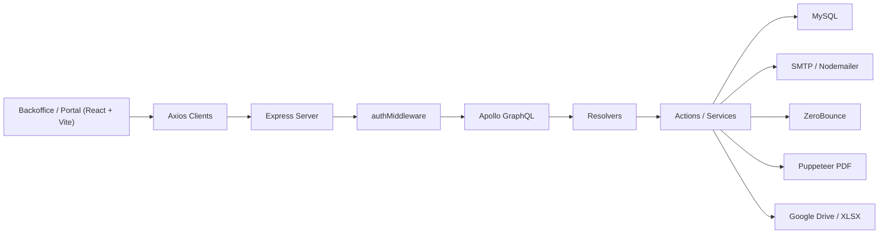

# Manual de Arquitectura

## 1. Vision del sistema

Business Control implementa una arquitectura cliente-servidor con dos superficies de uso:

- Backoffice: para `ADMIN`, `VENTAS` y `SOPORTE`.
- Portal del cliente: para contactos con acceso habilitado (`CONTACT_PORTAL`).

La API principal es GraphQL, pero el backend tambien expone endpoints REST puntuales para importacion y consulta dinamica de clientes.



## 2. Capas principales

### 2.1 Frontend

Responsabilidades:

- Renderizar el backoffice y el portal.
- Gestionar sesion y proteccion de rutas.
- Traducir acciones de UI a consultas/mutaciones GraphQL o endpoints REST.

Piezas clave:

- `src/main.jsx`: monta `AuthProvider` y `ThemeProvider`.
- `src/routes.jsx`: define rutas publicas, privadas y del portal.
- `src/context/AuthContext.jsx`: recupera sesion de `bc_token` y consulta `me`.
- `src/actionsAPI/*.api.js`: encapsula llamadas a la API.

### 2.2 Backend HTTP

Responsabilidades:

- Configurar Express, CORS y JSON body parsing.
- Exponer `/graphql`, `/health` y `/api/clients/*`.
- Resolver autenticacion desde JWT.

Punto de entrada:

- `backend/src/index.js`

Orden del pipeline:

1. `cors`
2. `express.json`
3. `authMiddleware`
4. rutas REST
5. Apollo GraphQL con contexto `{ user: req.user }`

### 2.3 Capa GraphQL

Responsabilidades:

- Definir contrato publico en `schema.graphql`.
- Aplicar control de acceso por rol.
- Delegar logica a acciones.
- Resolver relaciones entre entidades (`Client.contacts`, `Quote.items`, etc.).

Organizacion:

- `graphql/schema.graphql`: contrato de tipos, queries y mutations.
- `graphql/resolvers/query/*`: lecturas.
- `graphql/resolvers/mutation/*`: escrituras.
- `graphql/resolvers/types.js`: relaciones y campos derivados.

### 2.4 Capa de acciones y servicios

Responsabilidades:

- Ejecutar queries SQL.
- Encapsular reglas de negocio.
- Manejar transacciones cuando una operacion toca multiples tablas.
- Integrar servicios externos.

Patrones visibles:

- Acciones simples: CRUD y consultas puntuales.
- Acciones transaccionales: cotizaciones, cambios de precio, eliminaciones compuestas.
- Servicios especializados: importacion desde Drive y tabla dinamica de clientes.

### 2.5 Persistencia

Responsabilidades:

- Almacenar usuarios, roles, clientes, contactos, productos, cotizaciones y servicios.
- Soportar relaciones entre clientes, contactos, productos y cotizaciones.

Implementacion:

- `mysql2/promise`
- pool central en `src/config/db.js`
- `namedPlaceholders: true`
- `connectionLimit: 10`

## 3. Flujo de datos por caso de uso

### 3.1 Login de backoffice

1. `Login.jsx` llama `loginApi(email, password)`.
2. El frontend ejecuta la mutacion `login`.
3. `loginAction` consulta `users + roles`, compara `password_hash` y genera un JWT.
4. El frontend guarda `bc_token` en `localStorage`.
5. `AuthContext` usa `meApi()` para hidratar la sesion.

Detalles de sesion:

- Payload interno: `{ userId, role }`
- Roles usados por la app: `ADMIN`, `VENTAS`, `SOPORTE`

### 3.2 Login de portal

1. `PortalLogin.jsx` llama `loginContactApi(email, password)`.
2. `loginContactAction` valida que el contacto tenga `has_portal_access = 1`.
3. Se compara `portal_password_hash`.
4. Se firma un JWT con `{ contactId, clientId, role: "CONTACT_PORTAL" }`.
5. El portal guarda token y snapshot del contacto en `sessionStorage`.

### 3.3 Administracion de clientes y contactos

1. Las pantallas del backoffice llaman helpers de `clients.api.js` y `contacts.api.js`.
2. Los resolvers aplican `requireRoles`.
3. Las acciones ejecutan SQL directo sobre `clients` y `client_contacts`.
4. `Client.contacts` se resuelve de forma diferida al consultar un cliente.

Notas:

- `deleteContactAction` no borra fisicamente; desactiva el contacto.
- `updateContactAction` puede habilitar acceso al portal, hashear contrasena y enviar correo de bienvenida.

### 3.4 Catalogo de productos

1. El frontend usa `products.api.js`.
2. `products` y `searchProducts` admiten `client_id`.
3. El backend devuelve productos globales y, si aplica, productos dedicados para un cliente.
4. El historial de precios se persiste en `product_price_history`.

Notas:

- `createProductAction` y `updateProductPriceAction` son transaccionales.
- `getProductAction` hidrata `price_history`.

### 3.5 Cotizaciones backoffice

1. El usuario arma una cotizacion con cliente, contacto e items.
2. `createQuoteAction` valida productos y calcula totales.
3. Inserta `quotes` y `quote_items` en transaccion.
4. Si hay `contact_id`, genera automaticamente registros en `contact_products`.

Efectos secundarios:

- Cada item puede generar una o varias licencias/servicios.
- Las claves de licencia se generan de forma pseudoaleatoria.

### 3.6 Solicitud de cotizacion desde portal

1. El contacto selecciona productos en `PortalCatalog`.
2. `requestQuoteApi(items)` ejecuta la mutacion `requestQuote`.
3. `requestQuoteAction` crea una cotizacion con estado `REQUESTED`.
4. El backoffice detecta la nueva solicitud via polling.
5. `resolveQuoteRequestAction` convierte la solicitud a una cotizacion `PENDING`, asigna folio, items y vendedor, y genera servicios si corresponde.

### 3.7 Envio de cotizacion por correo

1. `sendQuoteEmailAction` reconstruye la cotizacion con cliente, vendedor e items.
2. Valida el correo con ZeroBounce.
3. Genera HTML.
4. Renderiza PDF con Puppeteer.
5. Envia el correo con Nodemailer.
6. Si el correo pertenece a un contacto portal, marca la cotizacion como visible en portal.

### 3.8 Importacion dinamica de clientes

1. El frontend llama `POST /api/clients/import-drive`.
2. El backend descarga el archivo desde Google Drive.
3. `xlsx` lee la primera hoja.
4. El servicio mapea encabezados contra columnas existentes.
5. Si faltan columnas, crea nuevas columnas `TEXT` en `clients`.
6. Inserta filas por lotes y devuelve un reporte.

Riesgo arquitectonico:

- Este flujo modifica el esquema de `clients` en runtime. Es potente para onboarding de datos, pero exige control operacional y respaldo de la BD.

## 4. Organizacion de carpetas

```text
business-control/
|-- README.md
|-- docs/
|   |-- ARCHITECTURE.md
|   `-- FUNCTIONS_GUIDE.md
|-- backend/
|   |-- migrations/
|   |-- sql/
|   |-- scripts/
|   |-- src/
|   |   |-- config/
|   |   |-- graphql/
|   |   |   |-- actions/
|   |   |   |-- resolvers/
|   |   |   `-- schema.graphql
|   |   |-- middlewares/
|   |   |-- routes/
|   |   |-- services/
|   |   |-- utils/
|   |   `-- index.js
|   |-- .env.example
|   `-- package.json
`-- frontend/
    |-- src/
    |   |-- actionsAPI/
    |   |-- assets/
    |   |-- components/
    |   |-- context/
    |   |-- pages/
    |   |-- styles/
    |   |-- App.jsx
    |   |-- main.jsx
    |   `-- routes.jsx
    |-- .env.example
    `-- package.json
```

### 4.1 Backend por carpeta

- `config/`: variables de entorno y pool MySQL.
- `graphql/actions/`: logica de negocio orientada a dominio.
- `graphql/resolvers/`: adaptadores GraphQL.
- `middlewares/`: autenticacion y autorizacion.
- `routes/`: endpoints REST fuera del esquema GraphQL.
- `services/`: procesos complejos de integracion o transformacion.
- `utils/`: JWT, password, correo y validacion externa.
- `migrations/` y `sql/`: bootstrap y cambios de esquema.

### 4.2 Frontend por carpeta

- `actionsAPI/`: capa cliente de API.
- `components/auth/`: proteccion de rutas y acceso maestro.
- `components/layout/`: sidebar, topbar y navegacion.
- `context/`: estado global de autenticacion y tema.
- `pages/auth/`: login/registro backoffice.
- `pages/home/`: modulos del backoffice.
- `pages/portal/`: dashboard, catalogo y cotizaciones del portal.
- `styles/`: CSS global.

## 5. Modelo de dominio

Entidades principales:

- `Role`: perfil de acceso.
- `User`: usuario interno del sistema.
- `Client`: empresa cliente.
- `Contact`: contacto de un cliente.
- `Product`: producto comercializable, global o vinculado a cliente.
- `Quote`: cotizacion.
- `QuoteItem`: detalle de productos de una cotizacion.
- `ContactProduct`: servicio/licencia activa asignada a un contacto.

Relaciones:

- Un `Role` tiene muchos `User`.
- Un `Client` tiene muchos `Contact`.
- Un `Contact` puede tener muchos `ContactProduct`.
- Una `Quote` pertenece a un `Client`, opcionalmente a un `Contact` y a un `User`.
- Una `Quote` tiene muchos `QuoteItem`.
- Un `Product` puede ser global (`client_id = null`) o dedicado a un cliente.

## 6. Consideraciones de seguridad

Estado actual:

- JWT firmado con `JWT_SECRET`.
- Passwords con bcrypt.
- Roles validados en la mayoria de queries y mutations sensibles.
- CORS configurable.

Riesgos a considerar:

- `MasterPasswordGate` contiene una contrasena maestra hardcodeada en frontend. Eso protege la UX, no la API.
- `createRole` y `deleteRole` no aplican `requireRoles` en backend.
- El token del backoffice vive en `localStorage`, expuesto a XSS.
- `authMiddleware` descarta tokens invalidos sin auditoria.
- La importacion dinamica altera columnas de BD en tiempo de ejecucion.

Recomendaciones:

- Mover registro/gestion de roles a un endpoint protegido por `ADMIN`.
- Sustituir la contrasena maestra hardcodeada por una politica backend.
- Evaluar cookies `httpOnly` o una estrategia anti-XSS.
- Registrar fallos de autenticacion y acciones criticas.

## 7. Manejo de errores

Patrones actuales:

- Se usa `throw new Error(...)` en acciones y resolvers.
- REST responde con `400`, `401`, `403` o `500` segun el caso.
- En frontend, los errores suelen mostrarse con `setError` o `SweetAlert`.

Fortalezas:

- El flujo es simple de seguir.
- Los errores funcionales suelen ser descriptivos.

Limitaciones:

- No existe una capa estandarizada de errores de dominio.
- No hay codigos de error propios ni trazabilidad estructurada.
- El logging es minimo y mayormente orientado a consola.

## 8. Escalabilidad y mantenimiento

Escala funcional:

- La separacion `resolver -> action -> SQL` facilita evolucionar el dominio.
- El uso de un pool MySQL evita conexiones por request.

Cuellos de botella potenciales:

- N+1 queries en resolvers de tipos.
- Envio de emails y PDFs dentro del request.
- Polling de notificaciones cada 10 segundos.
- Importacion que consulta `information_schema` y ejecuta `ALTER TABLE`.

Recomendaciones tecnicas:

- Introducir DataLoader o batching en relaciones GraphQL.
- Mover PDF/email a colas asyncronas.
- Añadir observabilidad y auditoria.
- Completar una estrategia formal de migraciones versionadas.

## 9. Estado del esquema y compatibilidad

El archivo `backend/sql/init.sql` es un punto de partida, pero el codigo actual espera mas campos y tablas que no estan completamente reflejados ahi.

Diferencias relevantes detectadas:

- `clients` usa `email1`, `email2`, `celular`, `telefono`, `codigo_postal`, `ciudad`.
- `client_contacts` usa `has_portal_access`, `portal_password_hash`, `is_active`.
- `products` usa `users_count` y `client_id`.
- `quotes` usa `folio`, `contact_id`, `REQUESTED`, `is_sent_to_client_portal`, `notification_read`.
- El flujo operativo actual usa `contact_products`, aunque `init.sql` tambien incluye un enfoque historico con `client_products`.

Implicacion:

- Para un ambiente nuevo, no basta con leer `init.sql`; hay que validar que el esquema quede alineado con el codigo en produccion antes de arrancar.
