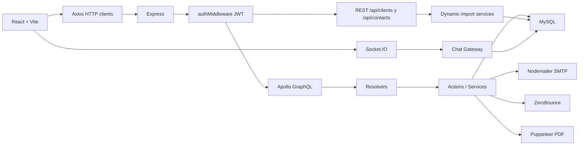

# Manual completo de Business Control

Este documento explica el proyecto de principio a fin: que problema resuelve,
como se ejecuta, como fluye la informacion, que tablas usa, que hace cada
modulo y que puntos tecnicos debes vigilar para mantenerlo.

## 1. Vision general

Business Control es una plataforma full stack para administracion comercial y
operativa. Tiene dos superficies:

- Backoffice interno: usado por `ADMIN`, `VENTAS` y `SOPORTE`.
- Portal del cliente: usado por contactos con acceso `CONTACT_PORTAL`.

El backoffice administra clientes, contactos, productos, cotizaciones,
servicios, polizas y soporte. El portal permite al contacto consultar sus
servicios, ver cotizaciones, solicitar nuevas cotizaciones y abrir chats de
soporte.

La arquitectura principal es:



## 2. Stack tecnologico

- Frontend: React 18, Vite 5, React Router 6, Tailwind CSS, SweetAlert2,
  TanStack Table, Socket.IO Client, XLSX, jsPDF.
- Backend: Node.js ESM, Express 4, Apollo Server 4, GraphQL 16, MySQL 8 con
  `mysql2/promise`, Socket.IO, Nodemailer, Puppeteer, Axios, XLSX.
- Seguridad: JWT para sesion, bcrypt para hashes de password, control de roles
  en resolvers y rutas REST.
- Persistencia: MySQL relacional con tablas para roles, usuarios, clientes,
  contactos, productos, historial de precios, cotizaciones, items, servicios,
  polizas y chat.

## 3. Estructura de carpetas

```text
business-control/
  README.md
  docs/
    ARCHITECTURE.md
    FUNCTIONS_GUIDE.md
    MANUAL_COMPLETO.md
  backend/
    src/
      index.js
      config/
      middlewares/
      graphql/
        schema.graphql
        resolvers/
        actions/
      routes/
      services/
      chat/
      utils/
    sql/
    migrations/
    scripts/
  frontend/
    src/
      main.jsx
      App.jsx
      routes.jsx
      context/
      actionsAPI/
      components/
      pages/
      styles/
```

Archivos de entrada clave:

- Backend: `backend/src/index.js`
- Esquema API: `backend/src/graphql/schema.graphql`
- Frontend: `frontend/src/main.jsx`
- Rutas UI: `frontend/src/routes.jsx`
- Base SQL recomendada: `backend/sql/workbench_full_setup.sql`

## 4. Como arrancar el proyecto

Requisitos:

- Node.js 18+
- MySQL 8+
- npm o pnpm
- Variables de entorno configuradas

Backend:

```bash
cd backend
npm install
npm run dev
```

Frontend:

```bash
cd frontend
npm install
npm run dev
```

URLs locales:

- Frontend: `http://localhost:5173`
- GraphQL: `http://localhost:4000/graphql`
- Health check: `http://localhost:4000/health`
- Socket.IO: `ws://localhost:4000`

Variables backend importantes:

```env
PORT=4000
JWT_SECRET=super-secret-change-me
JWT_EXPIRES_IN=7d
MYSQL_HOST=localhost
MYSQL_PORT=3306
MYSQL_USER=root
MYSQL_PASSWORD=tu_password
MYSQL_DATABASE=business_control
CORS_ORIGIN=http://localhost:5173
SMTP_HOST=smtp.gmail.com
SMTP_PORT=465
SMTP_USER=tu_correo
SMTP_PASS=tu_password_o_app_password
ZERO_BOUNCE_API_KEY=
ZEROBOUNCE_API_KEY=
```

Frontend:

```env
VITE_API_URL=http://localhost:4000/graphql
```

Nota: el codigo actual tiene dos nombres historicos para ZeroBounce:
`ZERO_BOUNCE_API_KEY` en `config/env.js` y `ZEROBOUNCE_API_KEY` en
`utils/zerobounce.js`. Define ambas para evitar sorpresas.

## 5. Base de datos y modelo mental

Tablas principales:

- `roles`: roles internos.
- `users`: usuarios del backoffice.
- `clients`: empresas cliente.
- `clients_column_meta`: orden y etiquetas de columnas dinamicas de clientes.
- `client_contacts`: contactos de clientes y acceso al portal.
- `products`: catalogo global o especifico por cliente.
- `product_price_history`: historial de cambios de precio.
- `quotes`: cotizaciones y solicitudes del portal.
- `quote_items`: partidas de una cotizacion.
- `contact_products`: servicios/licencias asignadas a contactos.
- `services`: espejo especializado de `contact_products` para servicios.
- `policies`: espejo especializado de `contact_products` para polizas.
- `support_conversations`: conversaciones de soporte.
- `support_messages`: mensajes de chat.

Relaciones principales:

- Un rol tiene muchos usuarios.
- Un cliente tiene muchos contactos.
- Un producto puede ser global (`client_id` nulo) o pertenecer a un cliente.
- Una cotizacion pertenece a un cliente, puede tener contacto y vendedor.
- Una cotizacion tiene muchos items.
- Un contacto tiene muchos `contact_products`.
- Un `contact_product` puede tener fila espejo en `services` o `policies`.
- Un chat pertenece a un contacto y puede tener agente asignado.

## 6. Backend de punta a punta

`backend/src/index.js` crea Express, crea un servidor HTTP compartido con
Socket.IO, aplica CORS, JSON body parsing y `authMiddleware`, monta REST y luego
monta Apollo en `/graphql`.

Pipeline real:

1. Llega request HTTP.
2. CORS valida origen contra `env.CORS_ORIGIN`.
3. Express parsea JSON hasta 50 MB.
4. `authMiddleware` busca `Authorization: Bearer <token>`.
5. Si el token es valido, lo decodifica y guarda `req.user`.
6. Las rutas REST leen `req.user`.
7. Apollo pasa `{ user: req.user }` al contexto GraphQL.
8. Query/mutation entra a resolver.
9. Resolver valida rol con `requireRoles`.
10. Resolver delega a una action.
11. Action consulta MySQL o usa integraciones.
12. El resultado vuelve al frontend.

La regla de oro del backend es:

```text
schema.graphql -> resolver -> action/service -> MySQL/integracion
```

## 7. Autenticacion y roles

Backoffice:

1. `Login.jsx` llama `loginApi`.
2. `loginApi` ejecuta mutation `login`.
3. `loginAction` busca usuario activo por email.
4. bcrypt compara password con `password_hash`.
5. Se firma JWT con `{ userId, role }`.
6. Frontend guarda token en `localStorage` como `bc_token`.
7. `AuthContext` llama `meApi` para hidratar usuario al recargar.

Portal:

1. `PortalLogin.jsx` llama `loginContactApi`.
2. `loginContactAction` busca contactos con `has_portal_access = 1`.
3. bcrypt compara `portal_password_hash`.
4. Se firma JWT con `{ contactId, clientId, role: "CONTACT_PORTAL" }`.
5. Portal guarda token en `sessionStorage` como `bc_portal_token`.
6. Tambien guarda snapshot del contacto en `bc_portal_contact`.

Roles efectivos:

- `ADMIN`: casi todo, incluyendo borrar productos y servicios asignados.
- `VENTAS`: clientes, contactos, productos, cotizaciones.
- `SOPORTE`: acceso a secciones de productos, polizas, historial y soporte en
  frontend, aunque varias operaciones backend exigen ADMIN/VENTAS.
- `CONTACT_PORTAL`: portal de cliente, cotizaciones publicadas y chat.

## 8. Frontend de punta a punta

`frontend/src/main.jsx` registra locale espanol para `react-datepicker`, carga
fuentes, CSS global, `AuthProvider`, `ThemeProvider` y renderiza `App`.

`App.jsx` solo renderiza `routes.jsx`.

`routes.jsx` divide la app en:

- Publicas: `/login`, `/register`, `/roles`.
- Portal: `/portal/login`, `/portal/dashboard`, `/portal/quotes`,
  `/portal/catalog`, `/portal/support`.
- Privadas backoffice: `/`, `/clientes`, `/productos`,
  `/registrar-productos`, `/polizas`, `/cotizaciones/*`, `/soporte`.

Proteccion:

- `ProtectedRoute` exige usuario en `AuthContext`.
- `RoleGate` exige que `user.role.name` este en una lista permitida.
- `MasterPasswordGate` protege visualmente registro.
- `RolesAccessGate` protege gestion de roles en frontend.

Clientes HTTP:

- `axiosClient`: usa `VITE_API_URL`, agrega token de backoffice o portal segun
  si la ruta empieza con `/portal`.
- `portalAxiosClient`: siempre usa `bc_portal_token`.

## 9. Modulo clientes

Backoffice lista clientes en `Clients.jsx`. Para ADMIN/VENTAS la pantalla de
inicio (`Home.jsx`) muestra directamente clientes.

Lectura normal:

- Frontend: `listClientsApi`, `getClientApi`, `searchClientsApi`.
- GraphQL: queries `clients`, `client`, `searchClients`.
- Backend: acciones `listClientsAction`, `getClientAction`,
  `searchClientsAction`.

Escritura:

- `createClient`, `bulkCreateClients`, `updateClient`, `deleteClient`.
- Todas exigen `ADMIN` o `VENTAS`.
- `deleteClientAction` limpia datos relacionados dentro de transaccion.

Vista dinamica:

- REST `GET /api/clients/dynamic` devuelve columnas reales de la tabla.
- REST `PUT /api/clients/:id/dynamic` actualiza columnas permitidas.
- `clientsDynamic.service.js` oculta campos sensibles y evita actualizar campos
  de sistema.

Importacion desde Drive:

1. Usuario pega URL de Google Drive o Google Sheets.
2. Backend intenta construir URLs de descarga/export.
3. Descarga XLSX con Axios.
4. Lee primera hoja con `xlsx`.
5. Toma primera fila como headers.
6. Mapea headers a columnas por alias, coincidencia exacta, fuzzy o posicion.
7. Si hay headers no mapeados, crea columnas `TEXT` en `clients`.
8. Inserta filas por lotes de 200.
9. Guarda etiquetas/orden en `clients_column_meta`.

Este modulo es muy potente, pero altera el esquema de BD en runtime.

## 10. Modulo contactos

Los contactos viven en `client_contacts`.

Operaciones:

- `contactsByClient(client_id)`: lista contactos por cliente.
- `contact(id)`: ADMIN/VENTAS pueden ver cualquiera; CONTACT_PORTAL solo el
  contacto propio.
- `createContact`, `bulkCreateContacts`, `updateContact`, `deleteContact`.

`deleteContactAction` no borra fisicamente: marca `is_active = 0`.

Acceso portal:

- `updateContactAction` puede activar `has_portal_access`.
- Si recibe `portal_password`, lo hashea y guarda `portal_password_hash`.
- Si el contacto tiene email, envia correo de bienvenida en segundo plano.
- Si no hay SMTP, `sendEmail` simula envio y lo deja en consola.

Contactos tambien tienen importacion dinamica:

- REST `GET /api/contacts/client/:clientId/dynamic`.
- REST `PUT /api/contacts/:id/dynamic`.
- REST `POST /api/contacts/import-drive`.
- El flujo es similar al de clientes, pero siempre inyecta `client_id`.

## 11. Modulo productos

Los productos se guardan en `products`.

Campos importantes:

- `client_id`: nulo si es global; definido si pertenece a un cliente.
- `name`, `category`, `current_price`, `description`, `users_count`.
- `product_type`: `PRODUCT`, `SERVICE` o `POLICY`.

Lectura:

- `products(client_id)` devuelve globales y, si hay cliente, tambien los de ese
  cliente.
- En portal, `portalProducts` fuerza `client_id` desde el token.
- `product(id)` hidrata `price_history`.
- `searchProducts(q, client_id)` busca por nombre o categoria.

Escritura:

- `createProduct`: ADMIN/VENTAS.
- `updateProduct`: ADMIN/VENTAS.
- `updateProductPrice`: ADMIN/VENTAS y crea historial.
- `deleteProduct`: solo ADMIN.
- `clearProductPriceHistory`: ADMIN/VENTAS.

Detalle importante: `createProductAction` intenta crear la columna
`product_type` automaticamente si falta.

## 12. Modulo servicios y polizas

El sistema maneja servicios/licencias asignadas mediante `contact_products`.
Cuando el producto parece servicio o poliza, tambien crea una fila espejo:

- Categorias/nombres con `servicio` -> tabla `services`.
- Categorias/nombres con `poliza` -> tabla `policies`.

Esto ocurre en:

- `createContactProductAction`
- `resolveQuoteRequestAction`

La query `policies` no solo lista polizas: devuelve servicios y polizas para el
modulo "Servicios y Polizas". Tambien incluye productos tipo servicio/poliza
que aun no estan asignados, con ids prefijados como `product-123`.

Estados calculados:

- `ACTIVE`: vigente.
- `EXPIRING_SOON`: vence en 30 dias o menos.
- `EXPIRED`: ya vencio.
- `CANCELLED`: cancelado manualmente.

## 13. Modulo cotizaciones

Tablas:

- `quotes`
- `quote_items`

Estados:

- `REQUESTED`: solicitud creada desde portal.
- `PENDING`: cotizacion operativa.
- `SENT`: enviada.
- `ACCEPTED`: aceptada.
- `REJECTED`: rechazada.

Crear cotizacion en backoffice:

1. `CreateQuote.jsx` arma cliente, contacto, items, folio, notas y descuentos.
2. `createQuoteApi` llama mutation `createQuote`.
3. `createQuoteAction` valida productos.
4. Calcula cantidad, precio base, descuento, precio final y total.
5. Inserta `quotes` con status `PENDING`.
6. Inserta `quote_items`.
7. Devuelve cotizacion basica; relaciones se resuelven por resolvers.

Importante: en el codigo actual `createQuoteAction` no genera
`contact_products` automaticamente. La generacion automatica de servicios al
resolver solicitudes ocurre en `resolveQuoteRequestAction`.

Solicitar cotizacion desde portal:

1. `PortalCatalog.jsx` carga `portalProducts`.
2. El contacto agrega productos a carrito.
3. `requestQuoteApi` ejecuta mutation `requestQuote`.
4. `requestQuoteAction` crea `quotes.status = REQUESTED`.
5. Inserta items con precio de catalogo y descuento 0.
6. Marca `is_sent_to_client_portal = 1`.

Notificaciones:

- `Sidebar` consulta conteo cada 30 segundos.
- `Topbar` consulta solicitudes no leidas cada 10 segundos.
- Notificaciones vienen de `unreadQuoteRequests`.
- Clic en notificacion abre `/cotizaciones/nueva?request_id=<id>`.

Resolver solicitud:

1. Backoffice abre `CreateQuote.jsx` con `request_id`.
2. El frontend carga la solicitud y sus items.
3. Usuario ajusta folio, precios, descuentos y contacto.
4. `resolveQuoteRequestApi` llama mutation `resolveQuoteRequest`.
5. Backend verifica que la quote siga en `REQUESTED`.
6. Recalcula total.
7. Actualiza la misma quote a `PENDING`.
8. Borra e inserta items finales.
9. Si hay contacto, genera `contact_products`.
10. Si el producto es servicio/poliza, crea fila en `services` o `policies`.

Enviar cotizacion por correo:

1. `sendQuoteEmail` exige ADMIN/VENTAS.
2. Busca quote, cliente, usuario, contacto e items.
3. Valida email con ZeroBounce.
4. Si frontend mando `pdf_base64`, usa ese PDF.
5. Si no, genera HTML y PDF con Puppeteer.
6. Envia correo con Nodemailer.
7. Si no hay credenciales SMTP, lo simula.

Publicar en portal:

- `toggleQuotePortal(id, access, contact_id)` marca si la quote se ve en portal.
- `listPortalQuotesAction(client_id)` devuelve solo cotizaciones visibles y no
  eliminadas.

Borrado:

- `deleteQuoteAction` y `deletePortalQuoteAction` hacen soft delete con
  `is_deleted_admin = 1`.

## 14. Modulo portal del cliente

Layout:

- `PortalLayout.jsx` lee `bc_portal_token` y `bc_portal_contact`.
- Si faltan, manda a `/portal/login`.
- Provee `contact` por `Outlet context`.

Pantallas:

- `PortalDashboard`: muestra servicios/polizas del contacto, filtra por estado
  y texto, y consulta cotizaciones.
- `PortalQuotes`: lista cotizaciones publicadas, permite borrar o editar
  solicitudes pendientes/solicitadas.
- `PortalCatalog`: lista productos visibles y permite solicitar cotizacion.
- `PortalSupport`: chat en tiempo real.

Seguridad portal:

- Backend no confia en `contactId` enviado por UI para datos sensibles.
- Para productos y cotizaciones usa `clientId` y `contactId` del JWT.
- Query `contact(id)` solo permite al portal consultar su propio contacto.

## 15. Modulo chat de soporte

El chat usa Socket.IO sobre el mismo servidor HTTP de Express.

Autenticacion:

1. Cliente Socket.IO manda token en `handshake.auth.token`.
2. Gateway verifica JWT.
3. Si es `ADMIN`, `VENTAS` o `SOPORTE`, entra al room `agents`.
4. Si es contacto portal, opera como cliente.

Rooms:

- Cada conversacion usa `conv:<id>`.
- Todos los agentes comparten room `agents` para cola de espera.

Eventos principales:

- `conversation:start`: contacto inicia chat.
- `conversation:take`: agente toma chat en espera.
- `conversation:join`: alguien se une a conversacion existente.
- `message:send`: envia mensaje.
- `message:delete`: elimina mensaje.
- `messages:history`: carga historial.
- `messages:seen`: marca visto.
- `conversation:close`: cierra chat.
- `conversation:rate`: califica chat.
- `queue:list`: agente pide cola.
- `typing:start` y `typing:stop`: indicadores de escritura.

Persistencia:

- `support_conversations` guarda contacto, agente, estado y rating.
- `support_messages` guarda mensajes `CLIENT`, `AGENT` o `SYSTEM`.

## 16. API GraphQL resumida

Queries:

- `me`
- `roles`
- `clients`, `client`, `searchClients`
- `contactsByClient`, `contact`
- `products`, `portalProducts`, `product`, `searchProducts`
- `policies`
- `quotes`, `quote`, `quotesByClient`
- `pendingQuoteRequestsCount`, `unreadQuoteRequests`

Mutations:

- Auth: `login`, `loginContact`, `registerUser`
- Clientes: `createClient`, `bulkCreateClients`, `updateClient`, `deleteClient`
- Contactos: `createContact`, `bulkCreateContacts`, `updateContact`,
  `deleteContact`
- Servicios asignados: `createContactProduct`, `deleteContactProduct`,
  `updateContactProductDates`
- Productos: `createProduct`, `updateProduct`, `deleteProduct`,
  `updateProductPrice`, `clearProductPriceHistory`
- Cotizaciones: `createQuote`, `resolveQuoteRequest`, `deleteQuote`,
  `sendQuoteEmail`, `toggleQuotePortal`, `markQuoteNotificationRead`,
  `requestQuote`, `deletePortalQuote`, `updatePortalQuoteRequest`
- Roles: `createRole`, `deleteRole`

## 17. REST resumido

- `GET /health`: verifica servidor.
- `GET /api/clients/dynamic`: columnas y filas dinamicas de clientes.
- `PUT /api/clients/:id/dynamic`: actualiza cliente dinamico.
- `POST /api/clients/import-drive`: importa clientes desde Drive.
- `GET /api/contacts/client/:clientId/dynamic`: contactos dinamicos.
- `PUT /api/contacts/:id/dynamic`: actualiza contacto dinamico.
- `POST /api/contacts/import-drive`: importa contactos desde Drive.

Todas las rutas REST dinamicas exigen `ADMIN` o `VENTAS`.

## 18. Patrones de desarrollo

Para agregar una nueva entidad backend:

1. Agrega tipos e inputs en `schema.graphql`.
2. Crea actions en `graphql/actions/<dominio>_actions`.
3. Crea resolvers query/mutation.
4. Exportalos desde los `index.js`.
5. Agrega tablas o migraciones SQL.
6. Crea helpers frontend en `actionsAPI`.
7. Crea pagina o componente.
8. Protege ruta con `ProtectedRoute` y `RoleGate`.

Para agregar una operacion sobre entidad existente:

1. Define si sera GraphQL o REST.
2. Si es negocio normal, usa GraphQL.
3. Si es importacion o manejo dinamico de tablas, usa REST.
4. Valida rol en backend, no solo en frontend.
5. Usa transaccion si toca multiples tablas.
6. Devuelve errores claros con `throw new Error`.

## 19. Puntos criticos y riesgos actuales

- `registerUserAction` crea o actualiza un usuario por rol, no multiples
  usuarios por rol. Si registras otro ADMIN, reemplaza credenciales del ADMIN
  existente de ese rol.
- `createRole` y `deleteRole` no validan rol en backend actualmente.
- `MasterPasswordGate` es una barrera de frontend, no seguridad real de API.
- El token backoffice vive en `localStorage`; hay riesgo si ocurre XSS.
- Las importaciones dinamicas hacen `ALTER TABLE` en runtime.
- `sendQuoteEmailAction` ejecuta Puppeteer dentro del request.
- Las notificaciones usan polling, no push.
- Hay resolvers con consultas por relacion que pueden crear N+1 a gran volumen.
- `product_type` e `is_deleted_admin` son columnas que el codigo usa, pero no
  todos los scripts SQL historicos las incluyen. Verifica esquema antes de
  desplegar.
- `workbench_full_setup.sql` es el mejor punto de partida, pero aun conviene
  ejecutar scripts de compatibilidad si la BD viene de una version anterior.

## 20. Ruta mental para entender el proyecto al 100%

Lee en este orden:

1. `README.md`: objetivo, arranque y mapa general.
2. `docs/ARCHITECTURE.md`: arquitectura y flujos.
3. `docs/FUNCTIONS_GUIDE.md`: contrato de API.
4. `backend/src/index.js`: pipeline real del servidor.
5. `backend/src/graphql/schema.graphql`: contrato completo.
6. `backend/src/graphql/resolvers`: autorizacion y adaptadores.
7. `backend/src/graphql/actions`: reglas de negocio reales.
8. `backend/src/services`: importaciones dinamicas.
9. `backend/src/chat`: soporte en tiempo real.
10. `frontend/src/routes.jsx`: mapa funcional de pantallas.
11. `frontend/src/actionsAPI`: como consume API el frontend.
12. `frontend/src/pages`: comportamiento visible por modulo.
13. `backend/sql/workbench_full_setup.sql`: modelo de datos inicial.

Si entiendes esa ruta, entiendes el sistema completo: entrada UI, seguridad,
API, reglas de negocio, base de datos, integraciones y puntos operativos.
