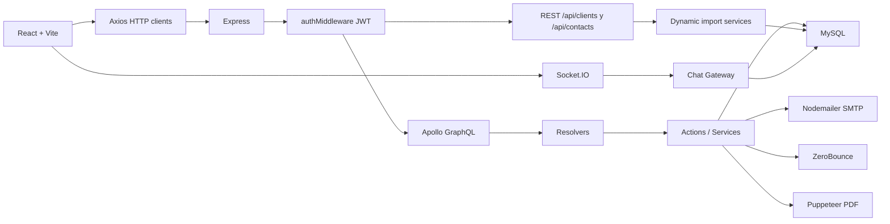
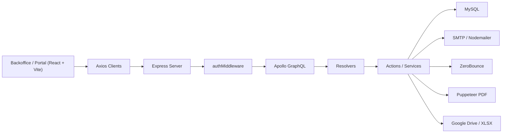

# Manual completo de Business Control

Este documento explica el proyecto de principio a fin: que problema resuelve,
como se ejecuta, como fluye la informacion, que tablas usa, que hace cada
modulo y que puntos tecnicos debes vigilar para mantenerlo.

## 1. Vision general

Business Control es una plataforma full stack para administracion comercial y
operativa. Tiene dos superficies:

- Backoffice interno: usado por `ADMIN`, `VENTAS` y `SOPORTE`.
- Portal del cliente: usado por contactos con acceso `CONTACT_PORTAL`.

El backoffice administra clientes, contactos, productos, cotizaciones,
servicios, polizas y soporte. El portal permite al contacto consultar sus
servicios, ver cotizaciones, solicitar nuevas cotizaciones y abrir chats de
soporte.

La arquitectura principal es:


```mermaid
flowchart LR
  UI["React + Vite"] --> API["Axios HTTP clients"]
  API --> EX["Express"]
  EX --> AUTH["authMiddleware JWT"]
  AUTH --> GQL["Apollo GraphQL"]
  AUTH --> REST["REST /api/clients y /api/contacts"]
  GQL --> RES["Resolvers"]
  RES --> ACT["Actions / Services"]
  REST --> SVC["Dynamic import services"]
  ACT --> DB["MySQL"]
  SVC --> DB
  ACT --> SMTP["Nodemailer SMTP"]
  ACT --> ZB["ZeroBounce"]
  ACT --> PDF["Puppeteer PDF"]
  UI --> WS["Socket.IO"]
  WS --> CHAT["Chat Gateway"]
  CHAT --> DB
```

## 2. Stack tecnologico

- Frontend: React 18, Vite 5, React Router 6, Tailwind CSS, SweetAlert2,
  TanStack Table, Socket.IO Client, XLSX, jsPDF.
- Backend: Node.js ESM, Express 4, Apollo Server 4, GraphQL 16, MySQL 8 con
  `mysql2/promise`, Socket.IO, Nodemailer, Puppeteer, Axios, XLSX.
- Seguridad: JWT para sesion, bcrypt para hashes de password, control de roles
  en resolvers y rutas REST.
- Persistencia: MySQL relacional con tablas para roles, usuarios, clientes,
  contactos, productos, historial de precios, cotizaciones, items, servicios,
  polizas y chat.

## 3. Estructura de carpetas

```text
business-control/
  README.md
  docs/
    ARCHITECTURE.md
    FUNCTIONS_GUIDE.md
    MANUAL_COMPLETO.md
  backend/
    src/
      index.js
      config/
      middlewares/
      graphql/
        schema.graphql
        resolvers/
        actions/
      routes/
      services/
      chat/
      utils/
    sql/
    migrations/
    scripts/
  frontend/
    src/
      main.jsx
      App.jsx
      routes.jsx
      context/
      actionsAPI/
      components/
      pages/
      styles/
```

Archivos de entrada clave:

- Backend: `backend/src/index.js`
- Esquema API: `backend/src/graphql/schema.graphql`
- Frontend: `frontend/src/main.jsx`
- Rutas UI: `frontend/src/routes.jsx`
- Base SQL recomendada: `backend/sql/baseline.sql`

## 4. Como arrancar el proyecto

Requisitos:

- Node.js 18+
- MySQL 8+
- npm o pnpm
- Variables de entorno configuradas

Backend:

```bash
cd backend
npm install
npm run dev
```

Frontend:

```bash
cd frontend
npm install
npm run dev
```

URLs locales:

- Frontend: `http://localhost:5173`
- GraphQL: `http://localhost:4000/graphql`
- Health check: `http://localhost:4000/health`
- Socket.IO: `ws://localhost:4000`

Variables backend importantes:

```env
PORT=4000
JWT_SECRET=super-secret-change-me
JWT_EXPIRES_IN=7d
MYSQL_HOST=localhost
MYSQL_PORT=3306
MYSQL_USER=root
MYSQL_PASSWORD=tu_password
MYSQL_DATABASE=business_control
CORS_ORIGIN=http://localhost:5173
SMTP_HOST=smtp.gmail.com
SMTP_PORT=465
SMTP_USER=tu_correo
SMTP_PASS=tu_password_o_app_password
ZERO_BOUNCE_API_KEY=
ZEROBOUNCE_API_KEY=
```

Frontend:

```env
VITE_API_URL=http://localhost:4000/graphql
```

Nota: el codigo actual tiene dos nombres historicos para ZeroBounce:
`ZERO_BOUNCE_API_KEY` en `config/env.js` y `ZEROBOUNCE_API_KEY` en
`utils/zerobounce.js`. Define ambas para evitar sorpresas.

## 5. Base de datos y modelo mental

Tablas principales:

- `roles`: roles internos.
- `users`: usuarios del backoffice.
- `clients`: empresas cliente.
- `clients_column_meta`: orden y etiquetas de columnas dinamicas de clientes.
- `client_contacts`: contactos de clientes y acceso al portal.
- `products`: catalogo global o especifico por cliente.
- `product_price_history`: historial de cambios de precio.
- `quotes`: cotizaciones y solicitudes del portal.
- `quote_items`: partidas de una cotizacion.
- `contact_products`: servicios/licencias asignadas a contactos.
- `services`: espejo especializado de `contact_products` para servicios.
- `policies`: espejo especializado de `contact_products` para polizas.
- `support_conversations`: conversaciones de soporte.
- `support_messages`: mensajes de chat.

Relaciones principales:

- Un rol tiene muchos usuarios.
- Un cliente tiene muchos contactos.
- Un producto puede ser global (`client_id` nulo) o pertenecer a un cliente.
- Una cotizacion pertenece a un cliente, puede tener contacto y vendedor.
- Una cotizacion tiene muchos items.
- Un contacto tiene muchos `contact_products`.
- Un `contact_product` puede tener fila espejo en `services` o `policies`.
- Un chat pertenece a un contacto y puede tener agente asignado.

## 6. Backend de punta a punta

`backend/src/index.js` crea Express, crea un servidor HTTP compartido con
Socket.IO, aplica CORS, JSON body parsing y `authMiddleware`, monta REST y luego
monta Apollo en `/graphql`.

Pipeline real:

1. Llega request HTTP.
2. CORS valida origen contra `env.CORS_ORIGIN`.
3. Express parsea JSON hasta 50 MB.
4. `authMiddleware` busca `Authorization: Bearer <token>`.
5. Si el token es valido, lo decodifica y guarda `req.user`.
6. Las rutas REST leen `req.user`.
7. Apollo pasa `{ user: req.user }` al contexto GraphQL.
8. Query/mutation entra a resolver.
9. Resolver valida rol con `requireRoles`.
10. Resolver delega a una action.
11. Action consulta MySQL o usa integraciones.
12. El resultado vuelve al frontend.

La regla de oro del backend es:

```text
schema.graphql -> resolver -> action/service -> MySQL/integracion
```

## 7. Autenticacion y roles

Backoffice:

1. `Login.jsx` llama `loginApi`.
2. `loginApi` ejecuta mutation `login`.
3. `loginAction` busca usuario activo por email.
4. bcrypt compara password con `password_hash`.
5. Se firma JWT con `{ userId, role }`.
6. Frontend guarda token en `localStorage` como `bc_token`.
7. `AuthContext` llama `meApi` para hidratar usuario al recargar.

Portal:

1. `PortalLogin.jsx` llama `loginContactApi`.
2. `loginContactAction` busca contactos con `has_portal_access = 1`.
3. bcrypt compara `portal_password_hash`.
4. Se firma JWT con `{ contactId, clientId, role: "CONTACT_PORTAL" }`.
5. Portal guarda token en `sessionStorage` como `bc_portal_token`.
6. Tambien guarda snapshot del contacto en `bc_portal_contact`.

Roles efectivos:

- `ADMIN`: casi todo, incluyendo borrar productos y servicios asignados.
- `VENTAS`: clientes, contactos, productos, cotizaciones.
- `SOPORTE`: acceso a secciones de productos, polizas, historial y soporte en
  frontend, aunque varias operaciones backend exigen ADMIN/VENTAS.
- `CONTACT_PORTAL`: portal de cliente, cotizaciones publicadas y chat.

## 8. Frontend de punta a punta

`frontend/src/main.jsx` registra locale espanol para `react-datepicker`, carga
fuentes, CSS global, `AuthProvider`, `ThemeProvider` y renderiza `App`.

`App.jsx` solo renderiza `routes.jsx`.

`routes.jsx` divide la app en:

- Publicas: `/login`, `/register`, `/roles`.
- Portal: `/portal/login`, `/portal/dashboard`, `/portal/quotes`,
  `/portal/catalog`, `/portal/support`.
- Privadas backoffice: `/`, `/clientes`, `/productos`,
  `/registrar-productos`, `/polizas`, `/cotizaciones/*`, `/soporte`.

Proteccion:

- `ProtectedRoute` exige usuario en `AuthContext`.
- `RoleGate` exige que `user.role.name` este en una lista permitida.
- `MasterPasswordGate` protege visualmente registro.
- `RolesAccessGate` protege gestion de roles en frontend.

Clientes HTTP:

- `axiosClient`: usa `VITE_API_URL`, agrega token de backoffice o portal segun
  si la ruta empieza con `/portal`.
- `portalAxiosClient`: siempre usa `bc_portal_token`.

## 9. Modulo clientes

Backoffice lista clientes en `Clients.jsx`. Para ADMIN/VENTAS la pantalla de
inicio (`Home.jsx`) muestra directamente clientes.

Lectura normal:

- Frontend: `listClientsApi`, `getClientApi`, `searchClientsApi`.
- GraphQL: queries `clients`, `client`, `searchClients`.
- Backend: acciones `listClientsAction`, `getClientAction`,
  `searchClientsAction`.

Escritura:

- `createClient`, `bulkCreateClients`, `updateClient`, `deleteClient`.
- Todas exigen `ADMIN` o `VENTAS`.
- `deleteClientAction` limpia datos relacionados dentro de transaccion.

Vista dinamica:

- REST `GET /api/clients/dynamic` devuelve columnas reales de la tabla.
- REST `PUT /api/clients/:id/dynamic` actualiza columnas permitidas.
- `clientsDynamic.service.js` oculta campos sensibles y evita actualizar campos
  de sistema.

Importacion desde Drive:

1. Usuario pega URL de Google Drive o Google Sheets.
2. Backend intenta construir URLs de descarga/export.
3. Descarga XLSX con Axios.
4. Lee primera hoja con `xlsx`.
5. Toma primera fila como headers.
6. Mapea headers a columnas por alias, coincidencia exacta, fuzzy o posicion.
7. Si hay headers no mapeados, crea columnas `TEXT` en `clients`.
8. Inserta filas por lotes de 200.
9. Guarda etiquetas/orden en `clients_column_meta`.

Este modulo es muy potente, pero altera el esquema de BD en runtime.

## 10. Modulo contactos

Los contactos viven en `client_contacts`.

Operaciones:

- `contactsByClient(client_id)`: lista contactos por cliente.
- `contact(id)`: ADMIN/VENTAS pueden ver cualquiera; CONTACT_PORTAL solo el
  contacto propio.
- `createContact`, `bulkCreateContacts`, `updateContact`, `deleteContact`.

`deleteContactAction` no borra fisicamente: marca `is_active = 0`.

Acceso portal:

- `updateContactAction` puede activar `has_portal_access`.
- Si recibe `portal_password`, lo hashea y guarda `portal_password_hash`.
- Si el contacto tiene email, envia correo de bienvenida en segundo plano.
- Si no hay SMTP, `sendEmail` simula envio y lo deja en consola.

Contactos tambien tienen importacion dinamica:

- REST `GET /api/contacts/client/:clientId/dynamic`.
- REST `PUT /api/contacts/:id/dynamic`.
- REST `POST /api/contacts/import-drive`.
- El flujo es similar al de clientes, pero siempre inyecta `client_id`.

## 11. Modulo productos

Los productos se guardan en `products`.

Campos importantes:

- `client_id`: nulo si es global; definido si pertenece a un cliente.
- `name`, `category`, `current_price`, `description`, `users_count`.
- `product_type`: `PRODUCT`, `SERVICE` o `POLICY`.

Lectura:

- `products(client_id)` devuelve globales y, si hay cliente, tambien los de ese
  cliente.
- En portal, `portalProducts` fuerza `client_id` desde el token.
- `product(id)` hidrata `price_history`.
- `searchProducts(q, client_id)` busca por nombre o categoria.

Escritura:

- `createProduct`: ADMIN/VENTAS.
- `updateProduct`: ADMIN/VENTAS.
- `updateProductPrice`: ADMIN/VENTAS y crea historial.
- `deleteProduct`: solo ADMIN.
- `clearProductPriceHistory`: ADMIN/VENTAS.

Detalle importante: `createProductAction` intenta crear la columna
`product_type` automaticamente si falta.

## 12. Modulo servicios y polizas

El sistema maneja servicios/licencias asignadas mediante `contact_products`.
Cuando el producto parece servicio o poliza, tambien crea una fila espejo:

- Categorias/nombres con `servicio` -> tabla `services`.
- Categorias/nombres con `poliza` -> tabla `policies`.

Esto ocurre en:

- `createContactProductAction`
- `resolveQuoteRequestAction`

La query `policies` no solo lista polizas: devuelve servicios y polizas para el
modulo "Servicios y Polizas". Tambien incluye productos tipo servicio/poliza
que aun no estan asignados, con ids prefijados como `product-123`.

Estados calculados:

- `ACTIVE`: vigente.
- `EXPIRING_SOON`: vence en 30 dias o menos.
- `EXPIRED`: ya vencio.
- `CANCELLED`: cancelado manualmente.

## 13. Modulo cotizaciones

Tablas:

- `quotes`
- `quote_items`

Estados:

- `SOLICITADA`: solicitud creada desde portal.
- `PENDIENTE`: cotizacion operativa.
- `ENVIADA`: enviada.
- `ACEPTADA`: aceptada.
- `RECHAZADA`: rechazada.

Crear cotizacion en backoffice:

1. `CreateQuote.jsx` arma cliente, contacto, items, folio, notas y descuentos.
2. `createQuoteApi` llama mutation `createQuote`.
3. `createQuoteAction` valida productos.
4. Calcula cantidad, precio base, descuento, precio final y total.
5. Inserta `quotes` con status `PENDIENTE`.
6. Inserta `quote_items`.
7. Devuelve cotizacion basica; relaciones se resuelven por resolvers.

Importante: en el codigo actual `createQuoteAction` no genera
`contact_products` automaticamente. La generacion automatica de servicios al
resolver solicitudes ocurre en `resolveQuoteRequestAction`.

Solicitar cotizacion desde portal:

1. `PortalCatalog.jsx` carga `portalProducts`.
2. El contacto agrega productos a carrito.
3. `requestQuoteApi` ejecuta mutation `requestQuote`.
4. `requestQuoteAction` crea `quotes.status = SOLICITADA`.
5. Inserta items con precio de catalogo y descuento 0.
6. Marca `is_sent_to_client_portal = 1`.

Notificaciones:

- `Sidebar` consulta conteo cada 30 segundos.
- `Topbar` consulta solicitudes no leidas cada 10 segundos.
- Notificaciones vienen de `unreadQuoteRequests`.
- Clic en notificacion abre `/cotizaciones/nueva?request_id=<id>`.

Resolver solicitud:

1. Backoffice abre `CreateQuote.jsx` con `request_id`.
2. El frontend carga la solicitud y sus items.
3. Usuario ajusta folio, precios, descuentos y contacto.
4. `resolveQuoteRequestApi` llama mutation `resolveQuoteRequest`.
5. Backend verifica que la quote siga en `SOLICITADA`.
6. Recalcula total.
7. Actualiza la misma quote a `ACEPTADA`.
8. Borra e inserta items finales.
9. Si hay contacto, genera `contact_products`.
10. Si el producto es servicio/poliza, crea fila en `services` o `policies`.

Enviar cotizacion por correo:

1. `sendQuoteEmail` exige ADMIN/VENTAS.
2. Busca quote, cliente, usuario, contacto e items.
3. Valida email con ZeroBounce.
4. Si frontend mando `pdf_base64`, usa ese PDF.
5. Si no, genera HTML y PDF con Puppeteer.
6. Envia correo con Nodemailer.
7. Si no hay credenciales SMTP, lo simula.

Publicar en portal:

- `toggleQuotePortal(id, access, contact_id)` marca si la quote se ve en portal.
- `listPortalQuotesAction(client_id)` devuelve solo cotizaciones visibles y no
  eliminadas.

Borrado:

- `deleteQuoteAction` y `deletePortalQuoteAction` hacen soft delete con
  `is_deleted_admin = 1`.

## 14. Modulo portal del cliente

Layout:

- `PortalLayout.jsx` lee `bc_portal_token` y `bc_portal_contact`.
- Si faltan, manda a `/portal/login`.
- Provee `contact` por `Outlet context`.

Pantallas:

- `PortalDashboard`: muestra servicios/polizas del contacto, filtra por estado
  y texto, y consulta cotizaciones.
- `PortalQuotes`: lista cotizaciones publicadas, permite borrar o editar
  solicitudes pendientes/solicitadas.
- `PortalCatalog`: lista productos visibles y permite solicitar cotizacion.
- `PortalSupport`: chat en tiempo real.

Seguridad portal:

- Backend no confia en `contactId` enviado por UI para datos sensibles.
- Para productos y cotizaciones usa `clientId` y `contactId` del JWT.
- Query `contact(id)` solo permite al portal consultar su propio contacto.

## 15. Modulo chat de soporte

El chat usa Socket.IO sobre el mismo servidor HTTP de Express.

Autenticacion:

1. Cliente Socket.IO manda token en `handshake.auth.token`.
2. Gateway verifica JWT.
3. Si es `ADMIN`, `VENTAS` o `SOPORTE`, entra al room `agents`.
4. Si es contacto portal, opera como cliente.

Rooms:

- Cada conversacion usa `conv:<id>`.
- Todos los agentes comparten room `agents` para cola de espera.

Eventos principales:

- `conversation:start`: contacto inicia chat.
- `conversation:take`: agente toma chat en espera.
- `conversation:join`: alguien se une a conversacion existente.
- `message:send`: envia mensaje.
- `message:delete`: elimina mensaje.
- `messages:history`: carga historial.
- `messages:seen`: marca visto.
- `conversation:close`: cierra chat.
- `conversation:rate`: califica chat.
- `queue:list`: agente pide cola.
- `typing:start` y `typing:stop`: indicadores de escritura.

Persistencia:

- `support_conversations` guarda contacto, agente, estado y rating.
- `support_messages` guarda mensajes `CLIENT`, `AGENT` o `SYSTEM`.

## 16. API GraphQL resumida

Queries:

- `me`
- `roles`
- `clients`, `client`, `searchClients`
- `contactsByClient`, `contact`
- `products`, `portalProducts`, `product`, `searchProducts`
- `policies`
- `quotes`, `quote`, `quotesByClient`
- `pendingQuoteRequestsCount`, `unreadQuoteRequests`

Mutations:

- Auth: `login`, `loginContact`, `registerUser`
- Clientes: `createClient`, `bulkCreateClients`, `updateClient`, `deleteClient`
- Contactos: `createContact`, `bulkCreateContacts`, `updateContact`,
  `deleteContact`
- Servicios asignados: `createContactProduct`, `deleteContactProduct`,
  `updateContactProductDates`
- Productos: `createProduct`, `updateProduct`, `deleteProduct`,
  `updateProductPrice`, `clearProductPriceHistory`
- Cotizaciones: `createQuote`, `resolveQuoteRequest`, `deleteQuote`,
  `sendQuoteEmail`, `toggleQuotePortal`, `markQuoteNotificationRead`,
  `requestQuote`, `deletePortalQuote`, `updatePortalQuoteRequest`
- Roles: `createRole`, `deleteRole`

## 17. REST resumido

- `GET /health`: verifica servidor.
- `GET /api/clients/dynamic`: columnas y filas dinamicas de clientes.
- `PUT /api/clients/:id/dynamic`: actualiza cliente dinamico.
- `POST /api/clients/import-drive`: importa clientes desde Drive.
- `GET /api/contacts/client/:clientId/dynamic`: contactos dinamicos.
- `PUT /api/contacts/:id/dynamic`: actualiza contacto dinamico.
- `POST /api/contacts/import-drive`: importa contactos desde Drive.

Todas las rutas REST dinamicas exigen `ADMIN` o `VENTAS`.

## 18. Patrones de desarrollo

Para agregar una nueva entidad backend:

1. Agrega tipos e inputs en `schema.graphql`.
2. Crea actions en `graphql/actions/<dominio>_actions`.
3. Crea resolvers query/mutation.
4. Exportalos desde los `index.js`.
5. Agrega tablas o migraciones SQL.
6. Crea helpers frontend en `actionsAPI`.
7. Crea pagina o componente.
8. Protege ruta con `ProtectedRoute` y `RoleGate`.

Para agregar una operacion sobre entidad existente:

1. Define si sera GraphQL o REST.
2. Si es negocio normal, usa GraphQL.
3. Si es importacion o manejo dinamico de tablas, usa REST.
4. Valida rol en backend, no solo en frontend.
5. Usa transaccion si toca multiples tablas.
6. Devuelve errores claros con `throw new Error`.

## 19. Puntos criticos y riesgos actuales

- `registerUserAction` crea o actualiza un usuario por rol, no multiples
  usuarios por rol. Si registras otro ADMIN, reemplaza credenciales del ADMIN
  existente de ese rol.
- `createRole` y `deleteRole` no validan rol en backend actualmente.
- `MasterPasswordGate` es una barrera de frontend, no seguridad real de API.
- El token backoffice vive en `localStorage`; hay riesgo si ocurre XSS.
- Las importaciones dinamicas hacen `ALTER TABLE` en runtime.
- `sendQuoteEmailAction` ejecuta Puppeteer dentro del request.
- Las notificaciones usan polling, no push.
- Hay resolvers con consultas por relacion que pueden crear N+1 a gran volumen.
- `product_type` e `is_deleted_admin` son columnas que el codigo usa, pero no
  todos los scripts SQL historicos las incluyen. Verifica esquema antes de
  desplegar.
- `workbench_full_setup.sql` es el mejor punto de partida, pero aun conviene
  ejecutar scripts de compatibilidad si la BD viene de una version anterior.

## 20. Ruta mental para entender el proyecto al 100%

Lee en este orden:

1. `README.md`: objetivo, arranque y mapa general.
2. `docs/ARCHITECTURE.md`: arquitectura y flujos.
3. `docs/FUNCTIONS_GUIDE.md`: contrato de API.
4. `backend/src/index.js`: pipeline real del servidor.
5. `backend/src/graphql/schema.graphql`: contrato completo.
6. `backend/src/graphql/resolvers`: autorizacion y adaptadores.
7. `backend/src/graphql/actions`: reglas de negocio reales.
8. `backend/src/services`: importaciones dinamicas.
9. `backend/src/chat`: soporte en tiempo real.
10. `frontend/src/routes.jsx`: mapa funcional de pantallas.
11. `frontend/src/actionsAPI`: como consume API el frontend.
12. `frontend/src/pages`: comportamiento visible por modulo.
13. `backend/sql/workbench_full_setup.sql`: modelo de datos inicial.

Si entiendes esa ruta, entiendes el sistema completo: entrada UI, seguridad,
API, reglas de negocio, base de datos, integraciones y puntos operativos.


---

# Contenido adjunto de docs\ARCHITECTURE.md


# Manual de Arquitectura

## 1. Vision del sistema

Business Control implementa una arquitectura cliente-servidor con dos superficies de uso:

- Backoffice: para `ADMIN`, `VENTAS` y `SOPORTE`.
- Portal del cliente: para contactos con acceso habilitado (`CONTACT_PORTAL`).

La API principal es GraphQL, pero el backend tambien expone endpoints REST puntuales para importacion y consulta dinamica de clientes.


```mermaid
flowchart LR
    A["Backoffice / Portal (React + Vite)"] --> B["Axios Clients"]
    B --> C["Express Server"]
    C --> D["authMiddleware"]
    D --> E["Apollo GraphQL"]
    E --> F["Resolvers"]
    F --> G["Actions / Services"]
    G --> H["MySQL"]
    G --> I["SMTP / Nodemailer"]
    G --> J["ZeroBounce"]
    G --> K["Puppeteer PDF"]
    G --> L["Google Drive / XLSX"]
```

## 2. Capas principales

### 2.1 Frontend

Responsabilidades:

- Renderizar el backoffice y el portal.
- Gestionar sesion y proteccion de rutas.
- Traducir acciones de UI a consultas/mutaciones GraphQL o endpoints REST.

Piezas clave:

- `src/main.jsx`: monta `AuthProvider` y `ThemeProvider`.
- `src/routes.jsx`: define rutas publicas, privadas y del portal.
- `src/context/AuthContext.jsx`: recupera sesion de `bc_token` y consulta `me`.
- `src/actionsAPI/*.api.js`: encapsula llamadas a la API.

### 2.2 Backend HTTP

Responsabilidades:

- Configurar Express, CORS y JSON body parsing.
- Exponer `/graphql`, `/health` y `/api/clients/*`.
- Resolver autenticacion desde JWT.

Punto de entrada:

- `backend/src/index.js`

Orden del pipeline:

1. `cors`
2. `express.json`
3. `authMiddleware`
4. rutas REST
5. Apollo GraphQL con contexto `{ user: req.user }`

### 2.3 Capa GraphQL

Responsabilidades:

- Definir contrato publico en `schema.graphql`.
- Aplicar control de acceso por rol.
- Delegar logica a acciones.
- Resolver relaciones entre entidades (`Client.contacts`, `Quote.items`, etc.).

Organizacion:

- `graphql/schema.graphql`: contrato de tipos, queries y mutations.
- `graphql/resolvers/query/*`: lecturas.
- `graphql/resolvers/mutation/*`: escrituras.
- `graphql/resolvers/types.js`: relaciones y campos derivados.

### 2.4 Capa de acciones y servicios

Responsabilidades:

- Ejecutar queries SQL.
- Encapsular reglas de negocio.
- Manejar transacciones cuando una operacion toca multiples tablas.
- Integrar servicios externos.

Patrones visibles:

- Acciones simples: CRUD y consultas puntuales.
- Acciones transaccionales: cotizaciones, cambios de precio, eliminaciones compuestas.
- Servicios especializados: importacion desde Drive y tabla dinamica de clientes.

### 2.5 Persistencia

Responsabilidades:

- Almacenar usuarios, roles, clientes, contactos, productos, cotizaciones y servicios.
- Soportar relaciones entre clientes, contactos, productos y cotizaciones.

Implementacion:

- `mysql2/promise`
- pool central en `src/config/db.js`
- `namedPlaceholders: true`
- `connectionLimit: 10`

## 3. Flujo de datos por caso de uso

### 3.1 Login de backoffice

1. `Login.jsx` llama `loginApi(email, password)`.
2. El frontend ejecuta la mutacion `login`.
3. `loginAction` consulta `users + roles`, compara `password_hash` y genera un JWT.
4. El frontend guarda `bc_token` en `localStorage`.
5. `AuthContext` usa `meApi()` para hidratar la sesion.

Detalles de sesion:

- Payload interno: `{ userId, role }`
- Roles usados por la app: `ADMIN`, `VENTAS`, `SOPORTE`

### 3.2 Login de portal

1. `PortalLogin.jsx` llama `loginContactApi(email, password)`.
2. `loginContactAction` valida que el contacto tenga `has_portal_access = 1`.
3. Se compara `portal_password_hash`.
4. Se firma un JWT con `{ contactId, clientId, role: "CONTACT_PORTAL" }`.
5. El portal guarda token y snapshot del contacto en `sessionStorage`.

### 3.3 Administracion de clientes y contactos

1. Las pantallas del backoffice llaman helpers de `clients.api.js` y `contacts.api.js`.
2. Los resolvers aplican `requireRoles`.
3. Las acciones ejecutan SQL directo sobre `clients` y `client_contacts`.
4. `Client.contacts` se resuelve de forma diferida al consultar un cliente.

Notas:

- `deleteContactAction` no borra fisicamente; desactiva el contacto.
- `updateContactAction` puede habilitar acceso al portal, hashear contrasena y enviar correo de bienvenida.

### 3.4 Catalogo de productos

1. El frontend usa `products.api.js`.
2. `products` y `searchProducts` admiten `client_id`.
3. El backend devuelve productos globales y, si aplica, productos dedicados para un cliente.
4. El historial de precios se persiste en `product_price_history`.

Notas:

- `createProductAction` y `updateProductPriceAction` son transaccionales.
- `getProductAction` hidrata `price_history`.

### 3.5 Cotizaciones backoffice

1. El usuario arma una cotizacion con cliente, contacto e items.
2. `createQuoteAction` valida productos y calcula totales.
3. Inserta `quotes` y `quote_items` en transaccion.
4. Si hay `contact_id`, genera automaticamente registros en `contact_products`.

Efectos secundarios:

- Cada item puede generar una o varias licencias/servicios.
- Las claves de licencia se generan de forma pseudoaleatoria.

### 3.6 Solicitud de cotizacion desde portal

1. El contacto selecciona productos en `PortalCatalog`.
2. `requestQuoteApi(items)` ejecuta la mutacion `requestQuote`.
3. `requestQuoteAction` crea una cotizacion con estado `SOLICITADA`.
4. El backoffice detecta la nueva solicitud via polling.
5. `resolveQuoteRequestAction` convierte la solicitud a una cotizacion `ACEPTADA`, asigna folio, items y vendedor, y genera servicios si corresponde.

### 3.7 Envio de cotizacion por correo

1. `sendQuoteEmailAction` reconstruye la cotizacion con cliente, vendedor e items.
2. Valida el correo con ZeroBounce.
3. Genera HTML.
4. Renderiza PDF con Puppeteer.
5. Envia el correo con Nodemailer.
6. Si el correo pertenece a un contacto portal, marca la cotizacion como visible en portal.

### 3.8 Importacion dinamica de clientes

1. El frontend llama `POST /api/clients/import-drive`.
2. El backend descarga el archivo desde Google Drive.
3. `xlsx` lee la primera hoja.
4. El servicio mapea encabezados contra columnas existentes.
5. Si faltan columnas, crea nuevas columnas `TEXT` en `clients`.
6. Inserta filas por lotes y devuelve un reporte.

Riesgo arquitectonico:

- Este flujo modifica el esquema de `clients` en runtime. Es potente para onboarding de datos, pero exige control operacional y respaldo de la BD.

## 4. Organizacion de carpetas

```text
business-control/
|-- README.md
|-- docs/
|   |-- ARCHITECTURE.md
|   `-- FUNCTIONS_GUIDE.md
|-- backend/
|   |-- migrations/
|   |-- sql/
|   |-- scripts/
|   |-- src/
|   |   |-- config/
|   |   |-- graphql/
|   |   |   |-- actions/
|   |   |   |-- resolvers/
|   |   |   `-- schema.graphql
|   |   |-- modules/
|   |   |   `-- quotes/
|   |   |       |-- application/
|   |   |       |-- domain/
|   |   |       |-- infrastructure/
|   |   |       `-- createQuote.js
|   |   |-- middlewares/
|   |   |-- routes/
|   |   |-- services/
|   |   |-- utils/
|   |   `-- index.js
|   |-- .env.example
|   `-- package.json
`-- frontend/
    |-- src/
    |   |-- actionsAPI/
    |   |-- assets/
    |   |-- components/
    |   |-- context/
    |   |-- features/
    |   |   `-- quotes/
    |   |       `-- domain/
    |   |-- pages/
    |   |-- styles/
    |   |-- App.jsx
    |   |-- main.jsx
    |   `-- routes.jsx
    |-- .env.example
    `-- package.json
```

### 4.1 Backend por carpeta

- `config/`: variables de entorno y pool MySQL.
- `graphql/actions/`: logica de negocio orientada a dominio.
- `graphql/resolvers/`: adaptadores GraphQL.
- `middlewares/`: autenticacion y autorizacion.
- `routes/`: endpoints REST fuera del esquema GraphQL.
- `services/`: procesos complejos de integracion o transformacion.
- `utils/`: JWT, password, correo y validacion externa.
- `migrations/` y `sql/`: bootstrap y cambios de esquema.
- `modules/<dominio>/domain/`: reglas puras sin GraphQL, MySQL ni servicios externos.
- `modules/<dominio>/application/`: casos de uso con dependencias explicitas.
- `modules/<dominio>/*.js`: composicion de casos de uso con adaptadores concretos.

Las rutas historicas de `graphql/actions/` y `services/` se mantienen como
adaptadores o reexportaciones durante la migracion. Esto permite mover un caso
de uso por vez sin cambiar el schema GraphQL ni sus consumidores.

### 4.2 Frontend por carpeta

- `actionsAPI/`: capa cliente de API.
- `components/auth/`: proteccion de rutas y acceso maestro.
- `components/layout/`: sidebar, topbar y navegacion.
- `context/`: estado global de autenticacion y tema.
- `pages/auth/`: login/registro backoffice.
- `pages/home/`: modulos del backoffice.
- `pages/portal/`: dashboard, catalogo y cotizaciones del portal.
- `styles/`: CSS global.
- `features/<dominio>/domain/`: reglas puras reutilizables y comprobables sin React.

Las paginas y hooks pueden consumir funciones de `features/`, pero los modulos
de dominio no pueden importar paginas, componentes, hooks, clientes API ni
servicios de interfaz.

### 4.3 Reglas de dependencia

| Area | Puede depender de | No debe depender de |
|------|-------------------|---------------------|
| Backend `domain` | valores y reglas del mismo dominio | GraphQL, MySQL, repositories, services |
| Backend `application` | dominio y dependencias recibidas | resolvers, rutas, pool global |
| Backend composicion | application, repositories, servicios | UI |
| Frontend `features/*/domain` | dominio y utilidades puras compartidas | React, router, pages, actionsAPI |
| Frontend pages/hooks | feature domain, API y componentes | detalles internos del backend |

`eslint.config.js` aplica estas restricciones a los nuevos modulos. El objetivo
es impedir dependencias inversas, no forzar interfaces o clases para cada CRUD.

## 5. Modelo de dominio

Entidades principales:

- `Role`: perfil de acceso.
- `User`: usuario interno del sistema.
- `Client`: empresa cliente.
- `Contact`: contacto de un cliente.
- `Product`: producto comercializable, global o vinculado a cliente.
- `Quote`: cotizacion.
- `QuoteItem`: detalle de productos de una cotizacion.
- `ContactProduct`: servicio/licencia activa asignada a un contacto.

Relaciones:

- Un `Role` tiene muchos `User`.
- Un `Client` tiene muchos `Contact`.
- Un `Contact` puede tener muchos `ContactProduct`.
- Una `Quote` pertenece a un `Client`, opcionalmente a un `Contact` y a un `User`.
- Una `Quote` tiene muchos `QuoteItem`.
- Un `Product` puede ser global (`client_id = null`) o dedicado a un cliente.

## 6. Consideraciones de seguridad

Estado actual:

- JWT firmado con `JWT_SECRET`.
- Passwords con bcrypt.
- Roles validados en la mayoria de queries y mutations sensibles.
- CORS configurable.

Riesgos a considerar:

- `MasterPasswordGate` contiene una contrasena maestra hardcodeada en frontend. Eso protege la UX, no la API.
- `createRole` y `deleteRole` no aplican `requireRoles` en backend.
- El token del backoffice vive en `localStorage`, expuesto a XSS.
- `authMiddleware` descarta tokens invalidos sin auditoria.
- La importacion dinamica altera columnas de BD en tiempo de ejecucion.

Recomendaciones:

- Mover registro/gestion de roles a un endpoint protegido por `ADMIN`.
- Sustituir la contrasena maestra hardcodeada por una politica backend.
- Evaluar cookies `httpOnly` o una estrategia anti-XSS.
- Registrar fallos de autenticacion y acciones criticas.

## 7. Manejo de errores

Patrones actuales:

- Se usa `throw new Error(...)` en acciones y resolvers.
- REST responde con `400`, `401`, `403` o `500` segun el caso.
- En frontend, los errores suelen mostrarse con `setError` o `SweetAlert`.

Fortalezas:

- El flujo es simple de seguir.
- Los errores funcionales suelen ser descriptivos.

Limitaciones:

- No existe una capa estandarizada de errores de dominio.
- No hay codigos de error propios ni trazabilidad estructurada.
- El logging es minimo y mayormente orientado a consola.

## 8. Escalabilidad y mantenimiento

Escala funcional:

- La separacion `resolver -> action -> SQL` facilita evolucionar el dominio.
- El uso de un pool MySQL evita conexiones por request.
- La creacion de cotizaciones ya usa un caso de uso inyectable en
  `backend/src/modules/quotes/application/`.
- El frontend concentra reglas puras de cotizaciones en
  `frontend/src/features/quotes/domain/`.

Cuellos de botella potenciales:

- N+1 queries en resolvers de tipos.
- Envio de emails y PDFs dentro del request.
- Polling de notificaciones cada 10 segundos.
- Importacion que consulta `information_schema` y ejecuta `ALTER TABLE`.

Recomendaciones tecnicas:

- Introducir DataLoader o batching en relaciones GraphQL.
- Mover PDF/email a colas asyncronas.
- Añadir observabilidad y auditoria.
- Completar una estrategia formal de migraciones versionadas.

## 9. Estado del esquema y compatibilidad

El archivo `backend/sql/init.sql` es un punto de partida, pero el codigo actual espera mas campos y tablas que no estan completamente reflejados ahi.

Diferencias relevantes detectadas:

- `clients` usa `email1`, `email2`, `celular`, `telefono`, `codigo_postal`, `ciudad`.
- `client_contacts` usa `has_portal_access`, `portal_password_hash`, `is_active`.
- `products` usa `users_count` y `client_id`.
- `quotes` usa `folio`, `contact_id`, `SOLICITADA`, `is_sent_to_client_portal`, `notification_read`.
- El flujo operativo actual usa `contact_products`, aunque `init.sql` tambien incluye un enfoque historico con `client_products`.

Implicacion:

- Para un ambiente nuevo, no basta con leer `init.sql`; hay que validar que el esquema quede alineado con el codigo en produccion antes de arrancar.


---

# Contenido adjunto de docs\ENTERPRISE_REFACTOR_ROADMAP.md


# Enterprise Refactor Roadmap - Business Control

Fecha de revision: 2026-06-02  
Alcance: revision estatica y verificacion basica de `frontend`, `backend`, `shared`, GraphQL, Express, React, servicios, repositorios, scripts y build.  
Regla aplicada: no se modifico codigo fuente de la aplicacion. Este documento es la entrega accionable.

## Resumen ejecutivo

El proyecto ya esta en un punto sano para evolucionar: tiene monorepo, separacion parcial `Resolver -> Action -> Service/Repository`, reglas de pricing compartidas, GraphQL con permisos por rol, `DateTime` validado, paginacion base, DataLoader casero, `ErrorBoundary`, cliente HTTP centralizado y scripts reales de test/build.

El salto a estandar empresarial no requiere reescribir todo. La prioridad es reducir acoplamiento y tamano de unidades, estandarizar errores, consolidar importaciones dinamicas, proteger mejor sesion/autenticacion y robustecer observabilidad/CI.

## Estado de verificacion

- `pnpm.cmd test`: pasa.
- Unitarias: 13 tests pasan.
- Integracion backend: 1 test queda skippeado porque `RUN_INTEGRATION_TESTS` no esta activo.
- `pnpm.cmd run build:frontend`: pasa fuera del sandbox. El primer intento fallo por permisos del entorno Windows/sandbox, no por error confirmado del proyecto.
- No se dejo corriendo ningun servidor local.

## Code Review

### Problemas principales detectados

- Componentes demasiado grandes y con multiples responsabilidades:
  - `frontend/src/pages/home/ClientDetail.jsx`: 1720 lineas.
  - `frontend/src/pages/home/RegistrarProducts.jsx`: 1100 lineas.
  - `frontend/src/pages/home/Clients.jsx`: 1044 lineas.
  - `frontend/src/pages/home/CreateQuote.jsx`: 998 lineas.
  - `frontend/src/pages/home/Products.jsx`: 909 lineas.
- Hooks con exceso de responsabilidades:
  - `frontend/src/pages/home/create-quote/hooks/useCreateQuote.js`: mezcla busqueda, seleccion, totales, UI state, timers, navegacion, guardado y envio a portal.
  - `frontend/src/pages/home/quotes/hooks/useQuotePdf.js`: mezcla DOM capture, PDF, Word HTML, descarga, notificaciones y formateo.
  - `frontend/src/pages/home/policies/usePolicies.js`: mezcla fetching, transformacion, filtros, exportacion PDF/Excel y UI feedback.
- Polling duplicado y agresivo:
  - `frontend/src/components/layout/Topbar.jsx:53` consulta notificaciones cada 2 segundos.
  - `frontend/src/components/layout/Sidebar.jsx:72` consulta conteos cada 2 segundos.
  - Esto deberia moverse a un hook compartido, pausar con pestaña oculta y eventualmente reemplazarse por Socket.IO o GraphQL subscription.
- Sesion en storage del navegador:
  - `frontend/src/context/AuthContext.jsx:11`
  - `frontend/src/actionsAPI/axiosClient.js:11`
  - `frontend/src/actionsAPI/axiosClient.js:13`
  - Para produccion empresarial, el token de backoffice deberia migrar a cookie `HttpOnly + Secure + SameSite` o, como minimo, quedar encapsulado tras un `tokenStorage` auditable.
- Manejo de errores todavia inconsistente:
  - Ya existen `backend/src/errors/appErrors.js` y errores GraphQL tipados, pero muchas acciones siguen lanzando `Error` generico.
  - REST responde manualmente en cada ruta (`backend/src/routes/clients.routes.js`, `backend/src/routes/contacts.routes.js`) en lugar de usar `asyncHandler` + middleware central de errores.
- SQL y reglas de persistencia duplicadas:
  - Clientes/contactos dinamicos repiten normalizacion, mapeo, insercion por batches, `ALTER TABLE`, backfill y metadatos.
  - `backend/src/repositories/client.repository.js` y `backend/src/repositories/contact.repository.js` tienen funciones casi equivalentes para columnas dinamicas.
- Riesgo operativo por `ALTER TABLE` en runtime:
  - `backend/src/repositories/client.repository.js:325`
  - `backend/src/repositories/contact.repository.js:323`
  - Esto puede bloquear tablas en MySQL y debe ejecutarse con feature flag, auditoria, backups y permisos administrativos.
- Queries con `SELECT *` aun presentes:
  - `backend/src/repositories/role.repository.js:12`
  - `backend/src/repositories/role.repository.js:22`
  - `backend/src/services/quoteRepository.service.js:16`
  - `backend/src/services/quoteRepository.service.js:21`
  - `backend/src/services/quoteRepository.service.js:26`
  - `backend/src/services/quoteRepository.service.js:38`
  - `backend/src/chat/chat.service.js:128`
  - `backend/src/chat/chat.service.js:135`
- Eliminaciones fisicas de datos sensibles:
  - `backend/src/repositories/product.repository.js:141-143`
  - `backend/src/repositories/client.repository.js:123`
  - `backend/src/repositories/contact.repository.js:125`
  - Para trazabilidad empresarial, preferir soft delete, auditoria y restricciones FK claras.
- `express.json({ limit: "50mb" })` es alto para toda la app:
  - `backend/src/server/createApp.js:55`
  - Deberia limitarse por ruta especifica cuando se sube base64/PDF/Excel.
- El envio de email de cotizacion queda en tarea fire-and-forget:
  - `backend/src/graphql/actions/quote_actions/sendQuoteEmail.action.js`
  - Retorna `success: true` cuando el envio apenas inicio. En produccion conviene registrar job, estado, tracking y reintentos.
- `package.json` tiene scripts `lint` y `format` que no ejecutan herramientas reales:
  - Hoy imprimen mensajes. Para CI empresarial deben fallar si hay problemas.

### Fortalezas actuales

- `backend/src/server/createApp.js` y `backend/src/server/createApolloGraphqlServer.js` ya separan parte del bootstrap.
- `backend/src/errors/appErrors.js` ya define errores GraphQL con codigos estables.
- `backend/src/graphql/resolvers/index.js` valida `DateTime` y evita `Invalid Date`.
- `backend/src/graphql/dataloaders/createLoaders.js` reduce N+1 en relaciones importantes.
- `shared/quotePricingRules.js` concentra reglas de pricing compartidas entre frontend/backend.
- `frontend/src/services/createApiClient.js` evita duplicar configuracion de Axios.
- `frontend/src/utils/graphqlClient.js` conserva `extensions.code`, `details` y lista de errores.
- `backend/src/utils/email.js` ya usa transporter SMTP singleton lazy.
- `frontend/vite.config.js` ya separa chunks pesados como `xlsx`, `pdf-export`, `canvas-export`, `alerts` y `table-vendor`.

## Que cambiar primero

### Prioridad 1: Bajo riesgo, alto impacto

- Activar lint/format real con ESLint + Prettier o Biome.
- Crear middleware REST centralizado de errores.
- Reemplazar `SELECT *` por columnas explicitas.
- Extraer `tokenStorage` en frontend.
- Extraer polling compartido para notificaciones/conteos.
- Documentar que `RUN_INTEGRATION_TESTS=true` requiere BD preparada.

### Prioridad 2: Refactor funcional

- Dividir `ClientDetail.jsx`, `Clients.jsx`, `CreateQuote.jsx` y `RegistrarProducts.jsx` por feature.
- Separar `useCreateQuote` en dominio, data hooks y UI controller.
- Separar `useQuotePdf` en `quoteExport.service`, templates puros y hook de UI.
- Unificar importacion dinamica de clientes/contactos con un servicio configurable.
- Convertir errores de dominio a clases/codigos estables.

### Prioridad 3: Arquitectura empresarial

- Migrar sesion de backoffice a cookies `HttpOnly`.
- Sustituir email fire-and-forget por job persistente con estados `queued`, `processing`, `sent`, `failed`.
- Agregar auditoria para login, permisos, importaciones, `ALTER TABLE`, eliminaciones y envio de emails.
- Mover polling a Socket.IO/eventos server-side.
- Agregar OpenTelemetry o logging estructurado con request id.

## Codigo refactorizado propuesto

> Estos bloques son propuestas listas para aplicar manualmente. No fueron aplicados al repositorio.

### 1. Middleware REST centralizado

Archivo sugerido: `backend/src/errors/httpErrors.js`

```js
export class HttpError extends Error {
  constructor(statusCode, message, details = undefined) {
    super(message);
    this.name = "HttpError";
    this.statusCode = statusCode;
    this.details = details;
  }
}

export function badRequest(message, details) {
  return new HttpError(400, message, details);
}

export function unauthorized(message = "No autenticado") {
  return new HttpError(401, message);
}

export function forbidden(message = "No autorizado") {
  return new HttpError(403, message);
}
```

Archivo sugerido: `backend/src/middlewares/error.middleware.js`

```js
import { logger } from "../utils/logger.js";

export function asyncHandler(handler) {
  return async (req, res, next) => {
    try {
      await handler(req, res, next);
    } catch (error) {
      next(error);
    }
  };
}

export function errorMiddleware(error, req, res, _next) {
  const statusCode = error.statusCode || 500;
  const isOperational = statusCode < 500;

  if (!isOperational) {
    logger.error("Unhandled HTTP error", {
      path: req.originalUrl,
      method: req.method,
      error: error.message,
      stack: error.stack,
    });
  }

  return res.status(statusCode).json({
    message: isOperational ? error.message : "Error interno del servidor",
    details: error.details,
  });
}
```

Uso sugerido en rutas:

```js
import { Router } from "express";
import { asyncHandler } from "../middlewares/error.middleware.js";
import { requireBackofficeRole } from "../middlewares/requireBackofficeRole.middleware.js";
import { listClientsDynamicAction } from "../services/clientsDynamic.service.js";

const router = Router();

router.get(
  "/dynamic",
  requireBackofficeRole,
  asyncHandler(async (_req, res) => {
    const data = await listClientsDynamicAction();
    return res.json(data);
  }),
);

export default router;
```

Cambio requerido en `createApp`:

```js
import { errorMiddleware } from "../middlewares/error.middleware.js";

// Registrar despues de rutas REST y GraphQL.
app.use(errorMiddleware);
```

### 2. Creacion de cotizaciones: modulo canonico

La creacion de cotizaciones usa un limite modular: GraphQL conserva su import
historico como reexportacion, pero la composicion real vive en
`backend/src/modules/quotes/createQuote.js`. Ese punto conecta el caso de uso con
los adaptadores concretos sin introducir dependencias de infraestructura en la
logica de aplicacion.

El caso de uso de `application/createQuote.usecase.js` recibe repositorio,
pricing, folios y reloj por inyeccion. El borrador se normaliza en dominio y la
generacion de folios queda aislada en infraestructura. Esto permite probar la
orquestacion con dobles deterministas y sin MySQL.

El contrato de folio vigente es `^[A-Z]{4}\d{3}$`: cuatro letras mayusculas
seguidas por tres digitos. Un folio valido se normaliza y conserva; cualquier
otro valor se reemplaza por un candidato con ese formato. No se usa el formato
`COT-GEN-*`.

La seccion `Estado de migracion modular` mantiene el inventario de lo ya migrado
y los siguientes pasos; esta seccion define solamente el limite y sus contratos.

### 3. Token storage desacoplado en frontend

Archivo sugerido: `frontend/src/services/tokenStorage.js`

```js
const BACKOFFICE_TOKEN_KEY = "bc_token";
const PORTAL_TOKEN_KEY = "bc_portal_token";

export const tokenStorage = {
  getBackofficeToken() {
    return localStorage.getItem(BACKOFFICE_TOKEN_KEY);
  },

  setBackofficeToken(token) {
    localStorage.setItem(BACKOFFICE_TOKEN_KEY, token);
  },

  clearBackofficeToken() {
    localStorage.removeItem(BACKOFFICE_TOKEN_KEY);
  },

  getPortalToken() {
    return sessionStorage.getItem(PORTAL_TOKEN_KEY);
  },

  setPortalToken(token) {
    sessionStorage.setItem(PORTAL_TOKEN_KEY, token);
  },

  clearPortalToken() {
    sessionStorage.removeItem(PORTAL_TOKEN_KEY);
  },
};
```

Uso sugerido en `axiosClient.js`:

```js
import { createApiClient } from "../services/createApiClient";
import { tokenStorage } from "../services/tokenStorage";

export const axiosClient = createApiClient({
  getToken: () => {
    const isPortalRoute = window.location.pathname.startsWith("/portal");
    return isPortalRoute
      ? tokenStorage.getPortalToken()
      : tokenStorage.getBackofficeToken();
  },
});
```

Siguiente paso empresarial: reemplazar el almacenamiento del backoffice por cookies `HttpOnly` y dejar `tokenStorage` como adaptador de compatibilidad temporal.

### 4. Polling compartido y pausado por visibilidad

Archivo sugerido: `frontend/src/hooks/usePolling.js`

```js
import { useEffect, useRef } from "react";

export function usePolling(callback, intervalMs, { enabled = true } = {}) {
  const callbackRef = useRef(callback);

  useEffect(() => {
    callbackRef.current = callback;
  }, [callback]);

  useEffect(() => {
    if (!enabled || !intervalMs) return undefined;

    let disposed = false;
    let timeoutId;

    const run = async () => {
      if (disposed) return;

      // Evita gastar red y bateria cuando la pestaña no esta activa.
      if (document.visibilityState === "visible") {
        await callbackRef.current();
      }

      timeoutId = window.setTimeout(run, intervalMs);
    };

    run();

    return () => {
      disposed = true;
      window.clearTimeout(timeoutId);
    };
  }, [enabled, intervalMs]);
}
```

Uso sugerido en `Topbar.jsx`:

```js
usePolling(fetchNotifications, 10_000, {
  enabled: Boolean(user),
});
```

Esto elimina polling duplicado cada 2 segundos y reduce carga del backend.

### 5. Servicio generico para importaciones tabulares

Problema actual: clientes y contactos dinamicos comparten gran parte del flujo. Conviene parametrizar lo que cambia.

Archivo sugerido: `backend/src/services/tabularImport.service.js`

```js
export function createTabularImportService(config) {
  return async function importRows({ fileUrl, context }) {
    if (!fileUrl) {
      throw new Error("Debes proporcionar la URL del archivo de Drive.");
    }

    await config.validateContext?.(context);

    const fileBuffer = await config.downloadFile(fileUrl);
    const { headers, rows: rawRows } = config.parseFile(fileBuffer);
    const columnsMeta = await config.getColumnsMeta();
    const mapping = config.mapHeaders(headers, columnsMeta);

    if (!Object.keys(mapping.mapped).length) {
      throw new Error(config.emptyMappingMessage);
    }

    const preparedRows = rawRows
      .map((row, index) =>
        config.prepareRow({
          row,
          rowNumber: index + 2,
          mappedHeaders: mapping.mapped,
          columnsMeta,
          context,
        }),
      )
      .filter(Boolean);

    if (!preparedRows.length) {
      throw new Error("No hubo filas validas para importar.");
    }

    const insertedCount = await config.insertRows(preparedRows);

    return {
      importedCount: insertedCount,
      totalRows: rawRows.length,
      mappingMode: mapping.mappingMode,
      mappedColumns: [...new Set(Object.values(mapping.mapped))],
      ignoredHeaders: mapping.unmatched,
    };
  };
}
```

Uso sugerido para clientes:

```js
export const importClientsFromDriveAction = createTabularImportService({
  downloadFile: downloadExcelBuffer,
  parseFile: parseExcelBuffer,
  getColumnsMeta: getClientsTableColumns,
  mapHeaders: (headers, columnsMeta) =>
    getHeaderToColumnMap(headers, getInsertableColumns(columnsMeta), {
      orderedHeaders: headers,
    }),
  prepareRow: prepareClientRow,
  insertRows: insertPreparedClientRows,
  emptyMappingMessage:
    "No se pudo mapear ninguna columna del Excel a la tabla clients.",
  validateContext({ createdByUserId }) {
    if (!createdByUserId) throw new Error("Usuario no autenticado.");
  },
});
```

Comentario importante: `ALTER TABLE` deberia quedar fuera del flujo automatico por defecto. Primero reportar columnas faltantes; luego aplicar cambios con aprobacion administrativa o migracion controlada.

### 6. Separar exportacion de cotizacion del hook UI

Archivo sugerido: `frontend/src/features/quotes/services/quoteExport.service.js`

```js
import html2canvas from "html2canvas";
import jsPDF from "jspdf";

export async function captureQuoteAsPdfBlob(node, options = {}) {
  if (!node) {
    throw new Error("No se pudo obtener la vista de la cotizacion.");
  }

  const canvas = await html2canvas(node, {
    scale: options.scale || 2,
    useCORS: true,
    backgroundColor: "#ffffff",
  });

  const imageData = canvas.toDataURL("image/png");
  const pdf = new jsPDF("p", "mm", "a4");
  const pageWidth = pdf.internal.pageSize.getWidth();
  const pageHeight = pdf.internal.pageSize.getHeight();
  const imageHeight = (canvas.height * pageWidth) / canvas.width;

  // Maneja contenido mas alto que una pagina sin que el hook sepa de PDF internals.
  let remainingHeight = imageHeight;
  let y = 0;

  pdf.addImage(imageData, "PNG", 0, y, pageWidth, imageHeight);
  remainingHeight -= pageHeight;

  while (remainingHeight > 0) {
    y -= pageHeight;
    pdf.addPage();
    pdf.addImage(imageData, "PNG", 0, y, pageWidth, imageHeight);
    remainingHeight -= pageHeight;
  }

  return pdf.output("blob");
}
```

Uso sugerido en un hook delgado:

```js
export function useQuoteExport({ notificationService }) {
  return async function exportPdf(node, filename) {
    try {
      const blob = await captureQuoteAsPdfBlob(node);
      downloadBlob(blob, filename);
    } catch (error) {
      notificationService.error(
        "Error",
        error.message || "No se pudo exportar el PDF.",
      );
    }
  };
}
```

### 7. Errores de dominio con codigos estables

Archivo sugerido: `backend/src/errors/domainErrors.js`

```js
export class DomainError extends Error {
  constructor(code, message, details = undefined) {
    super(message);
    this.name = "DomainError";
    this.code = code;
    this.details = details;
  }
}

export function invalidQuoteStatus(status) {
  return new DomainError("INVALID_QUOTE_STATUS", "Estado no valido", {
    status,
  });
}

export function quoteNotFound(id) {
  return new DomainError("QUOTE_NOT_FOUND", "Cotizacion no encontrada", {
    id,
  });
}
```

Adaptador GraphQL sugerido:

```js
import { GraphQLError } from "graphql";
import { DomainError } from "./domainErrors.js";

export function toGraphQLError(error) {
  if (error instanceof DomainError) {
    return new GraphQLError(error.message, {
      extensions: {
        code: error.code,
        details: error.details,
      },
    });
  }

  return error;
}
```

El objetivo no es envolver todo por envolver. Es evitar que frontend tenga que parsear mensajes humanos para decidir comportamiento.

## Estructura de carpetas sugerida

```text
frontend/src/
  features/
    clients/
      api/
      components/
      hooks/
      domain/
    quotes/
      api/
      components/
      hooks/
      services/
      domain/
    products/
    portal/
  shared/
    hooks/
    ui/
    services/

backend/src/
  modules/
    clients/
      client.repository.js
      client.service.js
      client.resolver.js
    quotes/
      quote.repository.js
      createQuote.usecase.js
      quote.resolver.js
  infrastructure/
    db/
    email/
    pdf/
    logger/
  server/
  errors/
```

No es obligatorio mover todo de golpe. Empieza por features nuevas o archivos con mas cambios.

## Estado de migracion modular

Implementado:

- La creacion de cotizaciones vive en
  `backend/src/modules/quotes/application/createQuote.usecase.js`.
- El borrador backend vive en `backend/src/modules/quotes/domain/quoteDraft.js`.
- La resolucion de folios vive en
  `backend/src/modules/quotes/infrastructure/quoteFolio.js`.
- Los imports historicos de `createQuote.action.js` y
  `quoteDraft.service.js` siguen disponibles como reexportaciones.
- Las reglas puras de items y borradores frontend viven en
  `frontend/src/features/quotes/domain/`.
- ESLint protege los nuevos limites de dominio y aplicacion.

Siguiente:

- Reducir `useCreateQuote` extrayendo controladores de busqueda, persistencia y
  envio en unidades independientes.
- Dividir `Products.jsx` y `QuoteHistory.jsx` por controlador, vista, columnas y
  exportacion.
- Separar `quote.repository.js` por capacidades cuando sus consumidores tengan
  pruebas de caracterizacion.
- Migrar despues productos, clientes/contactos, ventas y polizas usando el
  mismo patron.

## Checklist de implementacion

### Frontend

- Dividir `ClientDetail.jsx` en `ClientHeader`, `ClientContactsTab`, `ClientServicesTab`, `ClientPortalAccessModal`, hooks de carga y hooks de exportacion.
- Dividir `Clients.jsx` en tabla, filtros, bulk import/export y modal de edicion.
- Dividir `CreateQuote.jsx` en `QuoteItemsTable`, `ProductSearchModal`, `ClientSearchModal`, `QuoteTotals`, `QuoteActions`.
- Reducir `useCreateQuote` a orquestacion de UI; mover reglas a `features/quotes/domain`.
- Mover PDF/Word a servicios sin React.
- Cambiar `alert(...)` en `ProductDetail.jsx` por `notificationService`.
- Reemplazar `setInterval` directo por `usePolling`.
- Encapsular `localStorage/sessionStorage`.

### Backend

- Agregar `asyncHandler` y `errorMiddleware`.
- Convertir `Error` genericos frecuentes a `DomainError`.
- Cambiar `SELECT *` a columnas explicitas.
- Bajar `express.json` global a 1-2 MB y subir limite solo en rutas que lo requieran.
- Convertir importacion con `ALTER TABLE` en flujo controlado: preview -> approve -> migrate/import.
- Extraer servicio generico para importaciones tabulares.
- Agregar `requestId` al contexto GraphQL y logs.
- Persistir estado del envio de correos.

### CI/CD

- Reemplazar scripts placeholder:
  - `lint`: ESLint o Biome.
  - `format`: Prettier/Biome check.
- Agregar `test:all`: unitarias + integracion opt-in + build.
- Agregar presupuesto de bundle para chunks pesados (`xlsx`, `pdf-export`, `canvas-export`).
- Ejecutar E2E solo con `E2E_BASE_URL`, `E2E_ADMIN_EMAIL`, `E2E_ADMIN_PASSWORD`.

## Justificacion tecnica

- SRP: dividir componentes y hooks grandes reduce cambios colaterales. Una pantalla no deberia saber como renderizar PDF, descargar Excel, autenticar, calcular precios y navegar al mismo tiempo.
- DIP: casos de uso con repositorios/servicios inyectables permiten pruebas rapidas sin MySQL, SMTP, Puppeteer ni DOM.
- DRY: clientes/contactos dinamicos comparten el mismo problema de importacion; una abstraccion configurable reduce bugs duplicados.
- KISS: hooks pequeños y funciones puras son mas faciles de leer que condicionales largos con multiples estados y efectos.
- Clean Code: early returns y errores tipados reemplazan ramas anidadas y mensajes string-dependientes.
- Robustez: middleware central de errores evita respuestas REST inconsistentes y mejora logs.
- Seguridad: encapsular token storage abre camino a cookies `HttpOnly`, reduce superficie XSS y concentra cambios futuros.
- Rendimiento: menos polling, payloads SQL explicitos, limites de body y jobs async evitan carga innecesaria.
- Operacion: `ALTER TABLE` runtime, emails fire-and-forget y deletes fisicos necesitan auditoria para cumplir estandares empresariales.

## Criterio de terminado recomendado

Un refactor de produccion deberia considerarse completo cuando:

- `pnpm.cmd test` pasa.
- `pnpm.cmd run build:frontend` pasa.
- `lint` y `format` ejecutan herramientas reales.
- Las pantallas principales ya no superan 500 lineas por archivo salvo excepcion justificada.
- Los flujos criticos tienen pruebas unitarias de dominio.
- Los errores API tienen codigos estables.
- Importaciones dinamicas tienen preview, auditoria y control de esquema.
- El envio de correos tiene tracking persistente y reintentos.


---

# Contenido adjunto de docs\FUNCTIONS_GUIDE.md


# Guia de API y Funciones

## 1. Interfaces expuestas

El proyecto expone dos tipos de interfaz:

- GraphQL en `http://localhost:4000/graphql`
- REST auxiliar en `http://localhost:4000/api/*`

Autenticacion:

- Backoffice: JWT con payload `{ userId, role }`
- Portal: JWT con payload `{ contactId, clientId, role: "CONTACT_PORTAL" }`

Header esperado:

```http
Authorization: Bearer <token>
```

## 2. Queries GraphQL

### 2.1 Autenticacion y roles

| Query | Parametros | Retorno | Acceso | Notas |
| --- | --- | --- | --- | --- |
| `me` | Sin parametros | `User \| null` | Token valido | Devuelve el usuario autenticado |
| `roles` | Sin parametros | `[Role!]!` | Publico | Se usa para poblar el formulario de registro |

### 2.2 Clientes y contactos

| Query | Parametros | Retorno | Acceso | Notas |
| --- | --- | --- | --- | --- |
| `clients` | Sin parametros | `[Client!]!` | `ADMIN`, `VENTAS` | Lista ordenada por `business_name` |
| `client` | `id: ID!` | `Client` | `ADMIN`, `VENTAS` | Incluye `contacts` via resolver de tipo |
| `searchClients` | `q: String!` | `[Client!]!` | `ADMIN`, `VENTAS` | Busca por razon social, RFC y correo principal |
| `contactsByClient` | `client_id: ID!` | `[Contact!]!` | `ADMIN`, `VENTAS` | Lista contactos activos/portal por cliente |
| `contact` | `id: ID!` | `Contact` | `ADMIN`, `VENTAS`, `CONTACT_PORTAL` | El contacto portal solo puede consultarse a si mismo |

### 2.3 Productos y politicas

| Query | Parametros | Retorno | Acceso | Notas |
| --- | --- | --- | --- | --- |
| `products` | `client_id: ID` | `[Product!]!` | Backoffice o portal | En portal se fuerza `clientId` del token |
| `portalProducts` | Sin parametros | `[PortalProduct!]!` | `CONTACT_PORTAL` | Catalogo visible para autoservicio |
| `product` | `id: ID!` | `Product` | Token valido | Incluye `price_history` |
| `searchProducts` | `q: String!`, `client_id: ID` | `[Product!]!` | Backoffice o portal | Filtra por nombre/categoria |
| `policies` | Sin parametros | `[ContactProduct!]!` | `ADMIN`, `VENTAS`, `SOPORTE` | Lista servicios/licencias con vigencia |

### 2.4 Cotizaciones

| Query | Parametros | Retorno | Acceso | Notas |
| --- | --- | --- | --- | --- |
| `quotes` | Sin parametros | `[Quote!]!` | `ADMIN`, `VENTAS`, `CONTACT_PORTAL` | Cambia el subconjunto segun el rol |
| `quote` | `id: ID!` | `Quote` | `ADMIN`, `VENTAS` | Devuelve detalle completo |
| `quotesByClient` | `client_id: ID!` | `[Quote!]!` | `ADMIN`, `VENTAS` | Historial por cliente |
| `pendingQuoteRequestsCount` | Sin parametros | `Int!` | `ADMIN`, `VENTAS` | Cuenta solicitudes `SOLICITADA` |
| `unreadQuoteRequests` | Sin parametros | `[Quote!]!` | `ADMIN`, `VENTAS` | Notificaciones pendientes de leer |

## 3. Mutations GraphQL

### 3.1 Autenticacion

| Mutation | Parametros | Retorno | Acceso | Notas |
| --- | --- | --- | --- | --- |
| `login` | `input: LoginInput!` | `AuthPayload!` | Publico | Login de usuarios internos |
| `loginContact` | `email: String!`, `password: String!` | `LoginContactPayload!` | Publico | Login de portal |
| `registerUser` | `input: RegisterUserInput!` | `User!` | Publico | Crea o actualiza el usuario asociado a un rol |

### 3.2 Clientes

| Mutation | Parametros | Retorno | Acceso | Notas |
| --- | --- | --- | --- | --- |
| `createClient` | `input: CreateClientInput!` | `Client!` | `ADMIN`, `VENTAS` | Inserta cliente y registra `created_by_user_id` |
| `bulkCreateClients` | `inputs: [CreateClientInput!]!` | `[Client!]!` | `ADMIN`, `VENTAS` | Insercion por lotes |
| `updateClient` | `id: ID!`, `input: UpdateClientInput!` | `Client!` | `ADMIN`, `VENTAS` | Actualizacion parcial |
| `deleteClient` | `id: ID!` | `Boolean!` | `ADMIN`, `VENTAS` | Borra contactos y limpia historial de productos ligados |

### 3.3 Contactos y servicios

| Mutation | Parametros | Retorno | Acceso | Notas |
| --- | --- | --- | --- | --- |
| `createContact` | `input: CreateContactInput!` | `Contact!` | `ADMIN`, `VENTAS` | Inserta contacto |
| `bulkCreateContacts` | `inputs: [CreateContactInput!]!` | `[Contact!]!` | `ADMIN`, `VENTAS` | Insercion por lotes |
| `updateContact` | `id: ID!`, `input: UpdateContactInput!` | `Contact!` | `ADMIN`, `VENTAS` | Puede habilitar portal y enviar correo |
| `deleteContact` | `id: ID!` | `Boolean!` | `ADMIN`, `VENTAS` | Baja logica, no borrado fisico |
| `createContactProduct` | `input: CreateContactProductInput!` | `ContactProduct!` | `ADMIN`, `VENTAS` | Asigna servicio/licencia a contacto |
| `deleteContactProduct` | `id: ID!` | `Boolean!` | `ADMIN` | Elimina servicio asignado |

### 3.4 Productos

| Mutation | Parametros | Retorno | Acceso | Notas |
| --- | --- | --- | --- | --- |
| `createProduct` | `input: CreateProductInput!` | `Product!` | `ADMIN`, `VENTAS` | Inserta producto e historial inicial |
| `updateProduct` | `id: ID!`, `input: UpdateProductInput!` | `Product!` | `ADMIN`, `VENTAS` | Actualizacion parcial |
| `deleteProduct` | `id: ID!` | `Boolean!` | `ADMIN` | Borra historial y producto |
| `updateProductPrice` | `id: ID!`, `price: Float!` | `Product!` | `ADMIN`, `VENTAS` | Actualiza precio e inserta historial |
| `clearProductPriceHistory` | `product_id: ID!` | `Boolean!` | `ADMIN`, `VENTAS` | Limpia `product_price_history` |

### 3.5 Cotizaciones

| Mutation | Parametros | Retorno | Acceso | Notas |
| --- | --- | --- | --- | --- |
| `createQuote` | `input: CreateQuoteInput!` | `Quote!` | `ADMIN`, `VENTAS` | Crea cotizacion y servicios si hay contacto |
| `resolveQuoteRequest` | `requestId: ID!`, `input: CreateQuoteInput!` | `Quote!` | `ADMIN`, `VENTAS` | Convierte solicitud del portal a cotizacion operativa |
| `deleteQuote` | `id: ID!` | `Boolean!` | `ADMIN`, `VENTAS` | Borra registro de cotizacion |
| `markQuoteNotificationRead` | `id: ID!` | `Boolean!` | `ADMIN`, `VENTAS` | Marca la solicitud como leida |
| `sendQuoteEmail` | `quote_id: ID!`, `contact_email: String!`, `message: String!` | `SendEmailResponse!` | `ADMIN`, `VENTAS` | Valida email, genera PDF y envia correo |
| `toggleQuotePortal` | `id: ID!`, `access: Boolean!`, `contact_id: ID` | `Boolean` | `ADMIN`, `VENTAS` | Publica/oculta cotizacion en portal |
| `requestQuote` | `input: RequestQuoteInput!` | `Quote!` | `CONTACT_PORTAL` | Solicitud desde portal |

### 3.6 Roles

| Mutation | Parametros | Retorno | Acceso | Notas |
| --- | --- | --- | --- | --- |
| `createRole` | `name: String!` | `Role!` | Sin proteccion backend actual | Normaliza a mayusculas |
| `deleteRole` | `id: ID!` | `Boolean!` | Sin proteccion backend actual | Falla si hay usuarios ligados |

## 4. Endpoints REST

| Metodo | Ruta | Acceso | Descripcion | Respuesta |
| --- | --- | --- | --- | --- |
| `GET` | `/health` | Publico | Verifica disponibilidad del backend | `{ ok: true }` |
| `GET` | `/api/clients/dynamic` | `ADMIN`, `VENTAS` | Devuelve columnas visibles y filas de `clients` | `{ columns, rows }` |
| `POST` | `/api/clients/import-drive` | `ADMIN`, `VENTAS` | Importa clientes desde URL de Drive/Google Sheets | Reporte de importacion |

Payload REST de importacion:

```json
{
  "fileUrl": "https://docs.google.com/spreadsheets/d/FILE_ID/edit#gid=0"
}
```

Respuesta esperada:

```json
{
  "importedCount": 120,
  "skippedCount": 0,
  "totalRows": 120,
  "mappingMode": "name",
  "mappedColumns": ["business_name", "email1", "telefono"],
  "createdColumns": [],
  "ignoredHeaders": []
}
```

## 5. Modulos backend principales

### 5.1 Configuracion e infraestructura

| Modulo | Funcion / export | Parametros | Retorno | Descripcion |
| --- | --- | --- | --- | --- |
| `config/env.js` | `env` | N/A | Objeto | Centraliza `PORT`, JWT, MySQL, CORS y ZeroBounce |
| `config/db.js` | `pool` | N/A | `Pool` | Pool MySQL compartido |
| `middlewares/auth.middleware.js` | `authMiddleware(req, _res, next)` | Request Express | `void` | Extrae JWT y agrega `req.user` |
| `middlewares/role.middleware.js` | `requireRoles(ctxUser, allowedRoles)` | Usuario del contexto, lista de roles | `void` o error | Valida autenticacion y autorizacion |

### 5.2 Utilidades

| Modulo | Funcion | Parametros | Retorno | Descripcion |
| --- | --- | --- | --- | --- |
| `utils/jwt.js` | `signToken(payload)` | `object` | `string` | Firma JWT |
| `utils/jwt.js` | `verifyToken(token)` | `string` | `object` | Verifica JWT |
| `utils/password.js` | `hashPassword(plain)` | `string` | `Promise<string>` | Hash bcrypt |
| `utils/password.js` | `comparePassword(plain, hash)` | `string, string` | `Promise<boolean>` | Compara password vs hash |
| `utils/email.js` | `sendEmail(to, subject, text, html, attachments = [])` | Strings + adjuntos | `Promise<object>` | Envia correo o simula envio sin SMTP |
| `utils/zerobounce.js` | `verifyEmailWithZeroBounce(email)` | `string` | `Promise<object>` | Valida correo contra ZeroBounce |

### 5.3 Servicios especializados

| Modulo | Funcion | Parametros | Retorno | Descripcion |
| --- | --- | --- | --- | --- |
| `services/clientsDynamic.service.js` | `listClientsDynamicAction()` | Sin parametros | `{ columns, rows }` | Obtiene tabla dinamica de `clients` excluyendo campos ocultos |
| `services/clientsDynamic.service.js` | `importClientsFromDriveAction({ fileUrl, createdByUserId })` | URL + usuario creador | Reporte de importacion | Descarga Excel, mapea encabezados, crea columnas y carga datos |

### 5.4 Acciones de usuarios

| Funcion | Parametros | Retorno | Comportamiento |
| --- | --- | --- | --- |
| `loginAction({ email, password })` | Credenciales internas | `{ token, user }` | Valida usuario activo y firma JWT |
| `registerUserAction({ full_name, email, telefono, password, role_name })` | Datos de usuario | `User` | Crea o actualiza el usuario asociado al rol seleccionado |
| `meAction(userId)` | `number \| string` | `User \| null` | Devuelve usuario activo con rol |
| `loginContactAction({ email, password })` | Credenciales de portal | `{ token, contact }` | Requiere acceso portal y password hash cargado |

### 5.5 Acciones de clientes

| Funcion | Parametros | Retorno | Comportamiento |
| --- | --- | --- | --- |
| `createClientAction({ created_by_user_id, business_name, rfc, email1, email2, celular, telefono, codigo_postal, ciudad })` | Datos del cliente | `Client` | Inserta cliente |
| `bulkCreateClientsAction(created_by_user_id, clients)` | Usuario creador + array | `[Client]` | Insercion por batches de 100 |
| `listClientsAction()` | Sin parametros | `[Client]` | Lista clientes ordenados |
| `getClientAction(id)` | ID de cliente | `Client \| null` | Busca cliente por id |
| `searchClientsAction(q)` | Texto de busqueda | `[Client]` | Busca por nombre, RFC y email |
| `updateClientAction(id, input)` | ID + campos opcionales | `Client` | Actualizacion parcial |
| `deleteClientAction(id)` | ID | `boolean` | Transaccion con limpieza de contactos e historial de productos ligados |

### 5.6 Acciones de contactos y servicios

| Funcion | Parametros | Retorno | Comportamiento |
| --- | --- | --- | --- |
| `createContactAction({ client_id, full_name, email, phone, position_title })` | Datos de contacto | `Contact` | Inserta contacto |
| `bulkCreateContactsAction(contacts)` | Array de contactos | `[Contact]` | Insercion por batches de 100 |
| `listContactsByClientAction(client_id)` | ID de cliente | `[Contact]` | Lista y normaliza booleanos |
| `getContactAction(id)` | ID de contacto | `Contact` | Consulta directa |
| `updateContactAction(id, input)` | ID + campos opcionales | `Contact` | Actualiza datos, acceso portal y correo de bienvenida |
| `deleteContactAction(id)` | ID de contacto | `boolean` | Baja logica (`is_active = 0`) |
| `createContactProductAction({ contact_id, product_id, license_key, start_date, expiration_date })` | Asignacion de servicio | `ContactProduct` | Inserta servicio activo ligado a contacto |
| `deleteContactProductAction(id)` | ID del servicio | `boolean` | Elimina servicio |
| `listContactProductsAction(contact_id)` | ID de contacto | `[ContactProduct]` | Calcula estado `ACTIVE`, `EXPIRING_SOON` o `EXPIRED` |

### 5.7 Acciones de productos

| Funcion | Parametros | Retorno | Comportamiento |
| --- | --- | --- | --- |
| `createProductAction({ name, category, price, description, users_count, client_id })` | Datos del producto | `Product` | Inserta producto y primer registro de historial |
| `listProductsAction({ client_id } = {})` | Filtro opcional | `[Product]` | Devuelve productos globales o por cliente |
| `searchProductsAction(q, client_id)` | Texto + cliente opcional | `[Product]` | Busca por nombre y categoria |
| `getProductAction(id)` | ID | `Product \| null` | Hidrata historial de precios |
| `updateProductAction(id, input)` | ID + patch | `Product` | Actualizacion parcial |
| `updateProductPriceAction(id, newPrice)` | ID + nuevo precio | `Product` | Transaccion: actualiza precio e historial |
| `clearProductPriceHistoryAction(productId)` | ID de producto | `boolean` | Limpia historial |
| `deleteProductAction(id)` | ID | `boolean` | Elimina historial y producto |

### 5.8 Acciones de cotizaciones

| Funcion | Parametros | Retorno | Comportamiento |
| --- | --- | --- | --- |
| `createQuoteAction(input, user)` | `CreateQuoteInput`, usuario autenticado | `Quote` | Calcula totales, inserta quote/items y genera servicios si aplica |
| `requestQuoteAction(input, user)` | `RequestQuoteInput`, contacto portal | `Quote` | Inserta solicitud `SOLICITADA` desde portal |
| `resolveQuoteRequestAction(requestId, input, user)` | ID solicitud + quote final + vendedor | `Quote` | Convierte solicitud a `ACEPTADA` y genera servicios |
| `listQuotesAction()` | Sin parametros | `[Quote]` | Lista cotizaciones que no sean `SOLICITADA` |
| `listQuotesByClientAction(client_id)` | ID cliente | `[Quote]` | Historial por cliente |
| `listQuotesByUserAction(user_id)` | ID usuario | `[Quote]` | Historial por vendedor |
| `listPortalQuotesAction(client_id)` | ID cliente | `[Quote]` | Solo cotizaciones publicadas en portal |
| `getQuoteAction(id)` | ID cotizacion | `Quote` | Consulta directa |
| `getQuoteItemsAction(quote_id)` | ID cotizacion | `[QuoteItem]` | Devuelve items |
| `sendQuoteEmailAction({ quote_id, contact_email, message })` | Datos de envio | `{ success, message }` | Valida email, genera PDF y envia correo |
| `toggleQuotePortalAction(id, access, contact_id)` | ID, bandera, contacto opcional | `boolean` | Publica/oculta en portal |
| `getUnreadQuoteRequestsAction()` | Sin parametros | `[Quote]` | Recupera solicitudes no leidas |
| `markQuoteNotificationReadAction(id)` | ID | `boolean` | Marca `notification_read = 1` |
| `deleteQuoteAction(id)` | ID | `boolean` | Elimina cotizacion |

### 5.9 Acciones de roles y politicas

| Funcion | Parametros | Retorno | Comportamiento |
| --- | --- | --- | --- |
| `listRolesAction()` | Sin parametros | `[Role]` | Lista roles |
| `createRoleAction({ name })` | Nombre | `Role` | Inserta rol en mayusculas |
| `deleteRoleAction({ id })` | ID de rol | `boolean` | Falla si hay usuarios asociados |
| `listAllPoliciesAction()` | Sin parametros | `[ContactProduct]` | Lista servicios/polizas con producto, cliente y contacto precargados |

## 6. Modulos frontend principales

### 6.1 Cliente HTTP

| Modulo | Export | Descripcion |
| --- | --- | --- |
| `actionsAPI/axiosClient.js` | `axiosClient` | Cliente HTTP principal; usa `bc_token` o `bc_portal_token` segun ruta |
| `actionsAPI/portalAxiosClient.js` | `portalAxiosClient` | Cliente dedicado al portal; solo usa `bc_portal_token` |

### 6.2 API helpers del backoffice

| Modulo | Funciones principales | Uso |
| --- | --- | --- |
| `auth.api.js` | `loginApi`, `meApi`, `registerUserApi` | Sesion y configuracion de usuarios |
| `clients.api.js` | `listClientsApi`, `getClientApi`, `searchClientsApi`, `createClientApi`, `updateClientApi`, `deleteClientApi`, `bulkCreateClientsApi`, `listClientsDynamicApi`, `importClientsFromDriveApi` | Gestion de clientes e importacion |
| `contacts.api.js` | `createContactApi`, `updateContactApi`, `deleteContactApi`, `listContactProductsApi`, `createContactProductApi`, `deleteContactProductApi`, `bulkCreateContactsApi` | Gestion de contactos y servicios |
| `products.api.js` | `listProductsApi`, `getProductApi`, `createProductApi`, `updateProductApi`, `updateProductPriceApi`, `searchProductsApi`, `deleteProductApi`, `clearProductPriceHistoryApi` | Catalogo de productos |
| `quotes.api.js` | `listQuotesApi`, `listQuotesByClientApi`, `getQuoteApi`, `createQuoteApi`, `resolveQuoteRequestApi`, `deleteQuoteApi`, `getPendingQuoteRequestsCountApi`, `getUnreadQuoteRequestsApi`, `markQuoteNotificationReadApi`, `sendQuoteEmailApi`, `toggleQuotePortalApi` | Cotizaciones y notificaciones |
| `roles.api.js` | `getRolesApi`, `createRoleApi`, `deleteRoleApi` | Mantenimiento de roles |

### 6.3 API helpers del portal

| Modulo | Funciones principales | Uso |
| --- | --- | --- |
| `portal.api.js` | `loginContactApi`, `getContactDataApi`, `listPortalQuotesApi`, `listPortalProductsApi`, `requestQuoteApi` | Sesion de contactos y autoservicio |

## 7. Snippets de uso

### 7.1 Login desde JavaScript

```js
import { loginApi } from "./src/actionsAPI/auth.api";

const session = await loginApi("admin@businesscontrol.com", "Admin123*");
localStorage.setItem("bc_token", session.token);
console.log(session.user.role.name);
```

### 7.2 Crear un cliente desde JavaScript

```js
import { createClientApi } from "./src/actionsAPI/clients.api";

const client = await createClientApi({
  business_name: "ACME SA de CV",
  rfc: "ACM010101AAA",
  email1: "compras@acme.com",
  telefono: "3331234567",
  codigo_postal: "44100",
  ciudad: "Guadalajara",
});

console.log(client.id);
```

### 7.3 Crear cotizacion desde GraphQL

```graphql
mutation CreateQuote($input: CreateQuoteInput!) {
  createQuote(input: $input) {
    id
    folio
    total
    status
  }
}
```

Variables:

```json
{
  "input": {
    "client_id": "1",
    "contact_id": "2",
    "folio": "COT-2026-001",
    "notes": "Propuesta anual",
    "items": [
      { "product_id": "10", "quantity": 3 },
      { "product_id": "12", "quantity": 1 }
    ]
  }
}
```

### 7.4 Solicitar cotizacion desde portal

```js
import { requestQuoteApi } from "./src/actionsAPI/portal.api";

await requestQuoteApi([
  { product_id: "10", quantity: 2 },
  { product_id: "12", quantity: 1 },
]);
```

### 7.5 Importar clientes desde Google Drive

```js
import { importClientsFromDriveApi } from "./src/actionsAPI/clients.api";

const report = await importClientsFromDriveApi(
  "https://docs.google.com/spreadsheets/d/FILE_ID/edit#gid=0",
);

console.log(report.importedCount, report.createdColumns);
```

## 8. Consideraciones funcionales importantes

- `registerUserAction` no crea multiples usuarios por rol; si ya existe uno para ese rol, actualiza sus credenciales.
- `quotes` cambia su comportamiento por rol:
  - `VENTAS`: solo sus cotizaciones
  - `CONTACT_PORTAL`: solo las publicadas para su cliente
  - `ADMIN`: todas las cotizaciones operativas
- `products(client_id)` devuelve productos globales y del cliente indicado.
- `updateContactAction` envia correo si recibe `portal_password` y el contacto tiene email.
- `sendEmail` puede trabajar en modo simulado si faltan credenciales SMTP.
- La importacion dinamica puede crear columnas nuevas en `clients`.

## 9. Riesgos tecnicos que afectan la API

- El esquema SQL base no refleja completamente todas las columnas usadas por el codigo actual.
- Existen dos nombres de variable para ZeroBounce (`ZERO_BOUNCE_API_KEY` y `ZEROBOUNCE_API_KEY`).
- La gestion de roles necesita endurecimiento backend.
- El envio de cotizaciones por correo depende de Puppeteer y recursos del sistema.


---

# Contenido adjunto de docs\PRODUCTION_READINESS_REVIEW.md


# Production Readiness Review - Business Control

Fecha de revision: 2026-06-02

Alcance: revision estatica de frontend, backend, GraphQL, servicios, repositorios, shared, scripts de prueba y configuracion del monorepo. No se modifico codigo fuente de la aplicacion.

## Resumen ejecutivo

El proyecto ya tiene una base razonable para crecer: monorepo con `frontend`, `backend` y `shared`; una separacion parcial `Resolver -> Action -> Service/Repository`; reglas de pricing compartidas; middleware de seguridad; `ErrorBoundary`; escape HTML para templates de PDF backend; y algunas pruebas unitarias.

La mayor deuda actual no es que el sistema "no funcione", sino que varias pantallas y flujos concentran demasiadas responsabilidades. Para llevarlo a un nivel empresarial, el foco debe estar en:

- Reducir archivos y hooks gigantes en frontend.
- Estandarizar errores, validaciones y permisos en backend.
- Agregar paginacion y limites operativos a queries GraphQL.
- Limpiar configuracion del monorepo y archivos generados rastreados.
- Mover side effects pesados a servicios desacoplados y testeables.
- Subir cobertura automatizada en reglas de negocio, API y flujos criticos.

## Actualizacion de implementacion

Estado aplicado en esta iteracion:

- Backend: errores GraphQL tipados para autenticacion, autorizacion, input invalido y recursos no encontrados.
- Backend: scalar `DateTime` validado para evitar `Invalid Date` y `RangeError` no controlados.
- Backend: servidor separado parcialmente en `createApp` y `createApolloGraphqlServer`.
- Backend: paginacion base aplicada a listas principales de clientes, productos y cotizaciones.
- Backend: `SELECT *` eliminado de dataloaders, productos y cotizaciones principales.
- Backend: validacion de password reutiliza `shared/validation.js`.
- Frontend: cliente HTTP centralizado con `createApiClient`.
- Frontend: `graphqlClient` conserva `extensions.code`, `details` y la lista completa de errores GraphQL.
- Frontend: dominio puro de items de cotizacion conectado a `useCreateQuote`.
- Frontend: `Products.jsx` ya no usa imagenes externas aleatorias para avatars.
- Frontend: Vite usa rutas explicitas de workspace y `manualChunks` para separar librerias pesadas.
- Calidad: scripts raiz `test` y `build` agregados como comandos reales.
- Calidad: unitarias, integracion opt-in y build frontend verificados correctamente.

## Code Review

### 1. Riesgos altos

- `frontend/node_modules/.vite/deps/*` esta rastreado por Git. `git ls-files` muestra 52 archivos de `node_modules` versionados. Esto provoca diffs falsos, builds no reproducibles y ruido en PRs aunque `.gitignore` ya ignore `node_modules`.
- Hay multiples `pnpm-lock.yaml` y `pnpm-workspace.yaml`: raiz, `frontend` y `backend`. En un monorepo empresarial deberia existir un solo lockfile raiz y una unica configuracion clara de workspace.
- `package.json:9` define `test:integration` como `node --test backend/tests`. En este entorno falla con `MODULE_NOT_FOUND` antes de ejecutar el test. Deberia apuntar a `backend/tests/**/*.test.js` o delegar a `pnpm --dir backend test`.
- `backend/src/index.js:25-135` mezcla bootstrap, HTTPS, migraciones, seguridad, CORS, REST, GraphQL, Socket.IO y `listen`. Viola SRP y hace dificil probar el servidor sin levantarlo completo.
- `backend/src/graphql/schema.graphql:133-150` expone listas sin paginacion (`clients`, `products`, `quotes`, `unreadQuoteRequests`). A medida que crezca la base de datos, estas queries se volveran lentas y caras.
- El token principal se guarda en `localStorage` (`frontend/src/context/AuthContext.jsx:11`, `frontend/src/actionsAPI/axiosClient.js:9`). Para un estandar empresarial, conviene migrar a cookies `HttpOnly + Secure + SameSite`, o al menos encapsular storage y reducir superficie XSS.

### 2. Frontend: SRP, DRY y desacoplamiento

- Hay componentes/paginas demasiado grandes:
  - `frontend/src/pages/home/ClientDetail.jsx`: 1720 lineas.
  - `frontend/src/pages/home/RegistrarProducts.jsx`: 1100 lineas.
  - `frontend/src/pages/home/Clients.jsx`: 1044 lineas.
  - `frontend/src/pages/home/CreateQuote.jsx`: 998 lineas.
  - `frontend/src/pages/home/Products.jsx`: 968 lineas.
- `frontend/src/pages/home/create-quote/hooks/useCreateQuote.js:35` concentra busqueda, seleccion, item management, edicion, guardado, navegacion, portal auto-send, notificaciones y parsing de URL. Este hook deberia dividirse en dominio, adapters y UI state.
- `useCreateQuote.js:160` y `useCreateQuote.js:342` generan ids temporales con `Date.now() + Math.random()`. Para UI puede funcionar, pero produce colisiones teoricas y tests no deterministas. Usar `crypto.randomUUID()` o un generador inyectable.
- `frontend/src/pages/home/quotes/hooks/useQuotePdf.js:48-705` mezcla captura DOM, PDF, Word HTML, descarga, notificacion y formateo. Debe separarse en `quoteExport.service`, templates puros y hook de UI.
- `frontend/src/pages/home/Products.jsx:69-86` carga imagenes externas desde `loremflickr.com` por producto. Esto agrega dependencia de red externa, variabilidad visual y posible fuga de metadatos de catalogo. Preferir avatar local deterministico o assets propios.
- `Products.jsx:296`, `Products.jsx:312`, `Products.jsx:320`, `Products.jsx:517`, `Products.jsx:541` usan `Swal.fire` directo aunque existe `notificationService`. Esto acopla vistas a SweetAlert y dificulta cambiar UI de notificaciones.
- `frontend/src/actionsAPI/axiosClient.js` y `frontend/src/actionsAPI/portalAxiosClient.js` duplican cliente HTTP y logica de token. Conviene un `createApiClient({ tokenProvider })`.

### 3. Backend: errores, permisos y persistencia

- `backend/src/middlewares/role.middleware.js` lanza `Error` generico. En GraphQL conviene usar `GraphQLError` con `extensions.code` (`UNAUTHENTICATED`, `FORBIDDEN`, `BAD_USER_INPUT`) para que frontend pueda reaccionar sin parsear strings.
- Hay mezcla de mensajes de error en ingles y espanol (`Access denied`, `Unauthorized`, `No autorizado`). Definir catalogo de errores interno y traduccion de mensajes de UI.
- `backend/src/graphql/resolvers/index.js:10-23` acepta fechas con `new Date(value)` sin validar `Invalid Date`. Un valor invalido puede terminar como excepcion no controlada durante serialize.
- `backend/src/graphql/dataloaders/createLoaders.js:59`, `:104`, `:118` usa `SELECT *`. Aunque ya existe una implementacion de batch loader, conviene seleccionar columnas explicitas y evaluar el paquete oficial `dataloader`.
- `backend/src/services/clientsDynamic.service.js:209-237` puede agregar columnas a `clients` en runtime durante importaciones. Es potente, pero en produccion necesita feature flag, auditoria, backups y aprobacion operacional.
- `backend/src/utils/email.js` crea el transporter SMTP en cada envio. Mejor inicializarlo una vez por proceso y exponer un adapter inyectable.
- `backend/src/graphql/actions/quote_actions/sendQuoteEmail.action.js` devuelve `success: true` cuando el envio apenas fue iniciado. Para operacion empresarial, retornar estado `queued` con tracking persistente o esperar el resultado cuando el UX lo requiera.

### 4. DRY y validaciones

- `shared/validation.js:1-7` ya contiene `PASSWORD_PATTERN`, `PASSWORD_REQUIREMENTS_MESSAGE` e `isStrongPassword`, pero `backend/src/graphql/actions/user_actions/registerUser.action.js:9-10` todavia mantiene un `PASSWORD_REGEX` duplicado. Backend y frontend deben usar la misma validacion compartida.
- `quotePricingRules.js` esta bien ubicado en `shared`; este es el patron correcto para reglas de negocio que deben coincidir entre frontend y backend. Debe replicarse para validaciones de status, roles, fechas y formatos.
- La transformacion de errores GraphQL en `frontend/src/utils/graphqlClient.js:3-5` toma solo `data.errors[0].message`. Se pierden codigos, detalles y errores multiples.

### 5. Testing y calidad

- `pnpm.cmd test:unit` paso correctamente:

```text
tests 5
pass 5
fail 0
```

- `pnpm.cmd test:integration` fallo por configuracion del script raiz, no por logica de negocio:

```text
Error: Cannot find module '...\\backend\\tests'
Command failed with exit code 1.
```

- No hay scripts raiz visibles para lint, format, typecheck o build completo. Un pipeline minimo deberia ejecutar `lint`, `test:unit`, `test:integration` opt-in, `build:frontend` y E2E bajo variables de entorno.

## Codigo refactorizado propuesto

Estos bloques son propuestas listas para aplicar en una fase de refactor. No fueron aplicadas al repositorio.

### 1. Errores GraphQL con codigos estables

Archivo sugerido: `backend/src/errors/appErrors.js`

```js
import { GraphQLError } from "graphql";

export function unauthenticated(message = "No autenticado") {
  return new GraphQLError(message, {
    extensions: { code: "UNAUTHENTICATED" },
  });
}

export function forbidden(message = "No autorizado") {
  return new GraphQLError(message, {
    extensions: { code: "FORBIDDEN" },
  });
}

export function badUserInput(message, details = {}) {
  return new GraphQLError(message, {
    extensions: { code: "BAD_USER_INPUT", details },
  });
}
```

Uso sugerido en `backend/src/middlewares/role.middleware.js`:

```js
import { forbidden, unauthenticated } from "../errors/appErrors.js";

export function requireRoles(ctxUser, allowedRoles = []) {
  if (!ctxUser) throw unauthenticated();

  const isAllowed = allowedRoles.includes(ctxUser.role);
  if (!isAllowed) throw forbidden();
}
```

### 2. Bootstrap del servidor separado por responsabilidades

Archivo sugerido: `backend/src/server/createApp.js`

```js
import express from "express";
import cors from "cors";
import helmet from "helmet";
import { authMiddleware } from "../middlewares/auth.middleware.js";
import clientsRoutes from "../routes/clients.routes.js";
import contactsRoutes from "../routes/contacts.routes.js";

export function createApp({ corsOrigin }) {
  const app = express();

  app.use(helmet({
    crossOriginEmbedderPolicy: false,
    contentSecurityPolicy: process.env.NODE_ENV === "production" ? undefined : false,
    frameguard: { action: "deny" },
    hidePoweredBy: true,
    noSniff: true,
  }));

  app.use(cors({ origin: corsOrigin, credentials: true }));
  app.use(express.json({ limit: "50mb" }));
  app.use(authMiddleware);
  app.use("/api/clients", clientsRoutes);
  app.use("/api/contacts", contactsRoutes);
  app.get("/health", (_req, res) => res.json({ ok: true }));

  return app;
}
```

Archivo sugerido: `backend/src/server/createApolloGraphqlServer.js`

```js
import { readFileSync } from "node:fs";
import { join } from "node:path";
import { ApolloServer } from "@apollo/server";
import depthLimit from "graphql-depth-limit";
import resolvers from "../graphql/resolvers/index.js";

export function createApolloGraphqlServer() {
  const typeDefs = readFileSync(
    join(process.cwd(), "src/graphql/schema.graphql"),
    "utf8",
  );

  return new ApolloServer({
    typeDefs,
    resolvers,
    introspection: process.env.NODE_ENV !== "production",
    validationRules: [depthLimit(10)],
  });
}
```

### 3. Validacion de password sin duplicacion

Cambio sugerido en `backend/src/graphql/actions/user_actions/registerUser.action.js`:

```js
import {
  PASSWORD_REQUIREMENTS_MESSAGE,
  isStrongPassword,
} from "../../../../../shared/validation.js";

export async function registerUserAction(input) {
  const role = input.role_name?.trim().toUpperCase();
  const phone = input.telefono?.trim();

  if (!phone) {
    throw new Error("El telefono es requerido");
  }

  if (!isStrongPassword(input.password)) {
    throw new Error(PASSWORD_REQUIREMENTS_MESSAGE);
  }

  // Continuar con busqueda de rol, hash y persistencia.
}
```

### 4. Cliente HTTP reusable para backoffice y portal

Archivo sugerido: `frontend/src/services/createApiClient.js`

```js
import axios from "axios";

const graphqlBaseUrl = import.meta.env.VITE_API_URL || "http://localhost:4000/graphql";

export function createApiClient({ getToken }) {
  const client = axios.create({
    baseURL: graphqlBaseUrl,
    headers: { "Content-Type": "application/json" },
  });

  client.interceptors.request.use((config) => {
    const token = getToken?.();
    if (token) {
      config.headers.Authorization = `Bearer ${token}`;
    }
    return config;
  });

  return client;
}
```

Archivo sugerido: `frontend/src/services/graphqlClient.js`

```js
export async function gql(client, query, variables = {}) {
  const { data } = await client.post("", { query, variables });

  if (!data.errors?.length) {
    return data.data;
  }

  const [firstError] = data.errors;
  const error = new Error(firstError.message || "GraphQL request failed");
  error.code = firstError.extensions?.code || "GRAPHQL_ERROR";
  error.details = firstError.extensions?.details;
  error.errors = data.errors;
  throw error;
}
```

### 5. Dominio puro para items de cotizacion

Archivo sugerido: `frontend/src/features/quotes/domain/quoteItems.js`

```js
import { calculateItemTotal, normalizeDiscount, roundMoney } from "@shared/quotePricingRules.js";

export function createQuoteItem(product, quantity = 1, idFactory = crypto.randomUUID) {
  const safeQuantity = Math.max(1, Number(quantity) || 1);
  const price = roundMoney(product.current_price);

  return {
    tempId: idFactory(),
    product_id: product.id,
    name: product.name,
    price,
    discount: 0,
    quantity: safeQuantity,
    total: calculateItemTotal(price, safeQuantity, 0),
  };
}

export function upsertQuoteItem(items, product, quantity = 1, idFactory) {
  const safeQuantity = Math.max(1, Number(quantity) || 1);
  const existing = items.find((item) => item.product_id === product.id);

  if (!existing) {
    return [...items, createQuoteItem(product, safeQuantity, idFactory)];
  }

  return items.map((item) => {
    if (item.product_id !== product.id) return item;

    const nextQuantity = item.quantity + safeQuantity;
    return {
      ...item,
      quantity: nextQuantity,
      total: calculateItemTotal(item.price, nextQuantity, item.discount),
    };
  });
}

export function updateQuoteItemDraft(item, patch) {
  const quantity = Math.max(1, Number.parseInt(patch.quantity ?? item.quantity, 10) || 1);
  const price = Math.max(0, roundMoney(patch.price ?? item.price));
  const discount = normalizeDiscount(patch.discount ?? item.discount);

  return {
    ...item,
    quantity,
    price,
    discount,
    total: calculateItemTotal(price, quantity, discount),
  };
}
```

### 6. Paginacion base para repositorios

Archivo sugerido: `backend/src/repositories/pagination.js`

```js
export function normalizePagination({ limit = 50, offset = 0 } = {}) {
  const safeLimit = Math.min(Math.max(Number(limit) || 50, 1), 100);
  const safeOffset = Math.max(Number(offset) || 0, 0);

  return { limit: safeLimit, offset: safeOffset };
}
```

Uso sugerido:

```js
import { normalizePagination } from "./pagination.js";

export async function listClients({ limit, offset } = {}, queryRunner = pool) {
  const page = normalizePagination({ limit, offset });

  const [rows] = await queryRunner.query(
    `SELECT id, business_name, rfc, email1, telefono, ciudad
     FROM clients
     ORDER BY business_name ASC
     LIMIT ? OFFSET ?`,
    [page.limit, page.offset],
  );

  return rows;
}
```

## Plan de implementacion recomendado

### Fase 1: Higiene y CI

- Sacar `frontend/node_modules/.vite/deps/*` del tracking de Git con `git rm --cached`.
- Mantener un solo `pnpm-lock.yaml` y un solo `pnpm-workspace.yaml` en la raiz.
- Corregir `test:integration`.
- Agregar scripts raiz: `lint`, `format`, `test`, `build`.
- Agregar ESLint + Prettier o Biome, y hacer que CI falle si hay errores.

### Fase 2: Backend production hardening

- Separar `backend/src/index.js` en `createApp`, `createHttpServer`, `createApolloGraphqlServer` y `startServer`.
- Introducir errores GraphQL tipados.
- Agregar paginacion a queries principales.
- Validar `DateTime` con errores controlados.
- Reemplazar `SELECT *` por columnas explicitas.
- Convertir envio de email async en job persistente o respuesta `queued` real.

### Fase 3: Frontend architecture

- Dividir paginas grandes por feature:
  - `features/products`
  - `features/clients`
  - `features/quotes`
  - `features/portal`
- Extraer dominio puro de cotizaciones desde `useCreateQuote`.
- Mover templates Word/PDF frontend fuera del hook `useQuotePdf`.
- Reemplazar `Swal.fire` directo por `notificationService`.
- Centralizar token storage y GraphQL client.

### Fase 4: Calidad empresarial

- Pruebas unitarias para dominio puro: cotizaciones, filtros, export, status, validaciones.
- Pruebas de integracion GraphQL con base de datos dedicada o contenedor.
- E2E minimo para login, crear cotizacion, publicar portal y solicitar cotizacion.
- Observabilidad: request id, structured logs, tracking persistente de emails, metricas de errores.

## Justificacion tecnica

- SRP: separar bootstrap, UI, dominio y side effects reduce el costo de cambio. Una pantalla ya no tendria que saber como se genera un PDF, como se valida un email o como se construye un payload GraphQL.
- DRY: mover password validation, token handling, GraphQL error handling y quote item logic a modulos compartidos evita divergencias entre frontend y backend.
- KISS: extraer funciones puras pequeñas elimina hooks con decenas de estados y reduce ramas condicionales dentro de componentes.
- SOLID: inyectar dependencias como `pricingService`, `idFactory`, `emailSender` o `tokenProvider` permite probar sin red, sin DOM y sin base de datos.
- Robustez: errores con codigo estable hacen que frontend pueda distinguir entre sesion expirada, permiso denegado, input invalido y fallo interno.
- Rendimiento: paginacion, columnas explicitas y cache batch controlada reducen carga de MySQL y payloads GraphQL.
- Operacion: limpiar lockfiles, node_modules rastreado y scripts de CI da builds reproducibles y reduce sorpresas en despliegue.

## Estado actual de verificacion

- `pnpm.cmd test:unit`: paso con 13 tests.
- `pnpm.cmd test:integration`: paso; el test de BD queda skippeado cuando `RUN_INTEGRATION_TESTS` no esta activo.
- `pnpm.cmd test`: paso como comando raiz compuesto.
- `pnpm.cmd build:frontend`: paso. En sandbox requirio ejecucion elevada porque Vite/esbuild necesitaba resolver dependencias fuera de las restricciones de lectura del proceso.
- Dev server local: no quedo levantado porque `Start-Process` falla en este entorno Windows por variables duplicadas `Path/PATH`; el build de produccion si valida que el frontend compila.


---

# Contenido adjunto de docs\TESTING_STRATEGY.md


# Business Control Testing Strategy

This project uses a layered testing strategy so quality can be demonstrated at business-flow level, not only with isolated assertions.

## Quality layers

### 1. Unit and domain tests

Fast tests for pure business rules.

```bash
pnpm run test:unit
```

Current coverage:

- Quote item calculations.
- Quote pricing rules.
- Quote folio rules.
- Product type normalization.

### 2. Frontend component tests

React component tests run with Vitest, JSDOM and Testing Library.

```bash
pnpm run test:frontend
pnpm run test:coverage
```

Coverage HTML output:

```text
coverage/frontend/index.html
```

The current frontend coverage gate is intentionally scoped to the critical product-source selector. New critical UI modules should be added to `vitest.config.js` as they receive tests.

### 3. Backend integration tests

GraphQL/backend tests that can write to a real isolated MySQL database.

Default run skips destructive database tests:

```bash
pnpm --dir backend test
```

To run database integration tests:

```bash
$env:RUN_INTEGRATION_TESTS="true"
pnpm --dir backend test
```

Expected test database environment:

```bash
MYSQL_HOST=127.0.0.1
MYSQL_PORT=3306
MYSQL_USER=root
MYSQL_PASSWORD=root
MYSQL_DATABASE=business_control_test
```

### 4. End-to-End tests with Playwright

Playwright validates complete user flows through the real UI, backend and database.

```bash
pnpm run test:e2e
```

For the visual presentation mode:

```bash
$env:E2E_BASE_URL="http://127.0.0.1:5173"
$env:E2E_ADMIN_EMAIL="admin@businesscontrol.com"
$env:E2E_ADMIN_PASSWORD="Admin123*"
$env:E2E_REGISTER_PRODUCTS="true"
pnpm run test:e2e:demo
```

If you want Playwright to start backend and frontend automatically:

```bash
$env:PLAYWRIGHT_START_SERVERS="true"
```

Open the HTML report:

```bash
pnpm exec playwright show-report
```

Open a trace:

```bash
pnpm exec playwright show-trace test-results/**/trace.zip
```

## CI quality gate

GitHub Actions runs:

1. dependency install,
2. MySQL test database setup,
3. shared unit tests,
4. frontend component tests,
5. backend integration tests,
6. frontend coverage report,
7. frontend production build,
8. Playwright E2E smoke tests,
9. artifact upload for Playwright and coverage reports.

Workflow:

```text
.github/workflows/playwright.yml
```

## Presentation script

1. Show the GitHub Actions pipeline in green.
2. Open the frontend coverage HTML report.
3. Run Playwright UI Mode:

```bash
pnpm run test:e2e:ui
```

4. Open the product registration trace and show the automated user:
   - logs in,
   - opens product registration,
   - creates a category,
   - registers a service,
   - verifies it appears in the product catalog.

The key message is:

> The critical business flow is protected from UI to MySQL, and every pull request must pass the same quality gate.

## Isolated MySQL integration and real E2E

Use this layer when you want to prove the complete business flow against MySQL without touching your local development database.

### Database integration

```bash
pnpm run test:integration:db
```

What it does:

- creates/uses `business_control_test` by default;
- refuses to reset a database unless its name starts with `test_` or ends with `_test`;
- rebuilds a minimal schema for products, clients, contacts, quotes and portal visibility;
- verifies product registration → quote creation → quote registration → contact portal visibility.

### Real Playwright E2E

```bash
pnpm run test:e2e:real
```

What it does:

- starts the backend against `business_control_test`;
- starts the frontend against that backend;
- creates a real product and quote through GraphQL;
- proves the quote is hidden before registration;
- registers the quote;
- logs into the contact portal UI and verifies the quote, quote folio and product folio are visible.

This command writes only to the isolated test database. Do not use `ALLOW_NON_TEST_DATABASE=true` unless you intentionally know what you are doing.


---

# Contenido adjunto de implementation_plan.md


# Refactorización Enterprise-Level: Business Control

## Resumen del Proyecto Analizado

Tu proyecto es un **monorepo** (pnpm workspaces) con:
- **Backend**: Express 5 + Apollo Server 5 (GraphQL) + MySQL + Socket.IO (~83 archivos fuente)
- **Frontend**: React 18 + Vite + TailwindCSS + TanStack Table (~50+ componentes/páginas)
- **Shared**: Lógica de pricing compartida (`quotePricingRules.js`)

La arquitectura ya tiene bases sólidas: **Resolver → Action → Repository**, middleware de seguridad (Helmet, HSTS, cookie hardening), migraciones SQL, sistema de chat modular en tiempo real, y descomposición parcial de componentes. Sin embargo, el análisis exhaustivo de los **130+ archivos fuente** revela **28+ problemas** que necesitan refactorización para alcanzar estándares de producción empresarial.

---

## Code Review: Problemas Detectados

### 🚨 SEGURIDAD CRÍTICA (6 problemas)

| # | Problema | Archivo | Impacto |
|---|----------|---------|---------|
| S1 | **Mutaciones de roles SIN autenticación** — `createRole` y `deleteRole` no tienen `requireRoles()`. Cualquier usuario (o no autenticado) puede crear/eliminar roles | [roles.mutation.js](file:///c:/Users/lalit/Documentos/BUSINESS-CONTROL/business-control/business-control/backend/src/graphql/resolvers/mutation/roles.mutation.js) L4-5 | **Escalación de privilegios** |
| S2 | **Contraseña maestra hardcodeada en frontend** — `"Tc3@N360!"` en texto plano en el bundle JS | [Register.jsx](file:///c:/Users/lalit/Documentos/BUSINESS-CONTROL/business-control/business-control/frontend/src/pages/auth/Register.jsx) | **Exposición de credenciales** |
| S3 | **XSS almacenado en templates HTML** — `business_name`, `full_name`, `notes` se interpolan directamente en HTML sin escape | [quotePdfTemplate.service.js](file:///c:/Users/lalit/Documentos/BUSINESS-CONTROL/business-control/business-control/backend/src/services/quotePdfTemplate.service.js) L30, 59, 121, 139, 183, 225 | **Ejecución de código arbitrario vía datos del usuario** |
| S4 | **Timing attack en verifyMasterPassword** — `password === MASTER_PASSWORD` con comparación directa | [auth.mutation.js](file:///c:/Users/lalit/Documentos/BUSINESS-CONTROL/business-control/business-control/backend/src/graphql/resolvers/mutation/auth.mutation.js) L26 | **Inferencia de contraseña** |
| S5 | **Queries sin autenticación** — `product(id)`, `products`, `searchProducts` no validan roles (accesible por cualquier usuario, incluyendo CONTACT_PORTAL) | [products.query.js](file:///c:/Users/lalit/Documentos/BUSINESS-CONTROL/business-control/business-control/backend/src/graphql/resolvers/query/products.query.js) L7-12, L24-26 | **Fuga de datos** |
| S6 | **SQL injection potencial en `updateClient`** — claves del objeto `data` interpoladas como nombres de columna sin sanitizar | [client.repository.js](file:///c:/Users/lalit/Documentos/BUSINESS-CONTROL/business-control/business-control/backend/src/repositories/client.repository.js) L84-96 | **Inyección SQL** |

### ⚠️ ARQUITECTURA Y DISEÑO (10 problemas)

| # | Problema | Archivos | Principio |
|---|----------|----------|-----------|
| A1 | **God Components** (1000+ líneas) | `Clients.jsx` (1170), `ClientDetail.jsx` (800+), `CreateQuote.jsx` (700+) | SRP |
| A2 | **God Hooks** (30+ variables de estado) | `useCreateQuote.js` (701), `usePolicies.js` (556) | SRP, KISS |
| A3 | **HTML template inline** (~470 líneas de HTML como string literal) | `useQuotePdf.js` (709) | SRP |
| A4 | **`determineStatus()` duplicada 3 veces** — Lógica idéntica de cálculo de estado de póliza | [listContactProducts.action.js](file:///c:/Users/lalit/Documentos/BUSINESS-CONTROL/business-control/business-control/backend/src/graphql/actions/contact_actions/listContactProducts.action.js) L46-70, [listAllPolicies.action.js](file:///c:/Users/lalit/Documentos/BUSINESS-CONTROL/business-control/business-control/backend/src/graphql/actions/policy_actions/listAllPolicies.action.js) L7-33, [listClientProducts.action.js](file:///c:/Users/lalit/Documentos/BUSINESS-CONTROL/business-control/business-control/backend/src/graphql/actions/client_actions/listClientProducts.action.js) | DRY |
| A5 | **`requireBackofficeRole` duplicada** — Middleware idéntico en 2 archivos de rutas en vez de reusar `role.middleware.js` | [clients.routes.js](file:///c:/Users/lalit/Documentos/BUSINESS-CONTROL/business-control/business-control/backend/src/routes/clients.routes.js) L10-21, [contacts.routes.js](file:///c:/Users/lalit/Documentos/BUSINESS-CONTROL/business-control/business-control/backend/src/routes/contacts.routes.js) L10-21 | DRY |
| A6 | **`normalizeProductType` duplicada** — Misma lógica en 2 archivos | `listContactProducts.action.js` L27-38, `productFulfillmentRegistry.service.js` L17-29 | DRY |
| A7 | **Notificaciones inconsistentes** — 5 archivos usan `Swal.fire()` directamente en vez del `notificationService` centralizado | Login, Register, PortalLogin, PortalLayout, MasterPasswordGate | Desacoplamiento |
| A8 | **Panel decorativo duplicado** — 8 declaraciones de gradiente idénticas copiadas en 4 archivos de auth | Login, Register, Roles, PortalLogin | DRY |
| A9 | **API files sin abstracción GraphQL** — Todos los `actionsAPI/*.api.js` repiten: `axiosClient.post("", { query }) + if (data.errors) throw` | 9 archivos API | DRY |
| A10 | **Código muerto** — `loginClient.action.js` importa `pool`, `comparePassword`, `signToken` pero solo lanza un error | [loginClient.action.js](file:///c:/Users/lalit/Documentos/BUSINESS-CONTROL/business-control/business-control/backend/src/graphql/actions/client_actions/loginClient.action.js) | KISS |

### 🔧 MANEJO DE ERRORES (4 problemas)

| # | Problema | Archivo |
|---|----------|---------|
| E1 | **Sin ErrorBoundary** — Cero componentes ErrorBoundary. Cualquier error de runtime crashea toda la app | Todo el frontend |
| E2 | **Fire-and-forget email sin tracking** — IIFE async sin retry ni notificación de fallo | [sendQuoteEmail.action.js](file:///c:/Users/lalit/Documentos/BUSINESS-CONTROL/business-control/business-control/backend/src/graphql/actions/quote_actions/sendQuoteEmail.action.js) L36 |
| E3 | **17 instancias de `console.error`** en frontend sin servicio de logging | Múltiples archivos |
| E4 | **Rating de chat sin validación numérica** — Solo valida `< 1 || > 5` pero no verifica que sea número | [conversation.handlers.js](file:///c:/Users/lalit/Documentos/BUSINESS-CONTROL/business-control/business-control/backend/src/chat/handlers/conversation.handlers.js) L97 |

### 🐌 RENDIMIENTO (5 problemas)

| # | Problema | Impacto |
|---|----------|---------|
| P1 | **N+1 queries en type resolvers** — `Quote.client`, `Quote.user`, `Quote.contact`, `Quote.items` disparan queries individuales. Sin DataLoader, listar 50 cotizaciones = 200+ queries | [types.js](file:///c:/Users/lalit/Documentos/BUSINESS-CONTROL/business-control/business-control/backend/src/graphql/resolvers/types.js) L58-73 |
| P2 | **Cero `React.memo()`** — Cell renderers pesados se recrean cada render | Todo el frontend |
| P3 | **Solo 4 archivos usan `useCallback`** — Handlers se recrean innecesariamente | Componentes con tablas |
| P4 | **Sin paginación en listing queries** — `listClients`, `listProducts`, `listQuotes` retornan TODOS los registros | Repositorios backend |
| P5 | **Eliminación secuencial** — `for` + `await` en vez de `Promise.all()` | `usePolicies.js:226` |

### 📋 PRÁCTICAS FALTANTES (5 problemas)

| # | Problema |
|---|----------|
| F1 | **`pnpm-lock.yaml` en `.gitignore`** — Rompe builds reproducibles |
| F2 | **CI pipeline es no-op** — Todos los tests se skipean |
| F3 | **Sin linter/formatter configurado** |
| F4 | **Dark mode con 400 líneas de `!important` overrides** |
| F5 | **`registerUserAction` sobrescribe usuarios existentes por rol** — Comportamiento inusual que podría ser bug de lógica de negocio |

---

## Propuesta de Cambios (Priorizado por Impacto)

> [!IMPORTANT]
> Cada fase es independiente y puede ejecutarse por separado. Recomiendo aprobar **Fases 1-2** primero (seguridad) y luego continuar con las demás.

---

### Fase 1: Seguridad Crítica — Autenticación y XSS (**S1, S2, S3, S4**)

#### [MODIFY] [roles.mutation.js](file:///c:/Users/lalit/Documentos/BUSINESS-CONTROL/business-control/business-control/backend/src/graphql/resolvers/mutation/roles.mutation.js)
- Agregar `requireRoles(ctx.user, ["ADMIN"])` a `createRole` y `deleteRole`

```diff
-export const createRole = (_, { name }) => createRoleAction({ name });
-export const deleteRole = (_, { id }) => deleteRoleAction({ id });
+export const createRole = (_, { name }, ctx) => {
+  requireRoles(ctx.user, ["ADMIN"]);
+  return createRoleAction({ name });
+};
+export const deleteRole = (_, { id }, ctx) => {
+  requireRoles(ctx.user, ["ADMIN"]);
+  return deleteRoleAction({ id });
+};
```

#### [MODIFY] [Register.jsx](file:///c:/Users/lalit/Documentos/BUSINESS-CONTROL/business-control/business-control/frontend/src/pages/auth/Register.jsx)
- Eliminar la contraseña hardcodeada `"Tc3@N360!"` — usar siempre `verifyMasterPasswordApi()` del servidor

#### [NEW] `backend/src/utils/htmlEscape.js`
- Función `escapeHtml(str)` que escapa `&`, `<`, `>`, `"`, `'`
- Aplicar en `quotePdfTemplate.service.js` a: `business_name`, `full_name`, `notes`, `email`, `address`, `folio`, `position_title`, `phone`, `rfc`, `message`

#### [MODIFY] [auth.mutation.js](file:///c:/Users/lalit/Documentos/BUSINESS-CONTROL/business-control/business-control/backend/src/graphql/resolvers/mutation/auth.mutation.js)
- Reemplazar `password === MASTER_PASSWORD` con `crypto.timingSafeEqual()`

```diff
+import { timingSafeEqual } from "node:crypto";
+
 export const verifyMasterPassword = async (_parent, { password }) => {
   const MASTER_PASSWORD = env.MASTER_PASSWORD;
   if (!MASTER_PASSWORD) {
     throw new Error("Error de configuración: MASTER_PASSWORD no está definida en el servidor.");
   }
-  return password === MASTER_PASSWORD;
+  const a = Buffer.from(String(password));
+  const b = Buffer.from(String(MASTER_PASSWORD));
+  if (a.length !== b.length) return false;
+  return timingSafeEqual(a, b);
 };
```

---

### Fase 2: Seguridad — Autorización y SQL (**S5, S6**)

#### [MODIFY] [products.query.js](file:///c:/Users/lalit/Documentos/BUSINESS-CONTROL/business-control/business-control/backend/src/graphql/resolvers/query/products.query.js)
- Agregar `requireRoles()` a `products`, `product`, `searchProducts` para usuarios no-portal

```diff
 export const products = async (_parent, { client_id }, ctx) => {
+  if (!ctx.user) throw new Error("No autenticado");
   if (ctx.user?.role === "CONTACT_PORTAL") {
     return listProductsAction({ client_id: ctx.user.clientId });
   }
+  requireRoles(ctx.user, ["ADMIN", "VENTAS", "SOPORTE"]);
   return listProductsAction({ client_id });
 };

 export const product = async (_parent, { id }, ctx) => {
+  if (!ctx.user) throw new Error("No autenticado");
   return getProductAction(id);
 };
```

#### [MODIFY] [client.repository.js](file:///c:/Users/lalit/Documentos/BUSINESS-CONTROL/business-control/business-control/backend/src/repositories/client.repository.js)
- Sanitizar claves en `updateClient()` — usar `escapeIdentifier()` (que ya existe en el mismo archivo)

```diff
 export async function updateClient(id, data, queryRunner = pool) {
+  const ALLOWED_COLUMNS = new Set([
+    "business_name", "rfc", "email1", "email2", "celular",
+    "telefono", "codigo_postal", "ciudad"
+  ]);
   const setClauses = [];
   const params = [];
   for (const [key, value] of Object.entries(data)) {
+    if (!ALLOWED_COLUMNS.has(key)) continue;
-    setClauses.push(`${key} = ?`);
+    setClauses.push(`${escapeIdentifier(key)} = ?`);
     params.push(value);
   }
```

---

### Fase 3: Infraestructura de Calidad (**E1, A7, A9, A10**)

#### [NEW] `frontend/src/components/ErrorBoundary.jsx`
- ErrorBoundary reutilizable con fallback UI y logging
- Wrappear rutas lazy-loaded en `routes.jsx`

#### [NEW] `frontend/src/hooks/useAuth.js`
- Custom hook `useAuth()` que encapsula `useContext(AuthContext)` con validación
- Reemplazar las 13+ instancias de `useContext(AuthContext)`

#### [NEW] `frontend/src/utils/graphqlClient.js`
- Abstraer el patrón repetido de GraphQL request + error handling:

```javascript
export async function gql(query, variables = {}) {
  const { data } = await axiosClient.post("", { query, variables });
  if (data.errors?.length) throw new Error(data.errors[0].message);
  return data.data;
}
```
- Simplifica todos los `actionsAPI/*.api.js` — elimina ~200 líneas de boilerplate

#### [MODIFY] Login.jsx, Register.jsx, PortalLogin.jsx, PortalLayout.jsx, MasterPasswordGate.jsx
- Migrar llamadas directas a `Swal.fire()` → `notificationService`

#### [DELETE] Imports muertos en [loginClient.action.js](file:///c:/Users/lalit/Documentos/BUSINESS-CONTROL/business-control/business-control/backend/src/graphql/actions/client_actions/loginClient.action.js)
- Eliminar imports de `pool`, `comparePassword`, `signToken` (código muerto)

---

### Fase 4: Eliminación de Duplicación — Backend (**A4, A5, A6**)

#### [NEW] `backend/src/utils/policyStatus.js`
- Extraer `determineStatus()` y `normalizeProductType()` como funciones compartidas
- Eliminar las 3 copias en `listContactProducts.action.js`, `listAllPolicies.action.js`, `listClientProducts.action.js`

```javascript
// backend/src/utils/policyStatus.js
export function determineStatus(storedStatus, expirationDate) {
  const normalized = String(storedStatus || "").trim().toUpperCase();
  if (normalized === "CANCELLED") return "CANCELLED";
  if (normalized === "EXPIRED") return "EXPIRED";
  if (!expirationDate) return normalized || "ACTIVE";

  const now = new Date();
  const exp = new Date(expirationDate);
  if (exp < now) return "EXPIRED";

  const diffDays = Math.ceil(Math.abs(exp - now) / (1000 * 60 * 60 * 24));
  return diffDays <= 5 ? "EXPIRING_SOON" : "ACTIVE";
}

export function normalizeProductType(row) {
  const raw = String(row.product_type || "").trim().toUpperCase();
  if (raw === "SERVICE" || raw === "POLICY") return raw;

  const source = `${row.product_name || ""} ${row.product_category || ""}`
    .toLowerCase().normalize("NFD").replace(/[\u0300-\u036f]/g, "");

  if (source.includes("poliza")) return "POLICY";
  if (source.includes("servicio")) return "SERVICE";
  return "PRODUCT";
}
```

#### [NEW] `backend/src/middlewares/requireBackofficeRole.middleware.js`
- Extraer el middleware duplicado de routes como middleware reutilizable Express
- Actualizar `clients.routes.js` y `contacts.routes.js` para importarlo

#### [NEW] `shared/validation.js`
- Mover regex de password y validaciones compartidas
- Usado por backend `registerUser.action.js` y frontend `Login.jsx`, `Register.jsx`

---

### Fase 5: Descomposición de Componentes Frontend (**A1, A2, A8**)

#### [MODIFY] [Clients.jsx](file:///c:/Users/lalit/Documentos/BUSINESS-CONTROL/business-control/business-control/frontend/src/pages/home/Clients.jsx) (1170 → ~300 líneas)
Extraer lógica a hooks y subcomponentes:
- **[NEW]** `clients/hooks/useClientsData.js` — Estado de datos, carga, columnas dinámicas, localStorage persistence
- **[NEW]** `clients/hooks/useClientsFilter.js` — Búsqueda, filtros, filter picker
- **[NEW]** `clients/hooks/useClientsExport.js` — Exportación PDF/Excel/template
- **[NEW]** `clients/ClientsToolbar.jsx` — Barra de herramientas (búsqueda, filtros, botones export)
- **[NEW]** `clients/ClientsTable.jsx` — Tabla con expand/collapse y paginación

#### [NEW] `frontend/src/components/ui/AuthDecorativePanel.jsx`
- Extraer el panel decorativo con burbujas 3D duplicado en 4 archivos
- Prop `variant` para variaciones de color

---

### Fase 6: Rendimiento (**P1, P2, P3, P5**)

#### [NEW] `backend/src/graphql/dataloaders/` — DataLoader para N+1
- Implementar DataLoader para `Quote.client`, `Quote.user`, `Quote.contact`, `QuoteItem.product`
- Instanciar per-request en el contexto de Apollo Server
- **Impacto**: Listar 50 cotizaciones pasa de ~200 queries a ~5 queries batched

#### Memoización estratégica (Frontend)
- `React.memo()` en cell renderers de tabla y subcomponentes de row detail
- `useCallback` en handlers de eventos en componentes con tablas
- Constantes de estilo extraídas fuera del render

#### [MODIFY] `usePolicies.js`
- Cambiar eliminación secuencial `for + await` a `Promise.all()`

---

### Fase 7: Infraestructura DevOps (**F1, F2**)

#### [MODIFY] [.gitignore](file:///c:/Users/lalit/Documentos/BUSINESS-CONTROL/business-control/business-control/.gitignore)
- Remover `pnpm-lock.yaml` del gitignore

#### [MODIFY] [pnpm-workspace.yaml](file:///c:/Users/lalit/Documentos/BUSINESS-CONTROL/business-control/business-control/pnpm-workspace.yaml)
- Agregar `shared` como workspace member

#### [MODIFY] `.github/workflows/playwright.yml`
- Agregar paso de unit tests: `pnpm test:unit`
- Configurar variables de entorno mínimas para E2E

---

### Fase 8: CSS Dark Mode y Accesibilidad (**F4**)

#### [MODIFY] [index.css](file:///c:/Users/lalit/Documentos/BUSINESS-CONTROL/business-control/business-control/frontend/src/styles/index.css)
- Reemplazar ~400 líneas de dark mode `!important` overrides con CSS custom properties
- Definir tokens semánticos: `--color-surface`, `--color-text-primary`, etc.

#### [MODIFY] [tailwind.config.js](file:///c:/Users/lalit/Documentos/BUSINESS-CONTROL/business-control/business-control/frontend/tailwind.config.js)
- Registrar colores hardcodeados como tokens del design system

#### Accesibilidad básica
- `role="alert"` en mensajes de error
- `aria-label` en botones con solo iconos
- `role="dialog"` en modales

---

## Open Questions

> [!IMPORTANT]
> 1. **¿Conservar idioma español en variables/funciones?** Tu codebase tiene una mezcla intencional: español para UI strings y algunos nombres de funciones, inglés para la estructura. ¿Prefieres mantener la convención actual o migrar todo a inglés?

> [!IMPORTANT]
> 2. **¿Agregar TypeScript?** Sin TypeScript ni PropTypes. Agregar TS sería la mejora de mantenibilidad más grande posible pero es una migración significativa. ¿Lo incluimos en este scope?

> [!IMPORTANT]
> 3. **Comportamiento de `registerUserAction`** — Actualmente, si el rol ya tiene un usuario asignado, **sobrescribe las credenciales** del usuario existente en vez de rechazar el registro. ¿Es intencional (cada rol tiene exactamente 1 usuario) o es un bug?

> [!IMPORTANT]
> 4. **¿Prioridad de tests?** ¿Incluimos setup de testing framework (Vitest + React Testing Library) en esta refactorización?

---

## Justificación Técnica

### ¿Por qué estos cambios hacen el código más mantenible y profesional?

1. **`requireRoles` en role mutations (S1)** → Sin esto, cualquier request GraphQL puede crear o eliminar roles. Es el equivalente a dejar la puerta de la bóveda abierta.

2. **`escapeHtml()` para templates (S3)** → Un cliente con `business_name: "<script>alert('xss')</script>"` ejecutaría JavaScript en el PDF/email. Con escape, se renderiza como texto inofensivo.

3. **`crypto.timingSafeEqual()` (S4)** → La comparación `===` revela información sobre la contraseña correcta a través del tiempo de respuesta. Un atacante sofisticado puede inferir caracteres midiendo microsegundos.

4. **DataLoader para N+1 (P1)** → Sin DataLoader, listar 50 cotizaciones dispara: 50 queries para clients + 50 para users + 50 para contacts + 50 para items = **200 queries**. Con DataLoader: 4 queries batched. Es la diferencia entre 200ms y 2000ms.

5. **`determineStatus()` compartida (A4)** → 3 copias idénticas de ~25 líneas cada una. Si cambias la lógica de "EXPIRING_SOON" a 7 días, tienes que encontrar y actualizar 3 archivos. Con una función compartida, un solo cambio.

6. **`gql()` helper (A9)** → Las 9 API files del frontend repiten el mismo patrón de 6 líneas. Una función de 4 líneas elimina ~200 líneas de código duplicado y centraliza el manejo de errores GraphQL.

7. **ErrorBoundary (E1)** → Sin él, un `TypeError` en un cell renderer de tabla crashea TODA la aplicación. Con ErrorBoundary, solo ese componente muestra un fallback y el resto sigue funcionando.

8. **CSS custom properties vs `!important` (F4)** → Las 400 líneas de overrides son una bomba de tiempo: cada nuevo componente con `bg-white` necesita un override manual. Con custom properties, dark mode funciona automáticamente para componentes nuevos.

---

## Verification Plan

### Automated Tests
```bash
# 1. Backend inicia sin errores
pnpm dev:backend

# 2. Frontend compila sin errores
pnpm --filter frontend build

# 3. Unit tests existentes pasan
pnpm test:unit  # 5 tests de quotePricingRules

# 4. Verificar que roles requieren autenticación
# (manual: intentar createRole sin token → debe fallar)
```

### Manual Verification
- Login/register/portal login funcionan correctamente
- Crear cotización y enviar por email (verificar que HTML no ejecuta scripts)
- Eliminar un rol como admin (debe funcionar) vs sin auth (debe rechazar)
- Dark mode se ve correcto después de cambios CSS
- Tabla de clientes: filtros, búsqueda, expand, exportación PDF/Excel
- Chat de soporte funciona end-to-end
