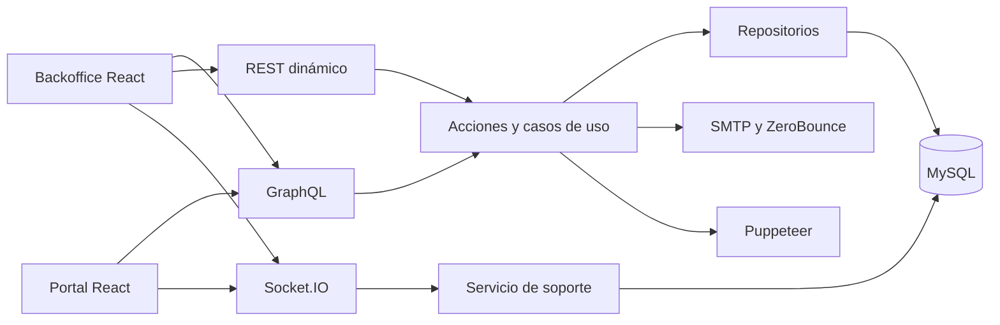
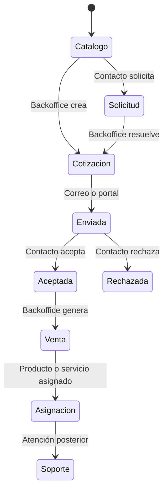
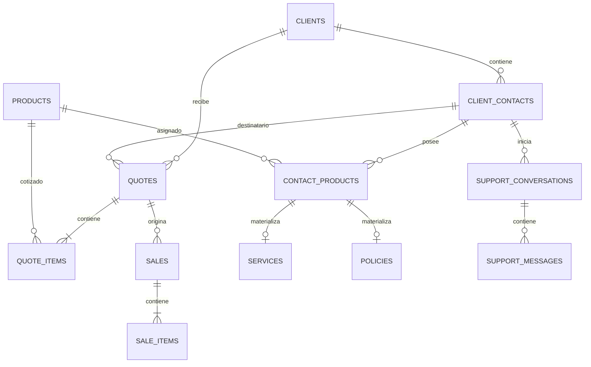

# Manual completo de Business Control

Guía funcional, técnica y operativa del sistema Business Control. Este documento explica qué resuelve el producto, cómo se usa, cómo está construido, cómo se ejecuta y qué condiciones debe respetar una modificación para no romper los flujos existentes.

> [!NOTE]
> Este manual describe el código actual del repositorio. No presenta roadmaps históricos ni propuestas de arquitectura como si ya estuvieran implementadas.

## Contenido

1. [Propósito y audiencia](#1-propósito-y-audiencia)
2. [Resumen del sistema](#2-resumen-del-sistema)
3. [Conceptos y roles](#3-conceptos-y-roles)
4. [Manual del backoffice](#4-manual-del-backoffice)
5. [Manual del portal de contactos](#5-manual-del-portal-de-contactos)
6. [Ciclo comercial completo](#6-ciclo-comercial-completo)
7. [Reglas de eliminación y conservación](#7-reglas-de-eliminación-y-conservación)
8. [Arquitectura actual](#8-arquitectura-actual)
9. [Estructura del repositorio](#9-estructura-del-repositorio)
10. [Frontend](#10-frontend)
11. [Backend](#11-backend)
12. [API e integraciones](#12-api-e-integraciones)
13. [Base de datos](#13-base-de-datos)
14. [Instalación y ejecución](#14-instalación-y-ejecución)
15. [Variables de entorno](#15-variables-de-entorno)
16. [Pruebas y calidad](#16-pruebas-y-calidad)
17. [Seguridad](#17-seguridad)
18. [Operación y diagnóstico](#18-operación-y-diagnóstico)
19. [Convenciones para mantener el proyecto](#19-convenciones-para-mantener-el-proyecto)
20. [Riesgos y limitaciones actuales](#20-riesgos-y-limitaciones-actuales)
21. [Glosario](#21-glosario)
22. [Índice de archivos clave](#22-índice-de-archivos-clave)

## 1. Propósito y audiencia

Business Control centraliza el trabajo comercial entre un equipo interno y los contactos de sus clientes. El producto cubre el registro de clientes y catálogo, la creación y entrega de cotizaciones, la aceptación desde un portal, la generación de ventas y la atención de soporte.

Este manual está pensado para tres perfiles:

| Perfil | Qué encontrará |
| --- | --- |
| Usuario de backoffice | Recorridos de clientes, contactos, productos, cotizaciones, ventas y soporte |
| Contacto de cliente | Funcionamiento del portal, cotizaciones, ventas, catálogo y ajustes |
| Desarrollo y mantenimiento | Arquitectura, API, datos, entorno, pruebas, seguridad y reglas de cambio |

### Lectura recomendada

- Para conocer el producto: secciones 2 a 7.
- Para desarrollar: secciones 8 a 17.
- Para operar o investigar fallos: secciones 18 a 22.
- Para levantar el proyecto rápidamente: sección 14.

## 2. Resumen del sistema

El sistema tiene dos superficies web que consumen el mismo backend y la misma base de datos:

- **Backoffice:** aplicación interna para administración y operación comercial.
- **Portal de contactos:** acceso independiente para contactos autorizados de los clientes.

La solución vive en un monorepo de `pnpm`:

| Componente | Tecnología | Responsabilidad |
| --- | --- | --- |
| Frontend | React 18 y Vite 5 | Backoffice y portal |
| Backend | Node.js, Express 5 y Apollo Server 5 | GraphQL, REST, seguridad, correo, PDF y tiempo real |
| Persistencia | MySQL 8 | Datos comerciales, usuarios, historial y soporte |
| Reglas compartidas | JavaScript ESM | Cálculos y validaciones usados por frontend y backend |
| Infraestructura | Docker Compose y Nginx | Entorno reproducible y servicio del frontend compilado |

### Mapa de alto nivel


```mermaid
flowchart LR
  BO[Backoffice React] --> GQL[GraphQL]
  PORTAL[Portal React] --> GQL
  BO --> REST[REST dinámico]
  PORTAL --> WS[Socket.IO]
  BO --> WS
  GQL --> USE[Acciones y casos de uso]
  REST --> USE
  USE --> REPO[Repositorios]
  REPO --> DB[(MySQL)]
  USE --> MAIL[SMTP y ZeroBounce]
  USE --> PDF[Puppeteer]
  WS --> CHAT[Servicio de soporte]
  CHAT --> DB
```

### Direcciones locales predeterminadas

| Servicio | Dirección |
| --- | --- |
| Frontend en desarrollo | `http://localhost:5173` |
| Frontend con Docker | `http://localhost` |
| GraphQL | `http://localhost:4000/graphql` |
| Health check | `http://localhost:4000/health` |
| MySQL local | `localhost:3306` |
| MySQL publicado por Docker | `localhost:3307` |

## 3. Conceptos y roles

### 3.1 Entidades principales

| Concepto | Significado |
| --- | --- |
| Cliente | Empresa o razón social administrada por el backoffice |
| Contacto | Persona vinculada con un cliente; puede recibir acceso al portal |
| Producto | Elemento comercial del catálogo; también puede representar un servicio o una póliza |
| Categoría | Clasificación del catálogo, opcionalmente asociada con un tipo de producto |
| Cotización | Propuesta comercial con partidas, cantidades, precios y descuentos |
| Venta | Documento generado desde una cotización aceptada |
| Asignación | Relación de un producto, servicio o póliza con un contacto |
| Conversación | Hilo persistente de soporte entre un contacto y el equipo interno |

### 3.2 Roles del backoffice

Los roles base usados por la aplicación son:

| Rol | Acceso visible en la interfaz |
| --- | --- |
| `ADMIN` | Clientes, productos, cotizaciones, ventas, soporte y tareas administrativas |
| `VENTAS` | Clientes, productos, cotizaciones, ventas y soporte |
| `SOPORTE` | La interfaz muestra productos, cotizaciones, ventas y centro de soporte |

La página de clientes está protegida en el frontend para `ADMIN` y `VENTAS`. La interfaz permite que `SOPORTE` abra productos, cotizaciones, pólizas, ventas y soporte; sin embargo, los resolvers actuales de cotizaciones y ventas solamente autorizan `ADMIN`, `VENTAS` y, en operaciones específicas, `CONTACT_PORTAL`. Por ello, `SOPORTE` puede alcanzar esas pantallas pero no completar sus consultas o mutaciones principales. Es una inconsistencia vigente entre frontend y backend.

> [!IMPORTANT]
> Las restricciones del frontend mejoran la navegación, pero no sustituyen la autorización del backend. Los resolvers y rutas deben validar siempre al usuario autenticado y sus roles.

### 3.3 Identidad del portal

El portal usa el rol técnico `CONTACT_PORTAL`. El token identifica al contacto por `contactId`. En las peticiones HTTP y GraphQL, el backend comprueba que el contacto siga existiendo, esté activo y conserve `has_portal_access`.

Un contacto deshabilitado o sin acceso al portal deja de ser autenticado por HTTP o GraphQL aunque conserve un token anterior. El handshake actual de Socket.IO solo verifica la firma del JWT y no repite esa consulta; esta brecha se documenta en la sección 20.

### 3.4 Contraseña maestra

El registro de usuarios internos está protegido por `MASTER_PASSWORD`. La interfaz solicita la contraseña antes de mostrar el registro y el backend vuelve a validarla. El acceso a la pantalla de roles usa además una llave de sesión de un solo recorrido; no debe asumirse que conocer la URL concede acceso.

## 4. Manual del backoffice

### 4.1 Inicio de sesión y navegación

1. Abre `/login`.
2. Ingresa las credenciales de un usuario activo.
3. El backend devuelve un JWT y los datos del usuario.
4. El frontend conserva el token del backoffice en `localStorage` bajo `bc_token`.
5. Las rutas protegidas validan que exista una sesión antes de mostrar el layout.

La aplicación carga las pantallas con `React.lazy` y `Suspense`. Un error no controlado de interfaz queda contenido por `ErrorBoundary`.

### 4.2 Panel principal

La ruta `/` funciona como entrada del backoffice. Desde el layout se accede a las áreas permitidas por el rol. El tema claro u oscuro se controla desde `ThemeContext` y no cambia el contrato de datos.

### 4.3 Clientes

Ruta principal: `/clientes`.

Funciones disponibles:

- Listado, búsqueda, filtros y paginación.
- Alta y edición de información empresarial.
- Carga masiva desde archivos tabulares.
- Columnas dinámicas para datos que no pertenecen al esquema fijo.
- Exportación tabular a PDF y Excel.
- Navegación al detalle del cliente.

El detalle en `/clientes/:id` reúne información general, contactos, productos asignados, servicios y pólizas relacionados.

#### Columnas dinámicas

Los campos dinámicos se atienden mediante REST porque sus columnas pueden variar en tiempo de ejecución. `clients_column_meta` conserva metadatos de presentación y los servicios dinámicos controlan lectura, actualización e importación.

#### Eliminación actual de clientes

La operación `deleteClient` elimina físicamente el cliente. Antes de hacerlo, copia el nombre del cliente y del contacto a los snapshots de cotizaciones y ventas para conservar la lectura histórica.

Aunque la tabla `clients` contiene `is_deleted` y existe una migración de soft delete, la acción actual no usa esa marca. Esta diferencia debe considerarse antes de cambiar el comportamiento.

### 4.4 Contactos

Los contactos se administran desde el detalle del cliente.

Funciones principales:

- Crear, editar y buscar contactos.
- Importar contactos en lote.
- Exportar la tabla a PDF o Excel.
- Habilitar o revocar acceso al portal.
- Administrar credenciales y datos de contacto.
- Asignar productos, servicios o pólizas.
- Mostrar por separado contactos activos y deshabilitados.

#### Deshabilitación de contactos

La acción expuesta como `deleteContact` no elimina el registro. Ejecuta:

```sql
UPDATE client_contacts
SET is_active = 0, has_portal_access = 0
WHERE id = ?;
```

El contacto debe permanecer en MySQL y aparecer en la sección de deshabilitados. También pierde inmediatamente el acceso al portal.

### 4.5 Productos y categorías

Rutas:

- `/productos`: catálogo y exportaciones.
- `/productos/:id`: detalle, precio e historial.
- `/registrar-productos`: alta de productos y administración de categorías.

Cada producto puede contener:

- Folio.
- Nombre y categoría.
- Tipo comercial.
- Precio actual.
- Límite o cantidad de usuarios.
- Descripción.
- Cliente asociado, cuando aplica.
- Versión e historial de cambios.

Los cambios de precio se registran en `product_price_history`. Las actualizaciones descriptivas se registran en `product_update_history` con versión, tipo de cambio y resumen.

La eliminación de una categoría debe considerar las referencias del catálogo. No se debe convertir una categoría en texto libre desde una sola pantalla sin revisar el contrato GraphQL y la persistencia.

### 4.6 Creación de cotizaciones

Ruta: `/cotizaciones/nueva`.

Flujo normal:

1. Seleccionar cliente.
2. Seleccionar contacto cuando corresponda.
3. Buscar productos del catálogo.
4. Agregar partidas y cantidades.
5. Ajustar descuentos permitidos.
6. Revisar subtotales y total.
7. Guardar o generar la cotización.
8. Enviar por correo o habilitarla en el portal.

La pantalla está dividida en controlador, componentes de búsqueda, tabla de partidas, modales y vista generada. Los borradores pueden persistirse mediante `form_drafts` para recuperar trabajo no finalizado.

#### Reglas de precios

Las reglas comunes viven en `shared/quotePricingRules.js` y `shared/validation.js`. El backend vuelve a obtener los productos y valida los importes; nunca debe aceptar como verdad final un total calculado únicamente por el navegador.

`quote_items` conserva por partida:

- Producto.
- Cantidad.
- Precio base.
- Precio unitario aplicado.
- Descuento.
- Total.

### 4.7 Historial y detalle de cotizaciones

Rutas:

- `/cotizaciones/historial`.
- `/cotizaciones/:id`.

Estados persistidos:

| Estado | Uso |
| --- | --- |
| `PENDIENTE` | Cotización creada y aún no respondida |
| `ENVIADA` | Disponible para el contacto o enviada por el flujo comercial |
| `ACEPTADA` | Aceptada por el contacto |
| `RECHAZADA` | Rechazada por el contacto o backoffice |
| `SOLICITADA` | Solicitud iniciada desde el portal |

Desde el detalle se puede generar PDF, enviar correo, cambiar disponibilidad en portal y actualizar el estado según las reglas del flujo.

### 4.8 Solicitudes provenientes del portal

Una solicitud del portal se registra como cotización `SOLICITADA` con `is_contact_requested = 1`. El backoffice puede consultar el conteo pendiente y las notificaciones no leídas.

Al resolver una solicitud, el caso de uso transforma la selección del contacto en una cotización comercial completa y actualiza su estado. Las notificaciones pueden marcarse como leídas o descartarse sin borrar el documento comercial.

### 4.9 Cotizaciones aceptadas y pólizas

La ruta `/polizas` presenta cotizaciones aceptadas y asignaciones relacionadas. En el modelo de datos, `contact_products` es la relación principal con el contacto. Dependiendo del tipo del producto, el registro de cumplimiento puede materializarse en `services` o `policies`.

Las fechas, licencia y estado de la asignación se actualizan mediante operaciones específicas; no deben inferirse solamente desde la fecha de la cotización.

### 4.10 Ventas

Rutas:

- `/ventas`.
- `/ventas/:id`.

Una cotización aceptada puede originar una o varias ventas parciales. Cada creación selecciona `quote_item_ids` todavía no vendidos; el backend impide reutilizar una partida y la copia a `sale_items`, conservando referencias a la cotización, cliente, contacto y usuario.

Funciones principales:

- Crear una venta desde una cotización.
- Consultar lista y detalle.
- Enviar la venta por correo.
- Habilitar o retirar su visibilidad en el portal.
- Exportar el documento.
- Eliminarla desde el backoffice.

La eliminación del backoffice es física: primero elimina `sale_items` y después `sales`. La eliminación desde el portal es lógica y solamente establece `is_deleted_portal = 1` para el contacto propietario.

### 4.11 Soporte

Ruta: `/soporte`.

El centro de soporte permite:

- Consultar la cola de conversaciones.
- Tomar una conversación como agente.
- Intercambiar mensajes en tiempo real.
- Mostrar indicadores de escritura y presencia.
- Recuperar historial paginado.
- Cerrar una conversación.

Los mensajes no se pueden eliminar mediante Socket.IO. Cerrar un chat conserva el historial y agrega eventos de sistema.

### 4.12 Registro de usuarios y roles

- `/register` permite registrar usuarios internos tras validar la contraseña maestra.
- `/roles` administra roles mediante un acceso conducido desde el flujo de registro.

Las mutaciones de roles requieren autenticación. Un mensaje `No autenticado` significa que la petición GraphQL no recibió un JWT válido, aunque la pantalla haya sido alcanzada desde la interfaz.

## 5. Manual del portal de contactos

### 5.1 Acceso

Ruta: `/portal/login`.

El contacto debe cumplir simultáneamente:

- Existir en `client_contacts`.
- Estar activo.
- Tener `has_portal_access = 1`.
- Presentar credenciales válidas.

El token del portal se guarda en `sessionStorage` bajo `bc_portal_token`, separado del token del backoffice.

### 5.2 Panel

Ruta: `/portal/dashboard`.

El panel resume información disponible para el contacto y enlaza cotizaciones, ventas, catálogo, servicios y soporte. Los datos deben estar limitados al `contactId` contenido en el token.

### 5.3 Cotizaciones

Rutas:

- `/portal/quotes`.
- `/portal/quotes/:id`.

El contacto puede:

- Consultar cotizaciones enviadas a su portal.
- Abrir el detalle.
- Aceptar una cotización `ENVIADA`.
- Rechazarla.
- Eliminarla solamente de su vista.
- Crear o actualizar una solicitud de cotización.

Aceptar una cotización registra la respuesta del portal. La creación de la venta continúa siendo una operación explícita del backoffice.

La eliminación desde el portal no borra `quotes` ni `quote_items`: marca `is_deleted_portal = 1`. La cotización sigue disponible para el backoffice salvo que éste ejecute su propia eliminación.

### 5.4 Ventas

Rutas:

- `/portal/sales`.
- `/portal/sales/:id`.

El portal muestra únicamente ventas asignadas al contacto, habilitadas para portal y no marcadas como eliminadas por ese contacto.

`deletePortalSale` establece `is_deleted_portal = 1`; no elimina la venta de MySQL y no la oculta al administrador. Si el backoffice ejecuta `deleteSale`, la venta y sus partidas se eliminan físicamente.

### 5.5 Catálogo

Ruta: `/portal/catalog`.

El catálogo muestra productos disponibles para portal. El contacto puede seleccionar productos para iniciar una solicitud. La disponibilidad visual no sustituye las validaciones de existencia y precio del backend.

### 5.6 Soporte

Ruta: `/portal/support`.

El contacto puede crear o reanudar una conversación abierta, enviar mensajes, ver el historial, cerrar el chat y calificar la atención.

La implementación actual valida la firma del JWT durante la conexión, pero no comprueba de forma consistente la propiedad de la conversación al iniciar con un `contactId`, unirse por `conversationId`, consultar historial o enviar mensajes. El uso esperado es operar solamente la conversación propia, pero esa separación todavía no está garantizada por el servidor.

### 5.7 Ajustes y recuperación

Rutas:

- `/portal/settings`.
- `/portal/forgot-password`.
- `/portal/reset-password`.

El cambio de contraseña solicita la contraseña actual. La recuperación genera un token temporal y utiliza el correo del contacto. El envío real depende de una configuración SMTP válida.

## 6. Ciclo comercial completo


```mermaid
stateDiagram-v2
  [*] --> Catalogo
  Catalogo --> Cotizacion: Backoffice crea
  Catalogo --> Solicitud: Contacto solicita
  Solicitud --> Cotizacion: Backoffice resuelve
  Cotizacion --> Enviada: Correo o portal
  Enviada --> Aceptada: Contacto acepta
  Enviada --> Rechazada: Contacto rechaza
  Aceptada --> Venta: Backoffice genera
  Venta --> Asignacion: Producto o servicio asignado
  Asignacion --> Soporte: Atención posterior
```

### Flujo de datos

1. El catálogo define productos, tipos, precios y categorías.
2. Una cotización conserva una fotografía comercial en sus partidas.
3. El portal puede responder solamente documentos asignados a su contacto.
4. Una o varias ventas copian las partidas aceptadas seleccionadas; una partida no puede venderse dos veces.
5. Las asignaciones registran licencia, vigencia y estado operativo.
6. El soporte conserva conversaciones y mensajes independientemente del documento comercial.

### Invariantes importantes

- El backend recalcula y valida importes.
- Una cotización con venta asociada no puede eliminarse físicamente.
- El portal solamente opera recursos del contacto autenticado.
- Ocultar un recurso en el portal no equivale a eliminarlo del backoffice.
- Las partidas se eliminan junto con su documento cuando la eliminación administrativa es física.
- Los nombres snapshot permiten leer históricos aun cuando cambien o desaparezcan relaciones.

## 7. Reglas de eliminación y conservación

Las acciones llamadas "eliminar" no tienen la misma semántica. Esta tabla es el contrato actual:

| Recurso y actor | Comportamiento | Persistencia |
| --- | --- | --- |
| Contacto desde backoffice | Deshabilita y revoca portal | Conserva `client_contacts`; cambia `is_active` y `has_portal_access` a `0` |
| Cliente desde backoffice | Elimina después de crear snapshots históricos | Borra `clients` físicamente |
| Cotización desde backoffice | Borra partidas y cabecera si no existe venta | Elimina `quote_items` y `quotes` |
| Cotización desde portal | La oculta solamente al contacto | Cambia `quotes.is_deleted_portal` a `1` |
| Venta desde backoffice | Borra partidas y cabecera | Elimina `sale_items` y `sales` |
| Venta desde portal | La oculta solamente al contacto propietario | Cambia `sales.is_deleted_portal` a `1` |
| Asignación de contacto | Elimina la relación autorizada | Borra `contact_products` correspondiente |
| Mensaje de soporte | No está permitido eliminarlo | Conserva historial |

> [!WARNING]
> Antes de modificar una operación de eliminación, revisa interfaz, resolver, acción, repositorio, claves foráneas y pruebas. Cambiar solamente el botón o solamente el SQL produce comportamientos inconsistentes.

## 8. Arquitectura actual

### 8.1 Clasificación honesta

Business Control es un **monolito modular en transición**. No es una implementación completa de Clean Architecture ni de arquitectura hexagonal.

El repositorio ya contiene:

- Módulos por dominio en backend.
- Casos de uso y dominio más explícitos para cotizaciones.
- Repositorios de persistencia.
- Políticas de acceso.
- Componentes, controladores y hooks especializados en frontend.
- Reglas puras compartidas.

También conserva:

- Carpetas horizontales.
- Acciones y servicios con responsabilidades superpuestas.
- Acceso SQL directo en algunos casos de uso.
- Contratos distribuidos entre GraphQL, REST y componentes.

La dirección adecuada es continuar la modularización por flujo sin reescribir todo el producto.

### 8.2 Dependencias principales

```text
Frontend page/view
  -> controller o hook
  -> actionsAPI / cliente HTTP
  -> GraphQL o REST
  -> resolver o route
  -> acción / caso de uso
  -> repositorio o servicio de infraestructura
  -> MySQL / SMTP / PDF / Socket.IO
```

### 8.3 Fronteras existentes

| Frontera | Responsabilidad |
| --- | --- |
| `frontend/src/pages` | Composición de pantallas y flujos |
| `frontend/src/actionsAPI` | Operaciones remotas |
| `frontend/src/features` | Dominio frontend extraído gradualmente |
| `backend/src/graphql` | Contrato GraphQL, resolvers, políticas y DataLoaders |
| `backend/src/modules` | Acciones y casos de uso por dominio |
| `backend/src/repositories` | SQL y persistencia |
| `backend/src/services` | Correo, PDF, Excel e integración especializada |
| `shared` | Reglas puras que deben coincidir en ambos lados |

### 8.4 Flujo de una petición GraphQL

1. Express recibe la petición y `authMiddleware` interpreta el Bearer token.
2. Apollo valida el documento y limita profundidad a 10.
3. El contexto expone `user` y DataLoaders por petición.
4. El resolver aplica autenticación y roles.
5. La acción o caso de uso ejecuta reglas de negocio.
6. El repositorio consulta MySQL.
7. Apollo serializa la respuesta o un error estable.

### 8.5 Flujo REST

REST se usa para clientes y contactos con columnas o importaciones dinámicas. Las rutas aplican `requireBackofficeRole`, que admite `ADMIN` y `VENTAS`.

GraphQL y REST no deben implementar reglas comerciales contradictorias. Cuando ambos expongan el mismo caso, deben converger en una acción o servicio común.

## 9. Estructura del repositorio

```text
business-control/
|-- frontend/
|   |-- src/actionsAPI/        # GraphQL, REST y clientes HTTP
|   |-- src/components/        # UI, layout y gates de acceso
|   |-- src/context/           # Autenticación, tema y notificaciones
|   |-- src/features/          # Dominio frontend extraído
|   |-- src/hooks/             # Hooks transversales
|   |-- src/pages/auth/        # Login, registro y roles
|   |-- src/pages/home/        # Backoffice
|   |-- src/pages/portal/      # Portal de contactos
|   |-- src/services/          # Cliente API, logger y notificaciones
|   |-- src/utils/             # PDF, Excel, formato, GraphQL y sockets
|   `-- src/routes.jsx         # Mapa de navegación
|-- backend/
|   |-- src/chat/              # Gateway, handlers y persistencia de soporte
|   |-- src/config/            # Entorno y conexión MySQL
|   |-- src/errors/            # Errores de aplicación
|   |-- src/graphql/           # Schema, resolvers, políticas y DataLoaders
|   |-- src/middlewares/       # Autenticación y autorización REST
|   |-- src/migrations/        # Ejecutor de migraciones SQL
|   |-- src/modules/           # Casos de uso por dominio
|   |-- src/repositories/      # Persistencia MySQL
|   |-- src/routes/            # REST dinámico
|   |-- src/server/            # Construcción de Express y Apollo
|   |-- src/services/          # Integraciones especializadas
|   |-- src/utils/             # JWT, password, logger y utilidades
|   `-- sql/                   # Baseline, migraciones y seeds
|-- shared/                    # Pricing y validaciones compartidas
|-- tests/e2e/                 # Playwright y arranque de entorno real
|-- docs/                      # Documentación del proyecto
|-- .github/workflows/         # Quality Gate
|-- docker-compose.yml
|-- playwright.config.js
|-- vitest.config.js
|-- pnpm-workspace.yaml
`-- package.json
```

## 10. Frontend

### 10.1 Arranque

`frontend/src/main.jsx` monta la aplicación. `frontend/src/routes.jsx` declara rutas, lazy loading, metadata, tema, error boundary y controles de acceso.

### 10.2 Estado y sesión

| Área | Mecanismo |
| --- | --- |
| Sesión backoffice | `AuthContext`, hook `useAuth` y token `bc_token` |
| Sesión portal | Token `bc_portal_token` y layout específico |
| Tema | `ThemeContext` |
| Notificaciones | `NotificationContext` y `notificationService` |
| Borradores | `usePersistedFormDraft` y GraphQL |

### 10.3 Clientes HTTP

`createApiClient` centraliza el cliente Axios. `axiosClient` resuelve el token según el contexto y `portalAxiosClient` siempre usa la sesión del portal.

Las operaciones por dominio viven en `actionsAPI`:

- `auth.api.js`
- `clients.api.js`
- `contacts.api.js`
- `products.api.js`
- `quotes.api.js`
- `sales.api.js`
- `portal.api.js`
- `roles.api.js`
- `formDrafts.api.js`

### 10.4 Patrón de pantallas

Las áreas que ya fueron divididas siguen este patrón:

```text
Página pequeña
  -> controlador/hook
  -> vista
  -> tabla, toolbar, modales y helpers
```

Ejemplos: clientes, detalle de cliente, productos, creación de cotización, historial, pólizas y módulos del portal.

Una ampliación debe continuar este patrón cuando una página empiece a mezclar carga de datos, estado, eventos, modales y renderizado.

### 10.5 PDF y Excel

- `pdfTableExport.js` genera reportes tabulares con jsPDF y AutoTable.
- `excelExport.js` crea libros con ExcelJS y calcula anchos para evitar colisiones.
- SheetJS se usa en flujos de importación.
- Las ventas tienen exportación documental especializada.
- Las cotizaciones comerciales generadas por backend usan Puppeteer.

Los exportadores deben recibir filas normalizadas. No deben depender del texto truncado que muestra una celda en pantalla.

## 11. Backend

### 11.1 Secuencia de arranque

`backend/src/index.js` ejecuta esta secuencia:

1. Carga variables de entorno.
2. Valida configuración obligatoria.
3. Ejecuta migraciones si `RUN_MIGRATIONS=true`.
4. Crea Express con CORS, Helmet, JSON, auth y REST.
5. Selecciona HTTP o HTTPS.
6. Inicia Apollo y monta `/graphql`.
7. Inicializa Socket.IO.
8. Escucha en `PORT`.

En producción, el backend se niega a iniciar sobre HTTP plano salvo que exista TLS directo o `ALLOW_UNSECURE_HTTP=true` detrás de un proxy que termine HTTPS.

### 11.2 GraphQL

El schema está en `backend/src/graphql/schema.graphql`. Los resolvers se separan por query, mutation y tipos.

Las políticas `quoteAccess.policy.js` y `saleAccess.policy.js` limitan recursos del portal. Los DataLoaders reducen lecturas repetidas de usuarios, clientes, contactos y productos dentro de una petición.

La introspección está deshabilitada cuando `NODE_ENV=production`.

### 11.3 Módulos

| Módulo | Responsabilidad |
| --- | --- |
| `clients` | Alta, edición, consulta y eliminación de clientes |
| `contacts` | Contactos, portal y asignaciones |
| `drafts` | Borradores de formularios |
| `policies` | Asignaciones y vigencias |
| `products` | Catálogo, precio, historial y categorías |
| `quotes` | Solicitudes, cotizaciones, estados, PDF y portal |
| `sales` | Creación, correo, portal y eliminación de ventas |
| `users` | Usuarios, login y roles |

Cotizaciones tiene la modularización más explícita, con dominio, aplicación e infraestructura. El resto continúa migrando sin romper imports y contratos existentes.

### 11.4 Repositorios

Los repositorios contienen SQL parametrizado y transformaciones de persistencia. Las operaciones de varias tablas deben usar una conexión y una transacción comunes.

Reglas mínimas:

- No interpolar valores del usuario en SQL.
- Liberar conexiones en `finally`.
- Confirmar o revertir transacciones de forma explícita.
- Mantener las partidas y cabeceras consistentes.
- Aplicar paginación en listados crecientes.

### 11.5 Servicios especializados

| Servicio | Función |
| --- | --- |
| `quotePricing.service.js` | Validación y cálculo de precios |
| `quotePdfGenerator.service.js` | Render de PDF con Puppeteer |
| `quotePdfTemplate.service.js` | Plantilla HTML de cotización |
| `quoteEmailSender.service.js` | Envío de cotizaciones |
| `emailValidator.service.js` | Validación de direcciones |
| `excelParser.service.js` | Lectura de hojas importadas |
| `clientsDynamic.service.js` | Datos dinámicos de clientes |
| `contactsDynamic.service.js` | Datos dinámicos de contactos |
| `productFulfillmentRegistry.service.js` | Registro de cumplimiento por tipo |

## 12. API e integraciones

### 12.1 Queries GraphQL

| Dominio | Operaciones principales |
| --- | --- |
| Sesión | `me`, `roles` |
| Borradores | `formDraft` |
| Clientes | `clients`, `client`, `searchClients` |
| Contactos | `contactsByClient`, `contact` |
| Productos | `products`, `portalProducts`, `product`, `searchProducts`, `productCategories` |
| Asignaciones | `policies` |
| Cotizaciones | `quotes`, `quote`, `quotesByClient`, `pendingQuoteRequestsCount`, `unreadQuoteRequests`, `generateQuotePdf` |
| Ventas | `sales`, `sale` |

### 12.2 Mutaciones GraphQL

| Dominio | Operaciones principales |
| --- | --- |
| Autenticación | `login`, `loginContact`, `registerUser`, `verifyMasterPassword` |
| Clientes | Crear, carga masiva, actualizar y eliminar |
| Contactos | Crear, carga masiva, actualizar, deshabilitar y asignar productos |
| Productos | Crear, actualizar, eliminar, cambiar precio y limpiar historial |
| Categorías | Crear, asignar tipo y eliminar |
| Cotizaciones | Crear, resolver solicitud, registrar, enviar, publicar, responder, actualizar estado y eliminar |
| Ventas | Crear desde cotización, enviar, publicar y eliminar |
| Portal | Solicitar cotización, ocultar cotización o venta, cambiar y recuperar contraseña |
| Borradores | Guardar y eliminar |
| Roles | Crear y eliminar |

Consulta el contrato exacto en [`backend/src/graphql/schema.graphql`](../backend/src/graphql/schema.graphql).

### 12.3 REST

Las rutas REST se montan bajo:

- `/api/clients`
- `/api/contacts`

Operaciones actuales:

| Método y ruta | Uso |
| --- | --- |
| `GET /api/clients/dynamic` | Lista de clientes con columnas dinámicas |
| `PUT /api/clients/:id/dynamic` | Actualización dinámica |
| `POST /api/clients/import-drive` | Importación desde una fuente descargable |
| `POST /api/clients/import-local-base64` | Importación local codificada |
| `GET /api/contacts/client/:clientId/dynamic` | Contactos dinámicos del cliente indicado |
| `PUT /api/contacts/:id/dynamic` | Actualización dinámica de contacto |
| `POST /api/contacts/import-drive` | Importación de contactos |

Estas rutas requieren JWT de backoffice con rol `ADMIN` o `VENTAS`.

### 12.4 Socket.IO

Eventos principales:

| Grupo | Eventos |
| --- | --- |
| Conversación | `conversation:start`, `conversation:join`, `conversation:close`, `conversation:rate` |
| Agente | `conversation:take`, `queue:list` |
| Mensajes | `message:send`, `messages:history`, `messages:seen` |
| Escritura | `typing:start`, `typing:stop` |

`message:delete` responde con error de forma intencional porque el historial se conserva.

### 12.5 Correo y validación

Nodemailer usa SMTP para cotizaciones, ventas y recuperación. ZeroBounce valida direcciones cuando el flujo lo requiere.

En producción, `validateEnv()` exige:

- `JWT_SECRET` seguro.
- `MASTER_PASSWORD`.
- `ZERO_BOUNCE_API_KEY` o su alias.
- `SMTP_USER` y `SMTP_PASS`.

Por lo tanto, ZeroBounce y las credenciales SMTP no son opcionales para iniciar el backend en producción.

## 13. Base de datos

### 13.1 Grupos de tablas

| Área | Tablas |
| --- | --- |
| Identidad | `roles`, `users` |
| Formularios | `form_drafts` |
| Clientes | `clients`, `clients_column_meta`, `client_contacts` |
| Catálogo | `products`, `product_categories`, `product_price_history`, `product_update_history` |
| Asignaciones | `client_products`, `contact_products`, `services`, `policies` |
| Cotizaciones | `quotes`, `quote_items` |
| Ventas | `sales`, `sale_items` |
| Soporte | `support_conversations`, `support_messages` |
| Control de esquema | `schema_migrations` |

### 13.2 Relaciones principales


```mermaid
erDiagram
  CLIENTS ||--o{ CLIENT_CONTACTS : contiene
  CLIENTS ||--o{ QUOTES : recibe
  CLIENT_CONTACTS ||--o{ QUOTES : destinatario
  QUOTES ||--|{ QUOTE_ITEMS : contiene
  PRODUCTS ||--o{ QUOTE_ITEMS : cotizado
  QUOTES ||--o{ SALES : origina
  SALES ||--|{ SALE_ITEMS : contiene
  CLIENT_CONTACTS ||--o{ CONTACT_PRODUCTS : posee
  PRODUCTS ||--o{ CONTACT_PRODUCTS : asignado
  CONTACT_PRODUCTS ||--o| SERVICES : materializa
  CONTACT_PRODUCTS ||--o| POLICIES : materializa
  CLIENT_CONTACTS ||--o{ SUPPORT_CONVERSATIONS : inicia
  SUPPORT_CONVERSATIONS ||--o{ SUPPORT_MESSAGES : contiene
```

### 13.3 Baseline y migraciones

- `backend/sql/baseline.sql` pretende crear el esquema inicial.
- `backend/sql/migrations/` contiene migraciones `001` a `024`.
- `schema_migrations` registra archivos aplicados.
- `pnpm --dir backend migrate` ejecuta solamente los pendientes.
- `RUN_MIGRATIONS=true` ejecuta el mismo proceso al arrancar el backend.

Cada migración corre dentro de una transacción. El runner tolera determinados errores de duplicación para convivir con instalaciones que recibieron cambios previos.

> [!CAUTION]
> El baseline actual combina varias columnas `client_id INT NOT NULL` con claves foráneas `ON DELETE SET NULL`. MySQL rechaza esa combinación al crear una base vacía. La migración `022_soft_delete_clients.sql` vuelve anulables esas columnas, pero no puede ejecutarse si el baseline falla antes. El bootstrap limpio no debe considerarse reproducible hasta corregir y probar el baseline sobre un volumen vacío.

### 13.4 Seeds

`backend/sql/seeds.sql` contiene cuentas y datos de demostración. Úsalo solamente en entornos locales o de prueba. No documentes ni reutilices sus contraseñas como credenciales reales.

### 13.5 Cómo agregar una migración

1. Crea el siguiente archivo numerado en `backend/sql/migrations/`.
2. Escribe cambios idempotentes cuando sea razonable.
3. Revisa claves foráneas, nulabilidad y datos existentes.
4. Ejecuta la migración sobre una copia de prueba.
5. Ejecuta las pruebas de integración.
6. Verifica también una instalación desde baseline cuando el cambio afecte el esquema inicial.

No edites manualmente una base compartida para simular una migración aplicada.

## 14. Instalación y ejecución

### 14.1 Requisitos

- Node.js 22 o superior.
- pnpm `11.1.1`.
- MySQL 8.
- Docker Desktop, si se usa Docker Compose.

### 14.2 Instalación de dependencias

Desde la raíz:

```bash
corepack enable
corepack prepare pnpm@11.1.1 --activate
pnpm install --frozen-lockfile
```

### 14.3 Desarrollo local

Prepara los archivos:

PowerShell:

```powershell
Copy-Item backend/.env.example backend/.env
Copy-Item frontend/.env.example frontend/.env
```

Bash:

```bash
cp backend/.env.example backend/.env
cp frontend/.env.example frontend/.env
```

Configura MySQL y después inicia dos terminales:

```bash
pnpm dev:backend
```

```bash
pnpm dev:frontend
```

### 14.4 Docker Compose

Prepara el entorno:

PowerShell:

```powershell
Copy-Item .env.docker .env
```

Bash:

```bash
cp .env.docker .env
```

Completa secretos y ejecuta:

```bash
docker compose up -d --build
```

> [!IMPORTANT]
> Con un volumen MySQL vacío, revisa primero la incompatibilidad del baseline descrita en la sección 13.3. Un volumen ya inicializado no vuelve a importar automáticamente `baseline.sql`.

Comandos operativos:

```bash
docker compose ps
docker compose logs -f backend
docker compose down
```

`docker compose down -v` elimina el volumen y todos los datos. No lo uses como comando rutinario.

### 14.5 Scripts de raíz

| Comando | Resultado |
| --- | --- |
| `pnpm dev:frontend` | Vite en desarrollo |
| `pnpm dev:backend` | Backend con Nodemon |
| `pnpm build` | Build del frontend |
| `pnpm lint` | ESLint del repositorio |
| `pnpm lint:fix` | Correcciones automáticas de ESLint |
| `pnpm test` | Unitarias compartidas, frontend y backend |
| `pnpm test:unit` | Reglas compartidas |
| `pnpm test:frontend` | Vitest frontend |
| `pnpm test:integration` | Suite backend |
| `pnpm test:integration:db` | Integración explícita con MySQL |
| `pnpm test:e2e` | Playwright |
| `pnpm test:e2e:real` | Flujo E2E con entorno real controlado |
| `pnpm test:coverage` | Cobertura frontend |
| `pnpm test:ci` | Unitarias, frontend, backend y build |

## 15. Variables de entorno

### 15.1 Backend

| Variable | Propósito | Condición |
| --- | --- | --- |
| `NODE_ENV` | Modo de ejecución | `development`, `test` o `production` |
| `PORT` | Puerto del backend | Predeterminado `4000` |
| `JWT_SECRET` | Firma JWT | Obligatoria y segura en producción |
| `JWT_EXPIRES_IN` | Duración del token | Predeterminado `7d` |
| `MYSQL_HOST` | Host de MySQL | Obligatoria |
| `MYSQL_PORT` | Puerto de MySQL | Predeterminado `3306` |
| `MYSQL_USER` | Usuario de MySQL | Obligatoria |
| `MYSQL_PASSWORD` | Contraseña de MySQL | Según el servidor |
| `MYSQL_DATABASE` | Base principal | Obligatoria |
| `RUN_MIGRATIONS` | Migraciones al iniciar | Se ejecutan cuando vale `true` |
| `CORS_ORIGIN` | Origen permitido | Debe coincidir con el frontend |
| `MASTER_PASSWORD` | Protección administrativa | Obligatoria en producción |
| `ZEROBOUNCE_API_KEY` | Validación de correo | Obligatoria en producción |
| `SMTP_HOST` | Host SMTP | Predeterminado `smtp.gmail.com` |
| `SMTP_PORT` | Puerto SMTP | Predeterminado `465` |
| `SMTP_USER` | Usuario SMTP | Obligatoria en producción |
| `SMTP_PASS` | Secreto SMTP | Obligatoria en producción |
| `LOG_LEVEL` | Nivel de logs | Predeterminado `info` |
| `SSL_KEY_PATH` | Llave TLS | Necesaria para HTTPS directo |
| `SSL_CERT_PATH` | Certificado TLS | Necesaria para HTTPS directo |
| `ALLOW_UNSECURE_HTTP` | HTTP detrás de proxy TLS | Solo cuando el proxy termina HTTPS |

El backend acepta `ZERO_BOUNCE_API_KEY` como alias de `ZEROBOUNCE_API_KEY`.

### 15.2 Frontend

| Variable | Propósito |
| --- | --- |
| `VITE_API_URL` | URL completa de GraphQL |

Ejemplo local:

```dotenv
VITE_API_URL=http://localhost:4000/graphql
```

Vite incorpora esta variable durante el build. Después de cambiarla, reinicia el servidor o reconstruye la imagen.

### 15.3 Pruebas

| Variable | Propósito |
| --- | --- |
| `MYSQL_TEST_DATABASE` | Base aislada de integración |
| `RUN_INTEGRATION_TESTS` | Habilita integración con DB |
| `E2E_USE_TEST_DATABASE` | Fuerza base de pruebas en Playwright |
| `E2E_REAL_FLOW` | Habilita flujo E2E real |
| `PLAYWRIGHT_START_SERVERS` | Permite que Playwright inicie frontend y backend |
| `E2E_BASE_URL` | URL frontend de E2E |
| `E2E_API_URL` | URL GraphQL de E2E |

### 15.4 Docker

`DB_EXTERNAL_PORT`, `BACKEND_PORT` y `FRONTEND_PORT` cambian los puertos publicados. Los secretos se leen desde el `.env` de la raíz.

Nunca confirmes `.env`, credenciales SMTP, contraseñas o claves de producción.

## 16. Pruebas y calidad

### 16.1 Capas de prueba

| Capa | Herramienta | Cobertura principal |
| --- | --- | --- |
| Dominio compartido | Node Test Runner | Pricing e items de cotización |
| Componentes frontend | Vitest, jsdom y Testing Library | UI, hooks, controladores y utilidades |
| Backend | Node Test Runner | Repositorios, acciones, auth, GraphQL y servicios |
| Integración MySQL | Suite backend | Migraciones y persistencia real |
| End-to-end | Playwright | Autenticación, productos y cotizaciones |

### 16.2 Cobertura frontend

`vitest.config.js` aplica umbrales:

| Métrica | Umbral |
| --- | --- |
| Statements | 90% |
| Branches | 70% |
| Functions | 75% |
| Lines | 90% |

La cobertura se limita a una selección explícita de componentes y utilidades. Alcanzar el umbral no significa que toda la aplicación tenga ese porcentaje.

### 16.3 Playwright

Playwright define proyectos para Chromium, Firefox y WebKit. CI ejecuta el proyecto Chromium. Con `PLAYWRIGHT_START_SERVERS=true`, la configuración inicia backend y Vite automáticamente.

El entorno real debe usar una base aislada. Nunca apuntes E2E destructivo a una base de producción.

### 16.4 Quality Gate

El workflow se ejecuta en pushes y pull requests hacia `main` o `master`:

1. Instala dependencias con lockfile.
2. Ejecuta ESLint.
3. Ejecuta pruebas compartidas y frontend.
4. Genera cobertura.
5. Inicia MySQL de integración.
6. Ejecuta pruebas backend.
7. Compila el frontend.
8. Ejecuta smoke tests de Playwright con Chromium.

> [!NOTE]
> El paso actual `git diff --check` se ejecuta después de un checkout limpio y no compara explícitamente el rango del PR. No debe presentarse como garantía completa de whitespace confirmado.

### 16.5 Verificación mínima antes de integrar

```bash
pnpm lint
pnpm test
pnpm build
```

Agrega integración o E2E cuando el cambio afecte SQL, autenticación, permisos, cotizaciones, ventas o portal.

## 17. Seguridad

### 17.1 Controles implementados

- JWT Bearer para backoffice y portal.
- Hash de contraseñas con bcryptjs.
- Validación de usuario y rol en backend.
- Revocación efectiva del portal HTTP/GraphQL al deshabilitar un contacto.
- Helmet, HSTS, frameguard y `nosniff`.
- CORS configurable con credenciales.
- Respuestas con caché deshabilitada.
- Profundidad GraphQL limitada a 10.
- Introspección GraphQL deshabilitada en producción.
- HTTP de producción bloqueado salvo configuración explícita de proxy TLS.
- SQL parametrizado en repositorios.
- Escape de contenido incorporado en plantillas sensibles.

### 17.2 Almacenamiento de tokens

- Backoffice: `localStorage`.
- Portal: `sessionStorage`.

Esta separación evita mezclar sesiones, pero ambos almacenamientos siguen siendo accesibles a JavaScript. La prevención de XSS y la revisión de dependencias son críticas.

### 17.3 Lista de despliegue

- [ ] Sustituir todos los secretos de ejemplo.
- [ ] Configurar HTTPS o un proxy TLS confiable.
- [ ] Restringir `CORS_ORIGIN` al dominio real.
- [ ] Usar un usuario MySQL con privilegios mínimos.
- [ ] Configurar SMTP y ZeroBounce.
- [ ] No cargar seeds de demostración.
- [ ] Validar restauración de respaldos.
- [ ] Ejecutar pruebas sobre un entorno equivalente.
- [ ] Revisar logs sin datos sensibles.

## 18. Operación y diagnóstico

### 18.1 Health check

```text
GET /health
```

Respuesta esperada:

```json
{ "ok": true }
```

El health check confirma que Express responde; no demuestra por sí solo que SMTP, ZeroBounce o todos los flujos de MySQL funcionen.

### 18.2 El backend no inicia

Revisa en este orden:

1. Variables obligatorias de producción.
2. Conectividad con MySQL.
3. Estado de migraciones.
4. Configuración HTTP/HTTPS.
5. Puerto ocupado.
6. Logs estructurados del backend.

### 18.3 MySQL no conecta

- Desde el host hacia Docker usa normalmente `127.0.0.1:3307`.
- Dentro de Compose usa `db:3306`.
- Verifica usuario, contraseña y nombre de base.
- Comprueba `docker compose ps`.
- En una base vacía, revisa la incompatibilidad del baseline.

### 18.4 Vite muestra dependencias optimizadas desactualizadas

PowerShell:

```powershell
Remove-Item -Recurse -Force frontend/node_modules/.vite
pnpm --dir frontend dev --force
```

### 18.5 Una petición responde `No autenticado`

Comprueba:

- Que exista el token correcto para backoffice o portal.
- Que Axios envíe `Authorization: Bearer <token>`.
- Que el token no esté vencido.
- Que el usuario interno siga activo.
- Que el contacto siga activo y con portal habilitado.
- Que no se esté usando `bc_portal_token` en una operación de backoffice.

### 18.6 El correo no sale

- Revisa `SMTP_HOST`, `SMTP_PORT`, `SMTP_USER` y `SMTP_PASS`.
- Usa una contraseña de aplicación cuando el proveedor lo requiera.
- Revisa validación de ZeroBounce.
- Confirma que el proveedor no esté rechazando remitente o destinatario.

### 18.7 El PDF no encuentra navegador

Docker incluye Chromium y define `PUPPETEER_EXECUTABLE_PATH=/usr/bin/chromium`. En local, instala un navegador compatible o configura esa variable con una ruta válida.

### 18.8 Un registro desaparece de una tabla

Antes de asumir que fue borrado, identifica la semántica:

- `is_active = 0`: deshabilitado.
- `is_deleted_portal = 1`: oculto solamente en portal.
- `is_deleted_admin = 1`: oculto para backoffice en consultas que usan esa marca.
- `DELETE`: eliminación física.

Revisa la matriz de la sección 7 y consulta MySQL dentro de una transacción de diagnóstico de solo lectura.

## 19. Convenciones para mantener el proyecto

### 19.1 Antes de modificar un flujo

Traza el recorrido completo:

```text
Pantalla
-> hook/controlador
-> actionsAPI
-> GraphQL/REST
-> resolver/ruta
-> acción/caso de uso
-> repositorio/servicio
-> tabla o integración
```

Protege el comportamiento actual con una prueba antes de mover responsabilidades.

### 19.2 Reglas de dependencia

- La UI no ejecuta SQL ni conoce credenciales.
- Los resolvers coordinan; no deben acumular reglas complejas.
- Las acciones expresan casos de uso.
- Los repositorios contienen persistencia.
- Los servicios encapsulan integraciones.
- El dominio compartido no depende de React, Express o MySQL.

### 19.3 Cuándo crear una abstracción

Crea un puerto o interfaz cuando exista una frontera real que deba sustituirse o probarse, por ejemplo:

- MySQL y transacciones.
- Correo.
- PDF.
- Excel.
- Reloj.
- Generación de identificadores.

No crees una interfaz para cada CRUD si solamente duplica nombres sin reducir acoplamiento.

### 19.4 Cambios de frontend

- Mantén páginas pequeñas.
- Extrae carga y eventos a controladores o hooks.
- Separa tablas, toolbars y modales.
- Conserva estados de carga, vacío y error.
- Revisa tema claro y oscuro.
- Verifica desktop y móvil.
- Evita exportar datos truncados de la presentación.

### 19.5 Cambios de backend

- Valida autenticación y roles en servidor.
- Usa parámetros SQL.
- Usa transacciones para escrituras relacionadas.
- Preserva snapshots e historial.
- Define explícitamente soft delete o hard delete.
- Agrega migraciones para cambios de esquema.
- Devuelve errores estables y sin secretos.

### 19.6 Cambios en cotizaciones y ventas

Estos flujos tienen mayor riesgo porque atraviesan varios módulos. Verifica siempre:

- Precio base y unitario.
- Descuento y total.
- Estado permitido.
- Propiedad del contacto.
- Publicación en portal.
- Partidas asociadas.
- Envío de correo y PDF.
- Regla de eliminación.
- Conversión de cotización a venta.

### 19.7 Criterio de terminado

Un cambio está terminado cuando:

- El comportamiento solicitado funciona.
- No cambia contratos no relacionados.
- Las pruebas relevantes pasan.
- El build pasa.
- Las migraciones fueron probadas cuando aplican.
- La documentación refleja el nuevo contrato.
- No quedaron secretos, datos temporales ni archivos generados.

## 20. Riesgos y limitaciones actuales

### 20.1 Baseline no reproducible desde cero

La nulabilidad de varios `client_id` no coincide con `ON DELETE SET NULL`. Es el riesgo operativo más inmediato porque afecta instalaciones limpias y también el job de CI que importa el baseline.

### 20.2 Arquitectura parcialmente modular

Conviven módulos por dominio con acciones, servicios y carpetas horizontales heredadas. Un refactor masivo tendría alto riesgo; la migración debe continuar por casos de uso pequeños y cubiertos.

### 20.3 Semántica de clientes no alineada

El esquema y la migración 022 sugieren soft delete mediante `clients.is_deleted`, pero `deleteClientAction` elimina físicamente el cliente después de crear snapshots. El comportamiento debe decidirse y unificarse antes de depender de la columna como contrato.

### 20.4 Varias semánticas de eliminación

Contactos, cotizaciones, ventas y portal usan estrategias distintas. Sin pruebas de contrato, un cambio aparentemente local puede borrar datos o mostrar registros a un actor incorrecto.

### 20.5 Autorización insuficiente en Socket.IO

El handshake de Socket.IO verifica la firma del JWT, pero no vuelve a consultar si un contacto sigue activo. Los handlers tampoco validan consistentemente que `contactId` o `conversationId` pertenezcan al contacto conectado antes de crear, unir, leer o enviar mensajes. Hasta corregirlo, el chat no ofrece aislamiento robusto entre conversaciones del portal.

### 20.6 Permisos de `SOPORTE` desalineados

Las rutas frontend permiten a `SOPORTE` abrir cotizaciones y ventas, mientras los resolvers GraphQL principales excluyen ese rol. Se debe decidir el permiso esperado y alinear ambos lados; mostrar la pantalla no concede acceso efectivo.

### 20.7 Cobertura selectiva

Los umbrales de Vitest cubren archivos seleccionados, no todo el frontend. Los módulos fuera de esa lista necesitan pruebas dirigidas según su riesgo.

### 20.8 Quality Gate de whitespace limitado

El workflow ejecuta `git diff --check` sobre un checkout limpio sin rango explícito. ESLint sí se ejecuta, pero la comprobación no garantiza todos los problemas de whitespace confirmados.

### 20.9 Tokens accesibles a JavaScript

El uso de `localStorage` y `sessionStorage` hace que un XSS pueda exponer tokens. Mantener escape, CSP, revisión de HTML y dependencias es obligatorio.

## 21. Glosario

| Término | Definición |
| --- | --- |
| Backoffice | Interfaz privada para el equipo interno |
| Portal | Interfaz privada para contactos de clientes |
| JWT | Token firmado usado para autenticar peticiones |
| Resolver | Adaptador GraphQL que recibe una operación y llama un caso de uso |
| Caso de uso | Operación de negocio coordinada por una acción o módulo |
| Repositorio | Componente responsable de persistencia y consultas |
| DataLoader | Agrupación y caché por petición para reducir consultas repetidas |
| Baseline | SQL destinado a crear el esquema inicial |
| Migración | Cambio incremental y versionado del esquema |
| Seed | Datos de demostración o prueba |
| Soft delete | Ocultamiento mediante estado o marca sin borrar la fila |
| Hard delete | Eliminación física mediante `DELETE` |
| Snapshot | Copia de un dato histórico para no depender de la relación actual |
| Folio | Identificador comercial legible de un producto, cotización o venta |
| Partida | Línea de producto con cantidad, precio, descuento y total |

## 22. Índice de archivos clave

| Archivo | Responsabilidad |
| --- | --- |
| [`README.md`](../README.md) | Presentación e instalación resumida |
| [`frontend/src/routes.jsx`](../frontend/src/routes.jsx) | Rutas y gates de interfaz |
| [`frontend/src/actionsAPI`](../frontend/src/actionsAPI) | Operaciones remotas del frontend |
| [`frontend/src/utils/pdfTableExport.js`](../frontend/src/utils/pdfTableExport.js) | Exportaciones PDF tabulares |
| [`frontend/src/utils/excelExport.js`](../frontend/src/utils/excelExport.js) | Exportaciones Excel |
| [`backend/src/index.js`](../backend/src/index.js) | Bootstrap del backend |
| [`backend/src/server/createApp.js`](../backend/src/server/createApp.js) | Express y middlewares |
| [`backend/src/graphql/schema.graphql`](../backend/src/graphql/schema.graphql) | Contrato GraphQL |
| [`backend/src/modules`](../backend/src/modules) | Casos de uso por dominio |
| [`backend/src/repositories`](../backend/src/repositories) | Persistencia MySQL |
| [`backend/src/services`](../backend/src/services) | Correo, PDF, Excel e integraciones |
| [`backend/src/chat`](../backend/src/chat) | Soporte en tiempo real |
| [`backend/sql/baseline.sql`](../backend/sql/baseline.sql) | Esquema inicial |
| [`backend/sql/migrations`](../backend/sql/migrations) | Migraciones versionadas |
| [`shared/quotePricingRules.js`](../shared/quotePricingRules.js) | Reglas compartidas de precios |
| [`docker-compose.yml`](../docker-compose.yml) | Entorno de contenedores |
| [`playwright.config.js`](../playwright.config.js) | Configuración E2E |
| [`vitest.config.js`](../vitest.config.js) | Pruebas y cobertura frontend |
| [`.github/workflows/playwright.yml`](../.github/workflows/playwright.yml) | Quality Gate |

---

Este manual debe actualizarse junto con cualquier cambio que modifique rutas, roles, variables de entorno, estados, semánticas de eliminación, estructura de datos o pasos de operación.
